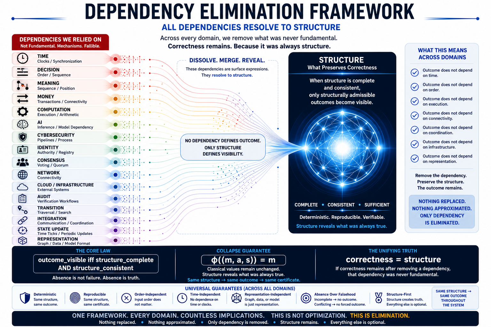

# ⭐ **SLANG-Observatory**

## **Structural Language (SLANG) — Tiny Deterministic Kernels**


`correctness = structure`  
`outcome_visible iff structure_mature`  
`structure_mature = complete AND consistent`

No workflows. No pipelines. No sequencing.  
Correctness resolves directly from structure.

---

## ⚡ **The Claim**

Across domains, correctness resolves without workflow, sequencing, or execution pipelines — when structure is sufficient.

---

## 🚀 **The Core Insight (30-Second Revolution)**

What if correctness never needed workflows, clocks, ordering, or coordination?

Traditional systems assume:

- Approval requires approval chains  
- Detection requires analysis pipelines  
- Inference requires model execution  
- Settlement requires transaction logs  

SLANG proves:

When structure is complete AND consistent, outcome becomes visible — deterministically and order-independently.

`same structure -> same outcome`  
`incomplete structure -> no outcome`  
`conflicting structure -> no forced resolution`

This is not a faster workflow.  
This is removal of what was never fundamental to correctness.

---

## 🔥 **Break This SLANG (Challenge)**

If workflows are required for correctness, this must fail:

`S1 = S2`  
`Outcome1 != Outcome2`

Or demonstrate any of the following:

- incomplete structure -> forced outcome  
- conflicting structure -> unsafe resolution  
- reordered structure -> different result  

If none of these occur:

workflow is not fundamental to correctness in this model

---

## ⚡ **Try it in 30 seconds**

Open any folder  
Run the script  
Modify the structure  
Run again  

Observe:

- same structure → same outcome  
- incomplete structure → no forced outcome  
- order does not matter  
- process does not matter  

---

## ⚡ **Instant Demo Entry**

Start with a real example:

```
python demo/SLANG-Invoice/slang_invoice.py
```

Then try:

Break structure → outcome disappears  
Fix structure → outcome reappears  

This is not execution control.  
This is structural visibility.

---

## 🧠 **The Unifying Principle**

`correctness = structure`

`outcome_visible iff structure_mature`

`structure_mature = complete AND consistent`

If correctness remains after removing a dependency, that dependency was never fundamental.

---

## 🧩 **Structural Collapse Guarantee**

This framework does not modify classical outcomes.  
It preserves them.

`phi((m, a, s)) = m`

Where:

- `m` = classical result  
- `a` = alignment  
- `s` = structural state  

No new result is created.  
No approximation is introduced.  

Structure reveals what was always true.

---

## ⚡ **The Critical Line**

Across every domain:

remove dependency → structure remains → correctness preserved

Nothing was improved.  
Nothing was optimized.  
Nothing was replaced.  

Only the dependency was removed.

And nothing broke.

---

## ⚠️ **Read This Carefully**

This is not a better workflow.  
This is not a faster system.  
This is not optimization.  

This is removal.

Correctness does not depend on process.

---

## 🔭 **The Observatory Insight (New Layer)**

SLANG-Observatory does not just resolve outcomes.

It answers:

Is this outcome structurally allowed to exist?

`observable_truth = resolve(structure)`

visibility = structure_mature

This introduces a new paradigm:

Systems do not produce truth.  
They reveal it — when structure is sufficient.

---

## 🔄 **The Shift**

Across domains, a pattern emerges:

- correctness does not depend on workflow  
- correctness does not depend on sequence  
- correctness does not depend on execution flow  

It is preserved by something deeper:

**structure**

---

## 🧱 **SLANG Dependency Elimination Pattern**

| SLANG Demo | Removed Dependency | What Preserves Correctness |
|---|---|---|
| Invoice | approval workflow | structure |
| Claims | payout workflow | structure |
| Cybersecurity | pipelines / escalation flow | structure |
| Password | authentication / login flow | structure |
| Audit | verification workflow | structure |
| Money | transactions / settlement flow | structure |
| Computation | execution flow | structure |

Each demo removes a dependency — yet correctness remains intact.

Nothing is approximated.  
Nothing is substituted.  
Only the dependency is removed.

👉 The same principle visualized:

---

## 🧭 **Visual Overview**



---

## 🧭 **Framework & References**

### **Docs**

- [Quickstart](docs/Quickstart.md)  
- [FAQ](docs/FAQ.md)  
- [Proof Sketch](docs/Proof-Sketch.md)  

---

### **Framework**

- [Dependency Elimination Framework](docs/Dependency-Elimination-Framework.png)
- [Shunyaya Structural Stack](docs/Shunyaya-Structural-Stack.png)

Part of a broader structural pattern (Dependency Elimination Framework) where removing assumed dependencies reveals that correctness is preserved by structure alone.

---

## **Repository Demos (Tiny Structural Proofs)**

Each demo isolates one domain and proves the same invariant:

`outcome = resolve(structure)`

Start anywhere:

- [SLANG-Invoice](demo/SLANG-Invoice/) — approval without workflow
- [SLANG-Claims](demo/SLANG-Claims/) — payout without workflow
- [SLANG-Cybersecurity](demo/SLANG-Cybersecurity/) — escalation without pipelines
- [SLANG-Password](demo/SLANG-Password/) — access resolution without authentication

More demo folders will be added progressively.  
Check Related Structural References for dedicated SLANG domain repositories.

Each demo is:

- tiny (`<2 KB`)  
- deterministic  
- order-independent  
- self-verifiable  

Same structure → same outcome  
No structure → no outcome  

---

## 🔍 **What This Repository Contains**

Each folder is a minimal SLANG demonstration across domains.

Each demonstrates the same invariant:

`same structure -> same outcome`  
order independent  
deterministic  
idempotent  

---

## 🧠 **How SLANG Works**

Express structure as relationships (rules + facts)  
Resolve only when structure is complete AND consistent  

Outcome appears — or remains absent  

`outcome = resolve(structure)`

Execution is the substrate.  
Structure is the source of truth.

---

## 🧠 **Execution Clarification**

Execution reveals outcomes.  
Structure determines them.

Outcome depends only on structure — not on:

- workflow  
- sequence  
- execution path  
- timing  
- coordination  

---

## **From Minimal Kernels to Full Systems**

These minimal kernels isolate the structural invariant.

They are the smallest visible proofs.

Alongside these, full reference implementations are available for selected domains, including:

- SLANG-Money  
- SLANG-Audit  
- SLANG-Computation  

These expanded packages demonstrate the same principle with:

- complete repository structure  
- documentation and proof sketches  
- reproducibility and verification layers  
- deterministic outputs and structural certificates  

The invariant remains identical:

`same structure -> same outcome`

The difference is scope:

kernels isolate the truth  
reference systems demonstrate it at scale  

The principle does not change with size. Only its visibility does.

---

## 🧠 **The Important Part**

These are not full systems.

These are the smallest visible proofs.

Each tiny kernel isolates one truth:

`correctness = structure`

The full Shunyaya stack extends this across:

- time  
- money  
- communication  
- execution  
- identity  
- consensus  
- and beyond  

The principle does not change.

Only its visibility increases.

---

## 🛡 **Safety & Guarantees**

`incomplete structure -> no outcome` (prevents wrong results)  
`conflicting structure -> no unsafe resolution`  
`identical structure -> identical outcome`  
reproducible across runs  
classical collapse preserved: `phi((m, a, s)) = m`  

Absence is truth. Silence is valid output.

This is structural safety.

---

## 🧭 **Structural Property**

`S1 = S2 -> Outcome1 = Outcome2`  
`Outcome1 != Outcome2 -> S1 != S2`  

Structure is the only source of truth.

---

## ⚖️ **What This Is / Is Not**

### **SLANG-Observatory IS:**

- a collection of minimal structural proofs  
- a deterministic resolution playground  
- a demonstration of dependency elimination  
- a structure-first correctness model  

### **SLANG-Observatory IS NOT:**

- a production system  
- a framework or SDK  
- a replacement for domain infrastructure  
- a security system  

---

## 🌍 **Why This Matters**

If this pattern holds:

- workflows become optional  
- execution becomes secondary  
- validation becomes structural  
- correctness becomes intrinsic  

Systems become:

- resilient  
- reproducible  
- dependency-independent  
- auditable by inspection  

---

## 📜 **License**

See: [LICENSE](LICENSE)

**Reference Implementation (This Repository):**

These tiny kernels are the official minimal examples of the SLANG structural resolution model.  
They demonstrate the core principles in their simplest form across multiple domains.

Released as an Open Standard — free to use, study, implement, extend, and deploy.

**Architecture and Documentation:**  
CC BY-NC 4.0

---

## 🧱 **Cross-System Dependency Elimination Map**

| Domain | System | Removed Dependency | What Preserves Correctness |
|---|---|---|---|
| Computation | [SLANG-Computation](https://github.com/OMPSHUNYAYA/SLANG-Computation) | Execution flow | Structure |
| Computation | [STOCRS](https://github.com/OMPSHUNYAYA/STOCRS) | Execution pipelines | Structure |
| Arithmetic | [SVARE](https://github.com/OMPSHUNYAYA/SVARE) | Computation | Structure |
| Time | [STIME](https://github.com/OMPSHUNYAYA/Structural-Time) | Clocks | Structure |
| Time | [SSUM-Time](https://github.com/OMPSHUNYAYA/SSUM-Time) | Time reconstruction | Structure |
| Ordering | [ORL](https://github.com/OMPSHUNYAYA/Orderless-Ledger) | Ordering / sequence | Structure |
| Connectivity | [STINT-Money](https://github.com/OMPSHUNYAYA/STINT-Money) | Continuous connectivity | Structure |
| Communication | [STILE](https://github.com/OMPSHUNYAYA/STILE) | Messaging / network | Structure |
| Traversal | [STRAL-Path](https://github.com/OMPSHUNYAYA/STRAL-Path) | Traversal / search | Structure |
| Infrastructure | [STIC](https://github.com/OMPSHUNYAYA/STIC) | Infrastructure / cloud orchestration | Structure |
| Media | [STRUMER](https://github.com/OMPSHUNYAYA/STRUMER) | Editing / media workflows | Structure |
| Finance | [SLANG-Money](https://github.com/OMPSHUNYAYA/SLANG-Money) | Transactions | Structure |
| Audit | [SLANG-Audit](https://github.com/OMPSHUNYAYA/SLANG-Audit) | Verification workflows | Structure |

---

## 🧭 **Final Statement**

Workflows did not create correctness.  
Execution did not create correctness.  
Validation did not create correctness.  

Correctness was always in structure.

SLANG-Observatory demonstrates that a quiet revolution is possible — one tiny kernel at a time.

Structure is fundamental. Everything else is optional — and removable.
