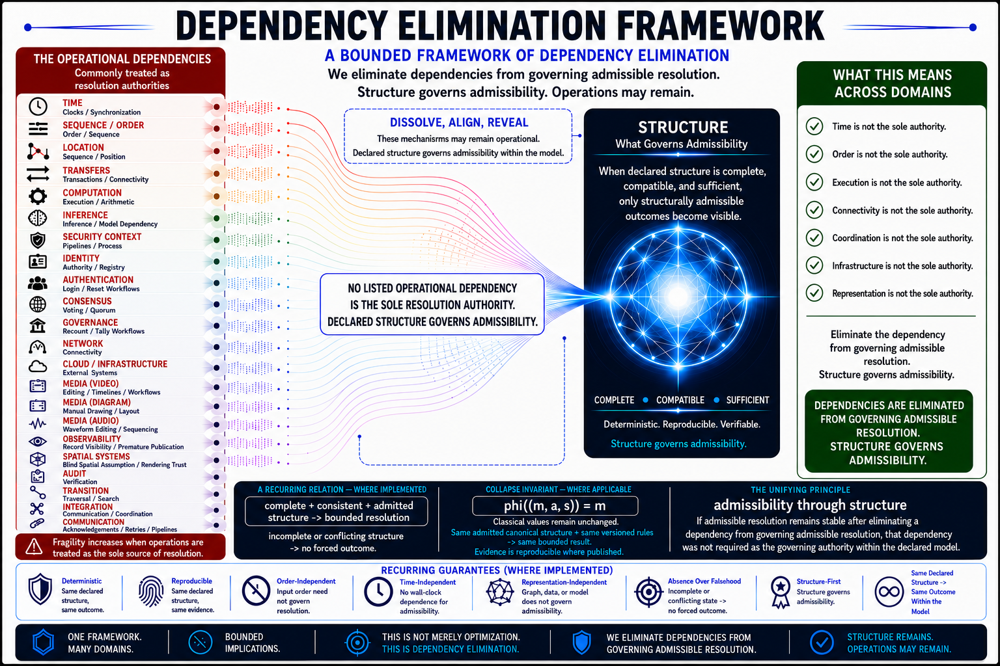

# ⭐ **SLANG-Observatory**

## **Structural Language (SLANG) — Bounded Deterministic Resolution Demos**


SLANG-Observatory is a collection of focused reference demonstrations that
resolve bounded outcomes from declared structure and versioned rules.

The recurring relation is:

`declared structure + versioned rules -> bounded resolution state`

Where a demo declares order independence:

`same canonical structure + same versioned rules -> same bounded result`

Where required structure is missing or conflicting:

`incomplete structure -> no forced outcome`

`conflicting structure -> ABSTAIN OR DENY OR another explicit non-result state`

The exact states, inputs, limits, evidence, and claim boundaries are defined by
each demo.

---

## ⚡ **What SLANG-Observatory Tests**

Each demo asks a narrow question:

Can a named workflow, sequence, arrival order, or operational mechanism stop
being the sole authority over a bounded result while deterministic structural
resolution remains reproducible?

The practical pattern is:

`operational mechanism -> no longer the sole resolution authority`

`complete + consistent + domain-bounded structure -> admissible outcome`

This does not mean that execution, communication, workflows, infrastructure,
authentication, transactions, or domain operations disappear physically.

They may remain necessary for real-world operation. The claim is only that,
within a declared reference model, they need not be the sole source of the
bounded resolution.

---

## 🧭 **Visual Overview**



---

## 🚀 **Start Here**

### Run the invoice demonstration

```bat
python demo/SLANG-Invoice/slang_invoice.py
```

### Run the SLANG-Exam v0.7.2 audit

```bat
cd demo/SLANG-Exam
python -B slang_exam_v0_7_2.py --self-test
```

Expected summary:

```text
TOTAL                127/127 PASS
```

Verify the frozen SLANG-Exam vectors:

```bat
python -B slang_exam_vectors_v0_7_2.py --verify SLANG_Exam_Vectors_v0_7_2.json
```

Expected summary:

```text
semantic vectors: 56/56 reproduced
reference evidence: 56/56 reproduced
relations: 10/10 reproduced
search probes: 3/3 reproduced
VERIFY: PASS
```

---

## 🧭 **Documentation**

- [Quickstart](docs/Quickstart.md)
- [FAQ](docs/FAQ.md)
- [Proof Sketch](docs/Proof-Sketch.md)
- [Dependency Elimination Framework](docs/Dependency-Elimination-Framework.png)
- [Shunyaya Structural Stack](docs/Shunyaya-Structural-Stack.png)

---

## 🧩 **Repository Demos**

The demos reuse a common structural-resolution discipline while retaining
different schemas, state models, and domain boundaries.

`shared SLANG contract + different bounded domain schema -> domain demonstration`

The repeated pattern is intentional. These demos are not presented as separate
foundational frameworks or as proof that every real-world dependency in each
domain has been removed.

### [SLANG-Invoice](demo/SLANG-Invoice/)

**Invoice approval visibility from complete declared structure.**

Tests whether approval workflow sequence must remain the sole resolution
authority for the bounded invoice model.

### [SLANG-Claims](demo/SLANG-Claims/)

**Claim-payability admission from complete declared structure.**

Resolves eligibility within the reference model. It does not execute payment or
replace insurer policy, legal review, fraud controls, or settlement systems.

### [SLANG-Cybersecurity](demo/SLANG-Cybersecurity/)

**Escalation admission from complete declared evidence.**

Tests whether pipeline order must remain the sole escalation authority for the
bounded model. It does not replace operational detection, response, monitoring,
or security controls.

### [SLANG-Hurricane](demo/SLANG-Hurricane/)

**Forecast visibility from structural maturity.**

`forecast_visible iff structure_complete AND structure_consistent`

This is a visibility-admission demonstration, not a forecasting model,
meteorological system, or public-safety authority.

### [SLANG-Exam](demo/SLANG-Exam/)

**Deterministic examination-form assembly and visibility from bounded declared
structure.**

SLANG-Exam v0.7.2 includes:

- canonical ranking
- abstention under unresolved multiplicity
- single-party commit-reveal ranking
- multi-party commit-reveal ranking
- scope-sensitive authority
- bounded exact-marks feasibility
- explicit search and resource limits
- reconstruction bundles
- compact receipts
- semantic and reference-evidence vectors

The reference separates assembly from visibility and preserves explicit
`RESOLVED`, `INCOMPLETE`, `CONFLICT`, `FORBIDDEN`, `UNSUPPORTED`, and `ABSTAIN`
states.

It is not a complete examination platform and does not provide authentication,
question secrecy, institutional authorization, secure distribution, invigilation,
grading, or legal certification.

### [SLANG-Voting](demo/SLANG-Voting/)

**Winner visibility from complete recorded structure.**

Tests whether recount or tally workflow sequence must remain the sole bounded
result source. It is not a complete election system, voting machine, legal
certification process, or public-election authority.

### [SLANG-Password](demo/SLANG-Password/)

**Deterministic admission of declared password-verification evidence.**

SLANG-Password v0.1.0 resolves whether externally produced verifier evidence is
complete, consistent, correctly bound to the declared authentication context,
compatible with the declared verifier set and evidence mode, and structurally
admissible under the identified profile and ruleset.

It does not compare passwords, authenticate users, grant access, create
sessions, issue tokens, mutate credentials, or replace established
authentication and security controls.

### [SLANG-ResetPassword](demo/SLANG-ResetPassword/)

**Deterministic admission of declared credential-replacement authorization
evidence.**

SLANG-ResetPassword v0.1.0 resolves whether externally produced
reset-authorization evidence is complete, consistent, correctly bound to the
declared reset context, compatible with the declared authorizer set and evidence
mode, and structurally admissible under the identified profile and ruleset.

It does not validate reset tokens, one-time passwords, recovery codes, or new
passwords; authenticate users; mutate credentials; grant access; create
sessions; or execute password resets.

---

## 🧱 **Focused Dependency Map**

This table describes only the bounded question tested by each demonstration.

| Demo | Operational Mechanism No Longer Treated as Sole Resolution Authority | Structural Basis |
|---|---|---|
| Invoice | approval workflow sequence | declared invoice facts, rules, and consistency checks |
| Claims | payout workflow sequence | declared claim evidence and eligibility rules |
| Cybersecurity | pipeline or escalation sequence | complete supported escalation evidence |
| Hurricane | forced or premature forecast publication | maturity and visibility-admission structure |
| Exam | pre-created final paper or selector procedure alone | question-bank metadata, blueprint, selector context, authority, and release structure |
| Voting | recount or tally workflow sequence | complete recorded tally structure |
| Password | password-verification workflow or verifier-evidence arrival order as sole bounded admission authority | declared verifier evidence, bound authentication context, verifier set, evidence mode, profile, and ruleset |
| ResetPassword | reset workflow or authorization-evidence arrival order as sole bounded admission authority | declared authorization evidence, bound reset context, authorizer set, evidence mode, profile, and ruleset |

The table does not claim that the named mechanisms are unnecessary in
real-world systems. It records what each demo removes from sole authority over
its own bounded result.

---

## 🔍 **What This Repository Contains**

Depending on the demo, a folder may include:

- a runnable Python reference implementation
- a browser demonstration
- example inputs
- frozen vectors
- reconstruction bundles
- compact receipts
- verification utilities
- diagrams and explanatory documents

Not every demo has the same artifact set. Each folder defines its own
verification surface and limits.

---

## 🧠 **How the Resolution Pattern Works**

A typical SLANG demonstration:

1. accepts declared facts, rules, and context
2. validates the supported input boundary
3. normalizes order-independent structures where declared
4. checks completeness, consistency, authority, and admissibility
5. resolves a bounded state
6. preserves explicit non-result states when resolution is not justified
7. produces evidence where the demo publishes verification artifacts

Conceptually:

`outcome = resolve(declared_structure, versioned_rules)`

Execution is still required to evaluate the resolver.

The structural claim concerns what determines the bounded result, not whether
software execution physically occurs.

---

## 🔁 **Determinism and Order Independence**

A demo may claim determinism when identical admitted canonical inputs under the
same versioned rules reproduce the same result.

A demo may claim order independence only for structures that its contract
explicitly normalizes or treats as sets.

Therefore:

`deterministic != universally order-independent`

`order-independent where declared != every input order is semantically equivalent`

SLANG-Exam, for example, distinguishes literal submission identity from
canonical result identity while preserving question-bank and manifest-order
invariance where declared.

---

## 🧾 **Evidence and Verification**

Verification strength varies by demo.

Published evidence may include:

- self-tests
- frozen conformance vectors
- metamorphic relations
- reconstruction bundles
- compact receipts
- exact replay verification
- semantic-only conformance modes
- tamper checks

A passing self-test or reconstruction check establishes agreement with the
declared reference contract. It does not establish production safety,
institutional approval, domain completeness, or third-party certification.

---

## ⚙️ **From Observatory Demos to Standalone Reference Systems**

Selected SLANG domains also have dedicated repositories with broader
documentation and verification surfaces:

- [SLANG-Computation](https://github.com/OMPSHUNYAYA/SLANG-Computation)
- [SLANG-Audit](https://github.com/OMPSHUNYAYA/SLANG-Audit)
- [SLANG-Money](https://github.com/OMPSHUNYAYA/SLANG-Money)

The Observatory contains focused domain demonstrations. The standalone
repositories define their own contracts, evidence, and limitations.

---

## ⚖️ **What This Is / Is Not**

### SLANG-Observatory is:

- a collection of bounded structural-resolution demonstrations
- a deterministic resolution playground
- a repository for inspectable domain kernels and evidence
- a place to test whether a named operational mechanism must remain the sole
  authority over a bounded result

### SLANG-Observatory is not:

- a production platform
- a universal correctness framework
- a complete SDK
- a replacement for domain infrastructure
- a security certification
- a formal technical standard
- proof that workflows, execution, communication, or infrastructure are
  unnecessary in real systems

---

## 🛡 **Safety and Claim Boundary**

The demonstrations preserve explicit non-result states rather than forcing an
answer when required structure is missing, conflicting, forbidden, unsupported,
or inconclusive.

Typical relations include:

`complete + consistent + admitted structure -> bounded resolution`

`incomplete structure -> no forced outcome`

`conflicting structure -> ABSTAIN OR DENY OR another explicit non-result state`

`unsupported input -> explicit refusal`

These relations apply only to the declared model implemented by the relevant
demo.

The repository does not certify:

- real-world correctness outside the declared model
- security
- safety
- fairness
- legal compliance
- operational readiness
- institutional authorization
- domain completeness
- superiority over established systems

Independent validation remains necessary before any high-risk or operational
use.

---

# 📜 **License**

See: [LICENSE](LICENSE)

The SLANG-Observatory reference implementations and associated verification
artifacts are free to use, copy, modify, test, study, and redistribute without a
license fee, subject to the license terms stated in the repository.

Documentation, architecture materials, specifications, diagrams, and
explanatory content are subject to the separate terms stated in the LICENSE.

This repository does not claim recognition as a formal technical standard,
security certification, production qualification, or third-party verification.

---

## 🧭 **Final Statement**

SLANG-Observatory demonstrates a bounded structural-resolution discipline:

`same admitted canonical structure + same versioned rules -> same bounded result`

Where a named workflow, sequence, or operational mechanism is removed from sole
resolution authority, the remaining structure must still be explicit,
complete, consistent, and verifiable within the declared model.

Each demo should be judged by its own code, evidence, limits, and documented
claim boundary.
