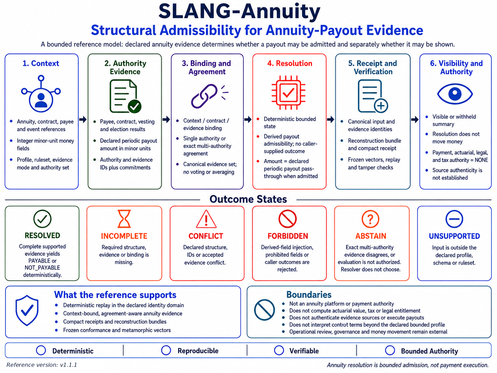

# SLANG-Annuity

## **Deterministic Annuitant Periodic-Payout Admission from Declared Structure**

**SLANG-Annuity does not authenticate evidence sources, interpret annuity contracts, establish legal entitlement, perform actuarial valuation, determine tax treatment, authorize payment, or move money. It resolves only a bounded annuitant periodic-payout admission state under an identified versioned contract.**

SLANG-Annuity v1.1.1 upgrades the earlier tiny Medium concept into an Observatory-grade deterministic reference package.

The central relation is:

`declared annuity context + bound authority evidence + versioned rules -> bounded payout-admission state`

For admitted canonical structure:

`same admitted canonical structure + same versioned contract -> same bounded result`

For unsupported, incomplete, conflicting, forbidden, or non-authorized structure:

`insufficient admissible structure -> no forced PAYABLE outcome`

The reference keeps bounded resolution separate from operational authority:

`PAYABLE != PAYMENT_AUTHORIZED`

`resolution != contract interpretation`

`declared payout amount != actuarial valuation`

`structural identity != source authenticity`

---

## **License and Use Notice**

Use of the SLANG-Annuity reference implementation, verification artifacts, documentation, specifications, schemas, and diagram is subject to the [SLANG-Observatory LICENSE](../../LICENSE).

Provided as is, without warranty. SLANG-Annuity is not an insurer, annuity issuer, custodian, annuity-contract administration system, source-authentication system, actuarial engine, tax engine, legal decision system, payment authority, banking system, accounting system, or regulatory certification.

---

## **Visual Overview**

[](SLANG-Annuity-Reference-Diagram.png)

The diagram summarizes context, authority evidence, exact agreement, bounded payout admission, reconstruction evidence, visibility, non-result states, and the operational-authority boundary. The detailed v1.1.1 contract additionally defines deterministic identities, non-result attestations, strict parser behavior, receipt-versus-correspondence separation, machine-readable contract material, and frozen conformance vectors.

`annuity resolution = bounded admission`

`annuity resolution != payment execution`

---

## **Quick Links**

**Core & Verification:** [Core](slang_annuity_v1_1_1.py) · [Vector Verifier](slang_annuity_vectors_v1_1_1.py) · [Independent Semantic Verifier](slang_annuity_independent_verifier_v1_1_1.py) · [Frozen Vectors](SLANG_Annuity_Vectors_v1_1_1.json)

**Contract & Profile:** [Profile](SLANG_Annuity_Profile_v1_1_1.txt) · [Contract](SLANG_Annuity_Contract_v1_1_1.json) · [Schemas](schemas/)

**Canonical Resolved Evidence:** [Example Input](SLANG_Annuity_Example_Input_v1_1_1.json) · [Bundle](SLANG_Annuity_Bundle_v1_1_1.json) · [Receipt](SLANG_Annuity_Receipt_v1_1_1.json)

**Canonical Non-Result Evidence:** [ABSTAIN Input](SLANG_Annuity_ABSTAIN_Example_Input_v1_1_1.json) · [Attestation](SLANG_Annuity_Attestation_v1_1_1.json)

**Visual:** [Reference Diagram](SLANG-Annuity-Reference-Diagram.png)

**Repository Navigation:** [SLANG-Observatory](../../) · [All Observatory Demos](../) · [Repository LICENSE](../../LICENSE)

---

## **Why v1.1.1 Is a Material Hardening Release**

The original concept demonstrated forward structural propagation in a tiny script. The GitHub reference strengthens both domain accuracy and verification discipline.

### Domain corrections

- removes beneficiary declaration as a universal gate for an annuitant periodic payout
- replaces the hard-coded payout amount with a declared periodic benefit amount
- does not pretend to derive a real annuity benefit from age, contribution history, mortality, interest, or actuarial tables
- narrows the supported payout mode to `ANNUITANT_PERIODIC`
- states explicitly that the reference does not interpret a real contract or establish real-world entitlement

### Structural hardening

- explicit `RESOLVED`, `INCOMPLETE`, `CONFLICT`, `FORBIDDEN`, `UNSUPPORTED`, and `ABSTAIN` states
- deterministic reason-code registry
- derived-field injection firewall
- strict JSON parsing with duplicate-key rejection
- bounded JSON depth, size, strings, containers, and integers
- source-evidence commitments
- case, contract, currency, authority-set, and evidence-set binding
- `SINGLE_AUTHORITY` and `MULTI_AUTHORITY_EXACT_AGREEMENT` modes
- canonical authority-set order independence
- deterministic SHA-256 identities
- reconstruction bundles
- compact receipts
- portable attestations
- withheld-outcome summary noninterference
- frozen conformance vectors
- independent semantic verification without importing the core resolver
- machine-readable contract and JSON Schemas

The upgrade changes the claim from an informal universal-sounding payout example into a reproducible bounded reference contract.

---

## **Current Reference**

Version:

`1.1.1`

Core:

`SLANG-CORE-1-D05`

Profile:

`SLANG-ANNUITY-PROFILE-1-D01`

Ruleset:

`SLANG-ANNUITY-RULESET-1-D01`

Canonicalization:

`SLANG-CANONICAL-JSON-1-D02`

Authority evidence profile:

`ANNUITY-PAYOUT-AUTHORITY-EVIDENCE-1`

Quantum profile:

`ANNUITY-DECLARED-PERIODIC-BENEFIT-PASS-THROUGH-1`

Contract:

`slang_annuity_contract_sha256:ea7932daa206e8864d634334200cebf6042cff4d53aeb5571960155bd9265ad1`

Identity domain:

`slang_annuity_identity_domain_sha256:266ca099be5951bc65e6cb30dc43d11ae135ab6451f87121dd369a08341db0a9`

Schemas:

- input: `SLANG-ANNUITY-INPUT-1`
- result: `SLANG-ANNUITY-RESULT-1`
- bundle: `SLANG-ANNUITY-BUNDLE-1`
- receipt: `SLANG-ANNUITY-RECEIPT-1`
- summary: `SLANG-ANNUITY-SUMMARY-1`
- attestation: `SLANG-ANNUITY-ATTESTATION-1`
- contract: `SLANG-ANNUITY-CONTRACT-1`

Target runtime:

`Python 3.9-compatible syntax; use a currently supported CPython release for operational testing`

Core dependencies:

`Python standard library only`

---

## **Quick Verification**

From the `SLANG-Annuity` folder, run:

```text
python -B slang_annuity_v1_1_1.py --self-test
```

Expected:

```text
SLANG-Annuity v1.1.1 self-test
TOTAL 102/102 PASS
```

Verify the frozen vector corpus:

```text
python -B slang_annuity_vectors_v1_1_1.py --verify SLANG_Annuity_Vectors_v1_1_1.json
```

Expected:

```text
header: 9/9 reproduced
semantic: 54/54 reproduced
relations: 4/4 reproduced
parser: 4/4 reproduced
artifacts: 8/8 reproduced
TOTAL: 79/79 PASS
VERIFY: PASS
```

Run the independent semantic verifier:

```text
python -B slang_annuity_independent_verifier_v1_1_1.py --core ./slang_annuity_v1_1_1.py
```

Expected:

```text
INDEPENDENT SEMANTIC VERIFIER: TOTAL 34/34 PASS
VERIFY: PASS
```

The independent verifier does not import the core resolver into its own process. It constructs valid evidence commitments and canonical inputs from a separate implementation of the published rules, exercises the core through local subprocess entry paths, and compares runtime results with hand-authored expected semantics.

Its independence is bounded: both implementations read the same published specification, so a defect shared by the specification itself is outside this check.

Verify the canonical reconstruction bundle:

```text
python -B slang_annuity_v1_1_1.py --verify-bundle SLANG_Annuity_Bundle_v1_1_1.json
```

Expected:

```text
BUNDLE_RECONSTRUCTION: PASS
OPERATIONAL_AUTHORITY: NONE
```

Verify receipt integrity:

```text
python -B slang_annuity_v1_1_1.py --check-receipt-integrity SLANG_Annuity_Receipt_v1_1_1.json
```

Expected:

```text
RECEIPT_INTEGRITY: PASS
BUNDLE_CORRESPONDENCE: NOT_CHECKED
OPERATIONAL_AUTHORITY: NONE
```

Verify exact receipt-to-bundle correspondence:

```text
python -B slang_annuity_v1_1_1.py --verify-receipt SLANG_Annuity_Receipt_v1_1_1.json --against-bundle SLANG_Annuity_Bundle_v1_1_1.json
```

Expected:

```text
RECEIPT_INTEGRITY: PASS
BUNDLE_CORRESPONDENCE: PASS
OPERATIONAL_AUTHORITY: NONE
```

Verify the canonical non-result attestation:

```text
python -B slang_annuity_v1_1_1.py --verify-attestation SLANG_Annuity_Attestation_v1_1_1.json --against-input SLANG_Annuity_ABSTAIN_Example_Input_v1_1_1.json
```

Expected:

```text
ATTESTATION_INTEGRITY: PASS
INPUT_CORRESPONDENCE: PASS
OPERATIONAL_AUTHORITY: NONE
```

---

## **Thirty-Second Demonstration**

Resolve the canonical example:

```text
python -B slang_annuity_v1_1_1.py --resolve SLANG_Annuity_Example_Input_v1_1_1.json
```

The reference resolves:

`state = RESOLVED`

`annuity_outcome = PAYABLE`

`payout_amount_minor = 1250000`

The amount is not calculated from age or contribution history. It is admitted from the bound field:

`declared_periodic_payout_minor = 1250000`

under the frozen relation when the payout is admitted:

`payout_amount_minor = declared_periodic_payout_minor`

To test a supported eligibility change, copy the canonical input to `edited.json` and change only:

`attained_age_years = 60`

The copied record now contains stale deterministic bindings. Refresh them into a separate file:

```text
python -B slang_annuity_v1_1_1.py --refresh-bindings edited.json --output edited_bound.json
```

Expected:

```text
REFRESH_BINDINGS: PASS
SOURCE_AUTHENTICITY: NOT_ESTABLISHED
```

Now resolve the refreshed input:

```text
python -B slang_annuity_v1_1_1.py --resolve edited_bound.json
```

The result is:

`state = RESOLVED`

`annuity_outcome = NOT_PAYABLE`

`reason_codes includes AGE_CONDITION_NOT_SATISFIED`

The refresh operation recomputes deterministic content bindings only:

`content binding refresh != source authentication`

For callers that have already regenerated each edited evidence record's `evidence_commitment`, the narrower helper updates only the two predeclared canonical identities:

```text
python -B slang_annuity_v1_1_1.py --stamp-declared-ids edited_with_valid_commitment.json --output edited_stamped.json
```

A broken evidence commitment is not masked. The narrow helper returns exit code `2` with:

```text
STAMP_DECLARED_IDS: FAIL
BLOCKING_ISSUES: EVIDENCE_COMMITMENT_MISMATCH
```

This is distinct from missing evidence:

`missing required field -> INCOMPLETE`

and from material multi-authority disagreement:

`exact-agreement failure -> ABSTAIN`

---

## **What the Reference Resolves**

The bounded question is:

**Does the declared and bound evidence admit a `PAYABLE` or `NOT_PAYABLE` annuitant periodic-payout result under this exact profile and ruleset?**

The supported evidence includes declared values for:

- contract status
- attained age
- minimum start age
- credited service
- minimum vesting service
- total contributions
- minimum contribution threshold
- payout election
- payee status
- declared periodic payout amount

The resolver does not independently establish whether those declarations are true in the real world.

---

## **Supported Payout Mode**

v1.1.1 supports exactly:

`ANNUITANT_PERIODIC`

This choice is deliberate.

The reference does not silently treat beneficiary designation, death benefits, survivorship options, riders, surrender values, variable-annuity account values, indexed-crediting methods, guaranteed minimum benefits, required distributions, tax withholding, or jurisdiction-specific rules as if they were universal annuity conditions.

Those require separately identified profiles if added later.

---

## **Eligibility Relation**

Let the admitted evidence declare:

`A = attained_age_years`

`A_min = minimum_start_age_years`

`V = credited_service_years`

`V_min = minimum_vesting_years`

`C = total_contributed_minor`

`C_min = minimum_contribution_minor`

`P = declared_periodic_payout_minor`

The frozen conditions are:

`contract_ok iff contract_status = ACTIVE`

`age_ok iff A >= A_min`

`vesting_ok iff V >= V_min`

`contribution_ok iff C >= C_min`

`election_ok iff payout_election = ELECTED`

`payee_ok iff payee_status = VALID`

`amount_ok iff P > 0`

The admitted result is:

`PAYABLE iff contract_ok AND age_ok AND vesting_ok AND contribution_ok AND election_ok AND payee_ok AND amount_ok`

When `PAYABLE`:

`payout_amount_minor = P`

When the evidence is complete and supported but one or more eligibility conditions fail:

`annuity_outcome = NOT_PAYABLE`

`payout_amount_minor = 0`

This is an identified demonstration profile, not universal annuity mathematics.

---

## **Why the Payout Amount Is Declared, Not Calculated**

The original tiny script emitted a fixed payout amount after eligibility propagation.

That is useful as a toy demonstration, but it can be misread as an annuity formula.

v1.1.1 makes the boundary explicit:

`eligibility evidence -> payout admission`

not:

`age + contribution history -> actuarial benefit`

The reference intentionally does not calculate:

- present value
- mortality-adjusted benefit
- interest accumulation
- annuity factor
- surrender value
- guaranteed income base
- tax withholding
- product-specific rider value

Therefore:

`declared_periodic_payout_minor != actuarially_derived_payout`

---

## **Evidence Modes**

### `SINGLE_AUTHORITY`

Exactly one expected authority and exactly one bound evidence record are required.

### `MULTI_AUTHORITY_EXACT_AGREEMENT`

Two or more expected authorities may be declared. Every expected authority must appear exactly once, and the bounded evidence fields must agree exactly.

`exact agreement -> continue`

`material disagreement -> ABSTAIN`

The resolver does not vote, average, rank, weight, or choose a majority.

---

## **Evidence Commitment**

Each authority record carries:

`slang_annuity_evidence_sha256:<digest>`

The commitment is computed over the record excluding the commitment field itself.

It provides deterministic content binding:

`same canonical evidence content -> same evidence commitment`

It does not provide real-world source authentication:

`content commitment != source authenticity`

`source_authenticity = NOT_ESTABLISHED_BY_REFERENCE_PROFILE`

---

## **Context and Evidence-Set Binding**

The context binds:

- case identifier
- contract reference
- currency
- payout mode
- evidence mode
- evaluation authorization
- visibility authorization
- expected authority set

Evidence must agree with the declared case, contract reference, and currency.

The reference also supports optional predeclared identities:

`declared_context_id`

`declared_evidence_set_id`

A mismatch is a `CONFLICT` rather than being silently ignored.

---

## **Resolution States**

| State | Meaning in this reference |
|---|---|
| `RESOLVED` | complete supported structure yields `PAYABLE` or `NOT_PAYABLE` |
| `INCOMPLETE` | required structure or expected authority evidence is missing |
| `CONFLICT` | supported bindings, commitments, identities, or authority declarations cannot coexist |
| `FORBIDDEN` | caller-supplied derived outcome or authority material is present |
| `UNSUPPORTED` | input is outside the exact versioned profile |
| `ABSTAIN` | evaluation is not authorized or exact multi-authority evidence materially disagrees |

Primary-state precedence is:

`FORBIDDEN > CONFLICT > UNSUPPORTED > INCOMPLETE > ABSTAIN > RESOLVED`

`reason_codes` is the deterministic union of detected issue codes, not a minimal root-cause set. A lower-precedence consequence may therefore remain visible beside the code governing the primary state.

`primary state = highest-precedence detected state`

`reason_codes = union of detected issue codes`

`reason_codes != minimal causal explanation`

`missing_dependencies`, `conflicts`, and `diagnostics` preserve their dedicated structural detail surfaces.

A non-result state does not silently become denial or approval.

---

## **Evaluation Authorization Scope**

`evaluation_authorized` gates admission of a bounded annuity evaluation outcome. It does not authorize or prohibit parsing, structural validation, or diagnostic generation for the submitted object.

Therefore, if an unauthorized input also contains a higher-precedence structural condition, the structural state remains primary. For example:

`evaluation_authorized = false + missing required evidence -> INCOMPLETE`

while `EVALUATION_NOT_AUTHORIZED` remains detectable in the reason and diagnostic surfaces.

This reference does not treat evaluation authorization as a confidentiality control.

`evaluation authorization != diagnostic confidentiality`

`evaluation authorization != visibility authorization`

Visibility of a resolved outcome remains governed separately by `visibility_authorized`. A privacy-sensitive integration may apply an external diagnostic-disclosure policy without changing the deterministic resolver.

---

## **Derived-Field Injection Firewall**

The original tiny kernel allowed arbitrary state to be pre-seeded. That was useful for explaining fixed-point propagation, but it also meant a caller could inject a derived payout field directly.

v1.1.1 separates submitted evidence from resolver-produced state.

Caller-supplied derived signatures such as these are forbidden:

`payout_eligible`

`payout_amount`

`payout_amount_minor`

`annuity_outcome`

`resolution_state`

`result_id`

`receipt_id`

`bundle_id`

CamelCase, snake_case, separator, and compact forms normalize to the same firewall signature.

This establishes:

`derived outcome != admissible input fact`

---

## **Order Independence**

The original concept demonstrated rule-order independence by repeatedly applying implications until a fixed point.

The strengthened reference makes a narrower and more inspectable claim.

The authority evidence set is canonicalized by `authority_id`.

Therefore:

`same authority evidence set + different list order -> same canonical result`

The frozen vectors reproduce this relation.

The project does not claim that every sequence in every real-world annuity operation is semantically irrelevant.

`deterministic != universally order-independent`

---

## **Strict Input Boundary**

The file parser rejects:

- duplicate JSON object keys
- floating-point values
- NaN and Infinity
- excessive nesting
- excessive string length
- excessive aggregate container size
- integers outside the declared portable range
- oversized input documents

Unknown fields are not silently accepted.

The strict parser and library entry path are tested for equivalent admitted JSON structures.

The portable integer ceiling is:

`MAX_SAFE_INTEGER = 9007199254740991`

This is a deterministic serialization and portability boundary, not an annuity-policy or economic ceiling.

`portable integer bound != maximum reasonable payout`

`portable integer bound != contract payout ceiling`

A product-specific or contract-specific payout ceiling belongs in a separately identified profile if one is required.

The in-memory library path preserves representative portable-JSON cause codes rather than collapsing them into `UNKNOWN_FIELD`:

`FLOAT_NOT_SUPPORTED`

`NON_STRING_KEY`

`UNSUPPORTED_JSON_TYPE`

Declared evidence-set correspondence is dependency-aware. If a submitted evidence record cannot be canonically normalized, the resolver does not derive a declared-evidence-set mismatch from the resulting incomplete evidence set.

`complete canonical evidence material -> evidence-set correspondence may be evaluated`

`dropped malformed evidence record -> consequential evidence-set mismatch is not generated`

A genuinely incorrect `declared_evidence_set_id` over otherwise complete canonical evidence still produces `CONFLICT`.

---

## **Binding Maintenance Commands**

`--stamp-declared-ids` recomputes only:

`declared_context_id`

`declared_evidence_set_id`

It validates the input with those two declarations removed. Any remaining normalization or binding issue blocks the operation.

`--refresh-bindings` additionally recomputes each evidence record's deterministic `evidence_commitment` before rebuilding the two declared identities.

Both operations are local deterministic maintenance tools.

`recomputed binding != authenticated source`

`SOURCE_AUTHENTICITY = NOT_ESTABLISHED_BY_REFERENCE_PROFILE`

---

## **Resolution and Visibility**

Resolution and presentation are distinct.

For a resolved result with visibility authorized:

`visibility_state = VISIBLE`

For a resolved result with visibility withheld:

`visibility_state = WITHHELD`

The public summary then neutralizes outcome-dependent fields:

`admission_state = WITHHOLD`

`annuity_outcome = NONE`

`currency = NONE`

`payout_amount_minor = 0`

`outcome_id = NONE`

`result_id = NONE`

`reason_codes = [OUTCOME_WITHHELD]`

The frozen vectors test:

`withheld PAYABLE summary == withheld NOT_PAYABLE summary`

for otherwise presentation-equivalent cases.

This is presentation noninterference within the declared summary projection. It is not encryption.

---

## **Reconstruction Bundle**

The bundle contains:

- submitted input
- normalized projection
- deterministic result
- version and contract identities
- bundle identity

Verification reconstructs the bundle from the submitted input and requires exact equality.

`bundle verification = deterministic reconstruction correspondence`

It does not establish source authenticity, legal correctness, actuarial correctness, tax correctness, or payment authority.

---

## **Receipt Verification: Two Questions**

A compact receipt has two verification scopes.

### Structural integrity

```text
python -B slang_annuity_v1_1_1.py --check-receipt-integrity RECEIPT.json
```

This checks the exact receipt field set, contract identifiers, authority exclusions, outcome invariants, and deterministic receipt identity.

It reports:

`BUNDLE_CORRESPONDENCE: NOT_CHECKED`

### Exact bundle correspondence

```text
python -B slang_annuity_v1_1_1.py --verify-receipt RECEIPT.json --against-bundle BUNDLE.json
```

This verifies the bundle, rebuilds the expected receipt, and requires exact equality.

Therefore:

`receipt integrity != bundle correspondence`

`bundle correspondence != source authenticity`

`source authenticity != payment authority`

---

## **Portable Attestations**

Attestations make non-result states first-class evidence surfaces.

The included canonical attestation demonstrates:

`state = ABSTAIN`

because:

`evaluation_authorized = false`

An attestation records bounded state, reason codes, diagnostics, deterministic bindings, and fixed authority exclusions without inventing a payout outcome.

---

## **Independent Semantic Verification**

The frozen vector verifier and the independent semantic verifier answer different assurance questions.

`frozen vectors -> implementation conformance and drift detection`

`independent verifier -> cross-implementation agreement on selected published semantics`

The independent verifier:

- does not import `slang_annuity_v1_1_1.py` into the verifier process
- independently constructs canonical JSON evidence commitments
- independently predicts the eligibility relation and primary-state behavior
- checks PAYABLE, NOT_PAYABLE, ABSTAIN, INCOMPLETE, CONFLICT, FORBIDDEN, and UNSUPPORTED cases
- checks the published union-style `reason_codes` policy on discriminating cascade cases
- checks that evaluation authorization gates outcome admission rather than structural inspection
- checks evidence-set order independence
- checks repeated deterministic resolution
- checks `--stamp-declared-ids` success and refusal behavior
- checks `--refresh-bindings`
- checks precise library-path classification for floats, non-string keys, and unsupported types
- checks dependency-aware suppression of consequential evidence-set mismatches
- confirms that a genuine declared evidence-set mismatch still produces `CONFLICT`
- includes the portable upper integer boundary as a declared pass-through case

The verifier exercises the local core through Python standard-library subprocess entry paths. It performs no network access.

The verifier is independent of the core implementation, not independent of the published specification.

`independent implementation agreement != proof that the specification itself is correct`

---

## **Machine-Readable Contract**

Inspect the exact contract:

```text
python -B slang_annuity_v1_1_1.py --describe-contract
```

The contract includes:

- versions and profile identifiers
- supported modes and enums
- state precedence
- exhaustive reason-code registry
- forbidden derived-field signatures
- identity-domain material
- rule-profile material
- authority boundary
- receipt verification scopes
- claim boundary

The canonical material is also published as:

`SLANG_Annuity_Contract_v1_1_1.json`

---

## **Machine-Readable Schemas**

The `schemas` folder includes JSON Schema 2020-12 preflight definitions for:

- input
- result
- bundle
- receipt
- summary
- attestation
- contract

Schema validation is a preflight aid.

`schema-valid != semantically admitted`

The executable resolver remains authoritative for cross-field rules, commitments, canonical identities, evidence agreement, and state precedence.

---

## **Reference Files**

### Core and conformance

- [`slang_annuity_v1_1_1.py`](slang_annuity_v1_1_1.py)
- [`slang_annuity_vectors_v1_1_1.py`](slang_annuity_vectors_v1_1_1.py)
- [`slang_annuity_independent_verifier_v1_1_1.py`](slang_annuity_independent_verifier_v1_1_1.py)
- [`SLANG_Annuity_Vectors_v1_1_1.json`](SLANG_Annuity_Vectors_v1_1_1.json)

### Canonical resolved evidence

- [`SLANG_Annuity_Example_Input_v1_1_1.json`](SLANG_Annuity_Example_Input_v1_1_1.json)
- [`SLANG_Annuity_Bundle_v1_1_1.json`](SLANG_Annuity_Bundle_v1_1_1.json)
- [`SLANG_Annuity_Receipt_v1_1_1.json`](SLANG_Annuity_Receipt_v1_1_1.json)

### Canonical non-result evidence

- [`SLANG_Annuity_ABSTAIN_Example_Input_v1_1_1.json`](SLANG_Annuity_ABSTAIN_Example_Input_v1_1_1.json)
- [`SLANG_Annuity_Attestation_v1_1_1.json`](SLANG_Annuity_Attestation_v1_1_1.json)

### Contract and profile

- [`SLANG_Annuity_Profile_v1_1_1.txt`](SLANG_Annuity_Profile_v1_1_1.txt)
- [`SLANG_Annuity_Contract_v1_1_1.json`](SLANG_Annuity_Contract_v1_1_1.json)

### Visual reference

- [`SLANG-Annuity-Reference-Diagram.png`](SLANG-Annuity-Reference-Diagram.png)

### Machine-readable schemas

- [`schemas/`](schemas/)
- [`SLANG_Annuity_Input_Schema_v1_1_1.json`](schemas/SLANG_Annuity_Input_Schema_v1_1_1.json)
- [`SLANG_Annuity_Result_Schema_v1_1_1.json`](schemas/SLANG_Annuity_Result_Schema_v1_1_1.json)
- [`SLANG_Annuity_Bundle_Schema_v1_1_1.json`](schemas/SLANG_Annuity_Bundle_Schema_v1_1_1.json)
- [`SLANG_Annuity_Receipt_Schema_v1_1_1.json`](schemas/SLANG_Annuity_Receipt_Schema_v1_1_1.json)
- [`SLANG_Annuity_Summary_Schema_v1_1_1.json`](schemas/SLANG_Annuity_Summary_Schema_v1_1_1.json)
- [`SLANG_Annuity_Attestation_Schema_v1_1_1.json`](schemas/SLANG_Annuity_Attestation_Schema_v1_1_1.json)
- [`SLANG_Annuity_Contract_Schema_v1_1_1.json`](schemas/SLANG_Annuity_Contract_Schema_v1_1_1.json)

### Repository navigation

- [SLANG-Observatory](../../)
- [All Observatory demos](../)
- [Repository LICENSE](../../LICENSE)

---

## **Command Reference**

Show version:

```text
python -B slang_annuity_v1_1_1.py --version
```

Run permanent self-test:

```text
python -B slang_annuity_v1_1_1.py --self-test
```

Print canonical example input:

```text
python -B slang_annuity_v1_1_1.py --example-input
```

Describe contract:

```text
python -B slang_annuity_v1_1_1.py --describe-contract
```

Resolve input:

```text
python -B slang_annuity_v1_1_1.py --resolve INPUT.json
```

Produce presentation summary:

```text
python -B slang_annuity_v1_1_1.py --summary INPUT.json
```

Refresh evidence commitments and predeclared identities after a controlled local edit:

```text
python -B slang_annuity_v1_1_1.py --refresh-bindings INPUT.json --output REFRESHED.json
```

Stamp only `declared_context_id` and `declared_evidence_set_id` when evidence commitments are already valid:

```text
python -B slang_annuity_v1_1_1.py --stamp-declared-ids INPUT.json --output STAMPED.json
```

Build reconstruction bundle:

```text
python -B slang_annuity_v1_1_1.py --bundle INPUT.json --output BUNDLE.json
```

Verify bundle:

```text
python -B slang_annuity_v1_1_1.py --verify-bundle BUNDLE.json
```

Create receipt:

```text
python -B slang_annuity_v1_1_1.py --receipt BUNDLE.json --output RECEIPT.json
```

Check receipt integrity:

```text
python -B slang_annuity_v1_1_1.py --check-receipt-integrity RECEIPT.json
```

Verify receipt correspondence:

```text
python -B slang_annuity_v1_1_1.py --verify-receipt RECEIPT.json --against-bundle BUNDLE.json
```

Create attestation:

```text
python -B slang_annuity_v1_1_1.py --attestation INPUT.json --output ATTESTATION.json
```

Check attestation integrity:

```text
python -B slang_annuity_v1_1_1.py --check-attestation-integrity ATTESTATION.json
```

Verify attestation correspondence:

```text
python -B slang_annuity_v1_1_1.py --verify-attestation ATTESTATION.json --against-input INPUT.json
```

Verify frozen vectors:

```text
python -B slang_annuity_vectors_v1_1_1.py --verify SLANG_Annuity_Vectors_v1_1_1.json
```

Run independent semantic verification:

```text
python -B slang_annuity_independent_verifier_v1_1_1.py --core ./slang_annuity_v1_1_1.py
```

---

## **Command-Line Exit and Error Contract**

Core command exit codes are:

`0 = requested command completed successfully`

`1 = self-test or artifact-verification failure`

`2 = runtime, input, JSON, I/O, or command-resolution error`

Exit code `0` from `--resolve` or `--summary` means the command executed successfully. It does not mean `PAYABLE`, payment authorized, evidence authenticated, legal entitlement established, actuarial correctness established, tax treatment established, or real-world truth established.

The independent semantic verifier follows the same broad convention: `0` for complete agreement, `1` for a detected disagreement, and `2` for invocation or harness error.

`command success != payout admission`

`payout admission != payment authorization`

---

## **Verification Scope Ladder**

The package deliberately prevents the word `verify` from silently acquiring operational meaning.

`FROZEN_CONFORMANCE != INDEPENDENT_SEMANTIC_VERIFICATION`

`SELF_CONSISTENT != CORRESPONDS`

`CORRESPONDS != SOURCE_AUTHENTIC`

`SOURCE_AUTHENTIC != REAL_WORLD_TRUE`

`REAL_WORLD_TRUE != AUTHORIZED_TO_ACT`

`PAYABLE != PAYMENT_AUTHORIZED`

Useful dimensions are:

1. **Structural integrity** - does the artifact satisfy its own exact versioned contract?
2. **Correspondence** - does it exactly correspond to the required reconstruction source?
3. **Source authenticity** - has an external authenticity mechanism established provenance under a supplied trust model?
4. **Real-world truth** - are the underlying annuity declarations factually and legally correct?
5. **Operational authority** - may an external system act on the result?

SLANG-Annuity v1.1.1 directly covers structural integrity and declared reconstruction correspondence where the relevant commands state so. It does not ship a cryptographic authenticity envelope, trust-root policy, contract interpretation authority, or payment authority.

`receipt integrity != bundle correspondence`

`attestation integrity != input correspondence`

`correspondence != source authenticity`

`source authenticity != payment authority`

---

## **What a Passing Verification Means**

A passing self-test establishes that the supplied core satisfies its internal SLANG-Annuity v1.1.1 checks.

A passing frozen-vector verification establishes reproduction of the supplied frozen corpus under the declared SLANG-Annuity v1.1.1 reference contract.

A passing independent semantic verification establishes agreement between the core runtime and a separately implemented reading of selected published semantics without importing the core. It does not independently validate the correctness of the shared specification itself.

It does not establish:

- source authenticity
- truth of the submitted evidence
- correctness of an external annuity contract interpretation
- legal entitlement
- tax treatment
- actuarial validity
- payment authorization
- production suitability
- regulatory approval
- third-party certification

---

## **Verification Status**

The supplied v1.1.1 package currently completes:

- core self-test: `102/102 PASS`
- frozen conformance corpus: `79/79 PASS`
- independent semantic verifier: `34/34 PASS`
- declared-ID stamping success/refusal checks: `PASS`
- binding-refresh walkthrough: `PASS`
- library-path diagnostic precision checks: `PASS`
- dependency-aware identity-correspondence checks: `PASS`
- canonical payable example: `RESOLVED / PAYABLE`
- reconstruction bundle verification: `PASS`
- receipt integrity verification: `PASS`
- receipt-to-bundle correspondence: `PASS`
- non-result attestation integrity: `PASS`
- attestation-to-input correspondence: `PASS`
- Draft 2020-12 schema validation for canonical input, result, bundle, receipt, summary, attestation, and contract: `7/7 PASS`

The canonical payable example preserves the declared authority boundary:

`payment_authority = NONE`

`actuarial_valuation_authority = NONE`

`legal_entitlement_authority = NONE`

`tax_authority = NONE`

`source_authenticity = NOT_ESTABLISHED_BY_REFERENCE_PROFILE`

These results apply only to the supplied implementation, artifacts, profile, ruleset, schemas, machine-readable contract, and declared test boundary.

---

## **High-Assurance Design Principle**

The strengthened reference follows a separation discipline:

`facts are submitted`

`derived states are computed`

`content identities are deterministic`

`integrity is distinguishable from correspondence`

`correspondence is distinguishable from authenticity`

`authenticity is distinguishable from real-world truth`

`bounded resolution is distinguishable from operational authority`

This separation is the main civilization-grade direction of the package.

---

## **Bounded Claim**

Within this exact reference profile:

`complete + supported + consistent + authorized declared structure -> deterministic PAYABLE or NOT_PAYABLE`

`missing structure -> INCOMPLETE`

`conflicting bindings -> CONFLICT`

`caller-supplied derived outcomes -> FORBIDDEN`

`outside profile -> UNSUPPORTED`

`unauthorized evaluation or exact-agreement failure -> ABSTAIN`

For explicitly canonicalized order-independent structures:

`same admitted canonical structure + same versioned contract -> same bounded result`

No broader annuity, insurance, financial, actuarial, legal, tax, or payment claim is made.

---

## **Final Statement**

SLANG-Annuity v1.1.1 is not an annuity payout engine.

It is a bounded structural admission reference.

The upgrade demonstrates a stronger proposition than the original tiny script without overclaiming the domain:

`workflow sequence need not be the sole resolution authority`

when the exact admitted structure and versioned rules are sufficient to determine the bounded reference result.

`resolution != execution`

`PAYABLE != PAYMENT_AUTHORIZED`

`structure determines the bounded reference state`
