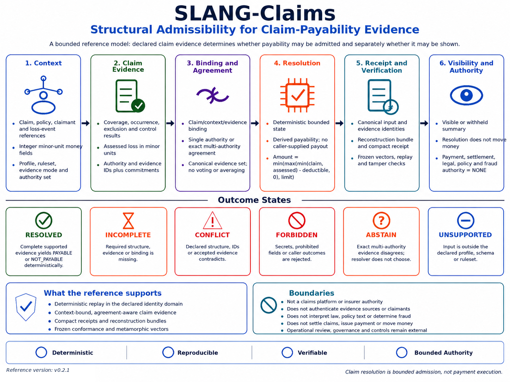

# SLANG-Claims

## **Deterministic Claim-Payability Admission from Declared Structure**

**SLANG-Claims does not authenticate claimants or evidence sources, interpret policy or law, determine fraud, settle claims, authorize payment, or move money. It resolves only a bounded structural claim-payability state under an identified versioned contract.**

SLANG-Claims v0.2.1 resolves declared claim context and bound claim-authority evidence under an explicit profile, ruleset, canonicalization contract, and bounded arithmetic profile.

The central relation is:

`declared claim context + bound claim-authority evidence + versioned rules -> bounded claim-payability state`

For admitted canonical structure:

`same admitted canonical structure + same versioned contract -> same bounded result`

For unsupported, incomplete, conflicting, forbidden, or non-authorized structure:

`insufficient admissible structure -> no forced PAYABLE outcome`

The reference keeps structural resolution separate from operational authority:

`PAYABLE != PAYMENT_AUTHORIZED`

`resolution != settlement`

`structural identity != source authenticity`

`authenticated artifact != real-world truth`

---

## **License and Use Notice**

Use of the SLANG-Claims reference implementation, verification artifacts, documentation, specifications, and diagram is subject to the [SLANG-Observatory LICENSE](../../LICENSE).

Provided as is, without warranty. SLANG-Claims is not an insurer, policy-administration system, source-authentication system, fraud-detection system, legal decision system, settlement engine, payment authority, banking system, accounting system, or regulatory certification.

---

## **Visual Overview**

[](SLANG-Claims-Reference-Diagram.png)

The diagram summarizes context binding, claim evidence, exact agreement, bounded resolution, reconstruction evidence, visibility, and the authority boundary. The detailed v0.2.1 contract additionally defines non-result attestations, machine-readable contract material, verification-scope separation, and an optional outer authenticity envelope.

---

## **Quick Links**

**Core & Verification:** [Core](slang_claims_v0_2_1.py) · [Vector Verifier](slang_claims_vectors_v0_2_1.py) · [Frozen Vectors](SLANG_Claims_Vectors_v0_2_1.json)

**Contract & Profile:** [Profile](SLANG_Claims_Profile_v0_2_1.txt) · [Contract](SLANG_Claims_Contract_v0_2_1.json) · [Schemas](schemas/)

**Authenticity:** [Authenticity Layer](slang_claims_signature_v0_2_1.py) · [Authenticity Profile](SLANG_Claims_Authenticity_Profile_v0_2_1.txt) · [Authenticity Contract](SLANG_Claims_Authenticity_Contract_v0_2_1.json)

**Visual:** [Reference Diagram](SLANG-Claims-Reference-Diagram.png)

---

## **Current Reference**

Version:

`0.2.1`

Core:

`SLANG-CORE-1-D05`

Profile:

`SLANG-CLAIMS-PROFILE-1-D03`

Ruleset:

`SLANG-CLAIMS-RULESET-1-D03`

Canonicalization:

`SLANG-CANONICAL-JSON-1-D02`

Authority evidence profile:

`CLAIM-AUTHORITY-EVIDENCE-1`

Quantum profile:

`CLAIM-QUANTUM-NET-AFTER-DEDUCTIBLE-CAP-1`

Contract:

`slang_claims_contract_sha256:dcc9fe86df0ded6930fe7c4116ba0f22e43220605d6a0bfd96b75c44f5f19d9a`

Identity domain:

`slang_claims_identity_domain_sha256:849c01acebc72403093ffa5e6878136d06a33cbb96ae2ab82827ec91e9cb999e`

Authenticity contract:

`slang_claims_authenticity_contract_sha256:1cfbe74fdf2d3efe9f9597aa01eb3f3a02560fc0698b4e3a53d668c1b2bd5a4f`

Schemas:

- input: `SLANG-CLAIMS-INPUT-1`
- result: `SLANG-CLAIMS-RESULT-1`
- bundle: `SLANG-CLAIMS-BUNDLE-1`
- receipt: `SLANG-CLAIMS-RECEIPT-1`
- summary: `SLANG-CLAIMS-SUMMARY-1`
- attestation: `SLANG-CLAIMS-ATTESTATION-1`
- contract: `SLANG-CLAIMS-CONTRACT-1`
- signed envelope: `SLANG-CLAIMS-SIGNED-ENVELOPE-1`
- keyset: `SLANG-CLAIMS-KEYSET-1`
- authenticity contract: `SLANG-CLAIMS-AUTHENTICITY-CONTRACT-1`
- verification report: `SLANG-CLAIMS-VERIFICATION-REPORT-1`

Target runtime:

`Python 3.9-compatible syntax; use a currently supported CPython release for operational testing`

Core dependencies:

`Python standard library only`

Authenticity envelope:

- HMAC-SHA256 path: Python standard library only
- Ed25519 path: optional `cryptography` package

---

## **Quick Verification**

Run the permanent core audit:

```bat
python -B slang_claims_v0_2_1.py --self-test
```

Expected:

```text
SLANG-Claims v0.2.1 self-test
TOTAL 101/101 PASS
```

Verify the frozen vector corpus:

```bat
python -B slang_claims_vectors_v0_2_1.py --verify SLANG_Claims_Vectors_v0_2_1.json
```

Expected:

```text
header: 1/1 reproduced
semantic: 88/88 reproduced
parser: 11/11 reproduced
relations: 13/13 reproduced
artifacts: 30/30 reproduced
serialization: 5/5 reproduced
reference_evidence: 6/6 reproduced
TOTAL: 154/154 PASS
VERIFY: PASS
```

Verify the canonical reconstruction bundle:

```bat
python -B slang_claims_v0_2_1.py --verify-bundle SLANG_Claims_Bundle_v0_2_1.json
```

Expected:

```text
BUNDLE_RECONSTRUCTION: PASS
OPERATIONAL_AUTHORITY: NONE
```

Check receipt structural integrity only:

```bat
python -B slang_claims_v0_2_1.py --check-receipt-integrity SLANG_Claims_Receipt_v0_2_1.json
```

Expected:

```text
RECEIPT_INTEGRITY: PASS
BUNDLE_CORRESPONDENCE: NOT_CHECKED
OPERATIONAL_AUTHORITY: NONE
```

Verify receipt correspondence against the exact bundle:

```bat
python -B slang_claims_v0_2_1.py --verify-receipt SLANG_Claims_Receipt_v0_2_1.json --against-bundle SLANG_Claims_Bundle_v0_2_1.json
```

Expected:

```text
RECEIPT_INTEGRITY: PASS
BUNDLE_CORRESPONDENCE: PASS
OPERATIONAL_AUTHORITY: NONE
```

Check the non-result attestation:

```bat
python -B slang_claims_v0_2_1.py --check-attestation-integrity SLANG_Claims_Attestation_v0_2_1.json
```

Verify it against its exact original input:

```bat
python -B slang_claims_v0_2_1.py --verify-attestation SLANG_Claims_Attestation_v0_2_1.json --against-input SLANG_Claims_ABSTAIN_Example_Input_v0_2_1.json
```

Run the optional authenticity-envelope audit:

```bat
python -B slang_claims_signature_v0_2_1.py --self-test
```

With the Ed25519 backend available, the current reference reports:

```text
TOTAL 46/46 PASS
```

Without the optional Ed25519 backend, the HMAC-only path remains runnable and currently reports `35/35 PASS`; the asymmetric group is cleanly unavailable rather than silently substituted.

---

## **Thirty-Second Demonstration**

Resolve the canonical example:

```bat
python -B slang_claims_v0_2_1.py --resolve SLANG_Claims_Example_Input_v0_2_1.json
```

The reference example uses:

`claim_amount_minor = 500000`

`assessed_loss_minor = 450000`

`deductible_minor = 100000`

`remaining_limit_minor = 1000000`

The frozen arithmetic profile computes:

`admitted_loss_minor = min(500000, 450000) = 450000`

`post_deductible_minor = max(450000 - 100000, 0) = 350000`

`payable_amount_minor = min(350000, 1000000) = 350000`

The resolved result is `PAYABLE`, while all operational authority exclusions remain `NONE`.

---

## **What v0.2.1 Strengthens**

The reference adds or hardens:

- withheld-outcome noninterference
- receipt integrity and bundle-correspondence separation
- exact receipt contract and authority invariant checking
- camelCase, separator, and compact forbidden-field recognition
- exhaustive versioned reason-code registry in the contract manifest
- portable attestations for non-result states
- machine-readable JSON Schemas for preflight validation
- machine-readable contract manifest with deterministic `contract_id`
- `--version` and `--describe-contract` introspection
- explicit verification vocabulary instead of generic double `PASS` output
- `ABSTAIN` for evaluation not authorized under the declared context
- optional detached authenticity envelopes for bundle, receipt, and attestation artifacts
- exact signer-set policy without voting, averaging, or ranking

---

## **What the Reference Resolves**

The bounded question is:

**Does the declared and bound claim evidence admit a PAYABLE or NOT_PAYABLE result under this exact profile and ruleset?**

A positive result requires supported declared evidence equivalent to:

`coverage_result = COVERED`

`occurrence_result = ESTABLISHED`

`exclusion_result = CLEAR`

`control_result = CLEAR`

and a positive amount under the frozen quantum profile.

The reference does not independently establish whether those declarations are true in the real world.

---

## **Bounded Claim Arithmetic**

Let:

`C = claim_amount_minor`

`A = assessed_loss_minor`

`D = deductible_minor`

`L = remaining_limit_minor`

The frozen reference arithmetic is:

`admitted_loss_minor = min(C, A)`

`post_deductible_minor = max(admitted_loss_minor - D, 0)`

`payable_amount_minor = min(post_deductible_minor, L)`

Equivalent form:

`payable_amount_minor = min(max(min(C, A) - D, 0), L)`

This is an identified reference profile, not universal insurance mathematics.

---

## **Evidence Modes**

### `SINGLE_AUTHORITY`

Exactly one expected authority and exactly one bound evidence record are required.

### `MULTI_AUTHORITY_EXACT_AGREEMENT`

Two or more expected authorities may be declared. Every expected authority must be represented exactly once, and admitted evidence must agree exactly on the bounded result fields.

`exact agreement -> continue`

`material disagreement -> ABSTAIN`

The resolver does not vote, average, rank authorities, or choose a majority.

---

## **Resolution States**

| State | Meaning in this reference |
|---|---|
| `RESOLVED` | supported structure yields `PAYABLE` or `NOT_PAYABLE` |
| `INCOMPLETE` | required structure or evidence is missing |
| `CONFLICT` | supported declarations or bindings cannot coexist |
| `FORBIDDEN` | prohibited material or caller-supplied derived authority/outcome fields are present |
| `UNSUPPORTED` | input is outside the exact versioned profile |
| `ABSTAIN` | evaluation is not authorized or exact multi-authority evidence materially disagrees |

`conflicts` contains only locations classified as `CONFLICT`. `ABSTAIN` is represented by the state and its reason codes rather than being mislabeled as a conflict.

Primary-state precedence is:

`FORBIDDEN > CONFLICT > UNSUPPORTED > INCOMPLETE > ABSTAIN > RESOLVED`

A non-result state does not silently become a denial or approval.

---

## **Resolution, Visibility, and Withheld-Outcome Noninterference**

Resolution and presentation are distinct.

For a resolved outcome with visibility authorized:

`visibility_state = VISIBLE`

For a resolved outcome with visibility withheld:

`visibility_state = WITHHELD`

The summary neutralizes outcome-dependent fields:

`admission_state = WITHHOLD`

`claim_outcome = NONE`

`currency = NONE`

`payable_amount_minor = 0`

`outcome_id = NONE`

`result_id = NONE`

`reason_codes = [OUTCOME_WITHHELD]`

The frozen vectors test the stronger property:

`withheld PAYABLE summary == withheld NOT_PAYABLE summary`

for otherwise presentation-equivalent cases.

This is presentation noninterference within the declared summary projection. It is not encryption or a general confidentiality mechanism.

---

## **Receipt Verification: Two Different Questions**

A compact receipt has two distinct verification scopes.

### Structural integrity

```bat
python -B slang_claims_v0_2_1.py --check-receipt-integrity RECEIPT.json
```

This checks the exact receipt field set, contract identifiers, authority exclusions, deterministic identity, state and outcome invariants, reason-code membership, arithmetic invariants, and receipt identity.

It deliberately reports:

`BUNDLE_CORRESPONDENCE: NOT_CHECKED`

### Exact bundle correspondence

```bat
python -B slang_claims_v0_2_1.py --verify-receipt RECEIPT.json --against-bundle BUNDLE.json
```

This reconstructs and verifies the bundle, validates the receipt, rebuilds the expected receipt, and requires exact canonical equality.

Therefore:

`receipt integrity != bundle correspondence`

`exit 0 from integrity checking != claim correctness`

`bundle correspondence != source authenticity`

`source authenticity != payment authority`

The safe integration path for a receipt is the bundle-correspondence verifier.

---

## **Portable Non-Result Attestations**

Non-result states are first-class evidence surfaces in v0.2.1.

`SLANG_Claims_Attestation_v0_2_1.json` demonstrates an `ABSTAIN` result.

An attestation records the bounded state, reason codes, diagnostics, contract identities, submission/result bindings, and fixed authority exclusions without pretending that a claim payout result exists.

Integrity check:

```bat
python -B slang_claims_v0_2_1.py --check-attestation-integrity ATTESTATION.json
```

Correspondence check:

```bat
python -B slang_claims_v0_2_1.py --verify-attestation ATTESTATION.json --against-input INPUT.json
```

The second operation regenerates the attestation from the exact input and requires exact equality.

`attestation integrity != input correspondence`

The artifact format supports `RESOLVED`, `INCOMPLETE`, `CONFLICT`, `FORBIDDEN`, `UNSUPPORTED`, and `ABSTAIN` states.

---

## **Strict Input Boundary and Forbidden-Field Defense**

The core uses an exact supported-field contract. Unknown fields are rejected; therefore the allowlist is the primary admission gate.

The forbidden-field recognizer is a defense-in-depth classifier. It recognizes ASCII separator, camelCase, and compact forms so representative names such as:

`bank_account`

`bank-account`

`bankAccount`

`bankaccount`

map to the forbidden-name family rather than relying on one spelling.

The same principle applies to representative card, government-identifier, secret, key, token, and caller-derived authority fields.

`strict allowlist = primary gate`

`forbidden-name recognition = defense-in-depth classification`

`field-name recognition != secret-content detection`

Values under recognized forbidden field names are replaced by a fixed redaction marker before the structural `submission_id` commitment is computed. Two otherwise identical forbidden inputs that differ only in the prohibited value therefore do not produce value-distinguishing submission commitments. This avoids turning the reference identity into a reusable digest of recognized secret material.

Unknown or permitted field values are not content-classified as secrets. Callers must still keep passwords, tokens, private keys, personal data, and other sensitive material out of every field.

The parser also rejects duplicate JSON object keys, floats, non-finite values, invalid UTF-8 file input, excessive depth, excessive node count, oversized strings/lists, non-string object keys, and integers outside the portable safe range.

---

## **Machine-Readable Contract**

`SLANG_Claims_Contract_v0_2_1.json` freezes a machine-readable declaration of:

- profile and ruleset identifiers
- core and canonicalization identifiers
- schema identifiers
- identity-domain identifier
- evidence modes
- resolution-state precedence
- outcome and admission symbols
- exhaustive reason-code registry
- resource limits
- authority exclusions
- receipt verification scopes
- attestation verification scopes
- forbidden-field matching model
- recognized forbidden-value commitment redaction
- preflight-schema scope
- frozen payable formula
- uniform library-entry portable/resource validation
- reason-code registry closure
- runtime compatibility statement

Its identity is:

`slang_claims_contract_sha256:dcc9fe86df0ded6930fe7c4116ba0f22e43220605d6a0bfd96b75c44f5f19d9a`

Introspection:

```bat
python -B slang_claims_v0_2_1.py --version
python -B slang_claims_v0_2_1.py --describe-contract
```

The contract manifest complements the human profile and frozen corpus. It does not replace executable verification.

`contract_id` is **not** the SHA-256 of the saved JSON file bytes. It is the domain-separated identity of the canonical contract manifest material with the `contract_id` field excluded, after which the identity is inserted into the artifact.

`contract_id != file_sha256`

---

## **Machine-Readable Schemas**

The `schemas/` folder supplies Draft 2020-12 JSON Schema documents for:

- input
- result
- reconstruction bundle
- compact receipt
- visibility-sensitive summary
- state attestation
- contract manifest
- signed envelope
- keyset
- authenticity contract
- verification report

Schema validation is **preflight only**.

It does not replace strict parser behavior, duplicate-key rejection, source-byte limits, canonicalization, cross-field semantics, identity reconstruction, artifact correspondence, authenticity verification, or authority checks.

---

## **Optional Authenticity Envelope**

The authenticity layer sits strictly outside the deterministic reconstruction artifacts.

`artifact -> outer signed envelope`

The enclosed bundle, receipt, or attestation remains the same JSON artifact value and retains the same canonical identity. The envelope does not insert signer- or time-dependent material into the bundle, receipt, or attestation.

The signed statement binds:

- contract identity
- artifact kind
- artifact schema
- artifact declared identity
- full canonical payload hash
- signing purpose
- signer identity
- key identity
- optional strict UTC `created_at`

The signed message is domain separated:

`b"SLANG-CLAIMS-SIGNATURE-1\x00" + canonical_json(statement)`

### Safe correspondence discipline

Signing a bundle requires successful bundle reconstruction.

Signing a receipt requires its exact bundle and successful receipt-to-bundle correspondence.

Signing an attestation requires its exact input and successful attestation-to-input correspondence.

The same correspondence requirement applies when a co-signature is added.

If the full verifier is asked to verify a receipt or attestation without the required correspondence artifact, aggregate verification fails before the signature phase and reports `AUTHENTICITY: NOT_CHECKED`.

This prevents a signer from using the reference signing command to attest a merely self-consistent receipt or attestation without the required correspondence evidence.

### HMAC-SHA256

HMAC is available with the Python standard library.

The reference requires at least `32` bytes of HMAC secret material. Length alone is not an entropy guarantee; deployments should use cryptographically random secret material rather than human-chosen passwords.

It provides message authentication inside a trust domain that shares the secret key.

It does **not** provide public verification. Every holder of the HMAC secret can create a valid HMAC.

HMAC keys are therefore private keyset material and are never emitted in a `PUBLIC` keyset.

### Ed25519

Ed25519 is available through an optional `cryptography` backend.

It provides asymmetric signature verification under a supplied public key. The public key can be placed in a distributable `PUBLIC` keyset while the private seed remains in a `PRIVATE` keyset.

The Ed25519 `key_id` is a domain-separated fingerprint of the public key and is itself committed by the signed statement.

Ed25519's deterministic signing behavior means fixed key + fixed statement -> fixed signature bytes.

A valid Ed25519 signature proves verification under the supplied public key. Whether that key belongs to a trusted organization or person is a separate trust-policy question.

`signature valid != trust root established`

`trusted signing key != real-world claim truth`

`real-world claim truth != payment authority`

### Freshness and key lifecycle

The envelope can bind an explicit `created_at`, but v0.2.1 does not impose a freshness window, nonce registry, key expiry, key rotation, revocation, certificate chain, or trust-root policy.

Those remain integration-plane responsibilities. The verifier reports both `FRESHNESS: NOT_EVALUATED` and `REPLAY_PROTECTION: EXTERNAL`.

### Authenticity contract

`SLANG_Claims_Authenticity_Contract_v0_2_1.json` freezes the optional envelope/key/signature contract separately from the deterministic claims contract. It exposes the HMAC secret floor, Ed25519 key sizes, supported payload kinds and algorithms, signature/keyset limits, timestamp grammar, replay/freshness boundary, trust-policy boundary, and authority exclusions.

Inspect it with:

```bat
python -B slang_claims_signature_v0_2_1.py --describe-authenticity-contract
```

The separation is deliberate:

`resolution contract != authenticity contract`

---

## **Authenticity Commands**

Generate an Ed25519 PRIVATE keyset:

```bat
python -B slang_claims_signature_v0_2_1.py --gen-ed25519 --signer-id SIGNER-E --output private_keyset.json
```

Derive a distributable PUBLIC keyset:

```bat
python -B slang_claims_signature_v0_2_1.py --public-view private_keyset.json --output public_keyset.json
```

Sign a reconstruction bundle:

```bat
python -B slang_claims_signature_v0_2_1.py --sign-bundle SLANG_Claims_Bundle_v0_2_1.json --private-keyset private_keyset.json --signer-id SIGNER-E --output bundle_envelope.json
```

Verify the signed bundle:

```bat
python -B slang_claims_signature_v0_2_1.py --verify-envelope bundle_envelope.json --keyset public_keyset.json
```

Sign a receipt, requiring the exact bundle:

```bat
python -B slang_claims_signature_v0_2_1.py --sign-receipt SLANG_Claims_Receipt_v0_2_1.json --against-bundle SLANG_Claims_Bundle_v0_2_1.json --private-keyset private_keyset.json --signer-id SIGNER-E --output receipt_envelope.json
```

Verify the signed receipt with both authenticity and correspondence:

```bat
python -B slang_claims_signature_v0_2_1.py --verify-envelope receipt_envelope.json --keyset public_keyset.json --against-bundle SLANG_Claims_Bundle_v0_2_1.json
```

Sign a state attestation, requiring its exact input:

```bat
python -B slang_claims_signature_v0_2_1.py --sign-attestation SLANG_Claims_Attestation_v0_2_1.json --against-input SLANG_Claims_ABSTAIN_Example_Input_v0_2_1.json --private-keyset private_keyset.json --signer-id SIGNER-E --output attestation_envelope.json
```

Verify it:

```bat
python -B slang_claims_signature_v0_2_1.py --verify-envelope attestation_envelope.json --keyset public_keyset.json --against-input SLANG_Claims_ABSTAIN_Example_Input_v0_2_1.json
```

A deliberately weaker command is available when only the envelope's structural payload integrity and signatures are being checked:

```bat
python -B slang_claims_signature_v0_2_1.py --check-envelope-authenticity envelope.json --keyset public_keyset.json
```

For receipt or attestation envelopes it reports correspondence as `NOT_CHECKED` unless the appropriate external artifact is supplied through the full verifier.

---

## **Exact Signer-Set Policy**

An envelope may carry multiple signatures. Verification can require an exact signer set:

```bat
python -B slang_claims_signature_v0_2_1.py --verify-envelope envelope.json --keyset public_keyset.json --require-signers SIGNER-A,SIGNER-B --exact-signer-set
```

The policy is non-forcing:

`all required signers valid and no unexpected signer -> policy satisfied`

`missing or unexpected or invalid signer -> verification fails`

There is no majority vote, signature weighting, averaging, or first-arrival rule.

The verification report keeps cryptographic authenticity and signer policy separate. A signature set can report `AUTHENTICITY: PASS` while an independently requested signer policy reports `SIGNER_POLICY: FAIL`; aggregate envelope verification then fails without mislabeling the signatures themselves. When no signer policy is requested, `SIGNER_POLICY: NOT_APPLIED`.

Keyset entries are stored in canonical order by `(signer_id, alg, key_id)`. Signature blocks are stored in canonical order by `(signer_id, alg, key_id, tbs_id, signature)`. Therefore, the same admitted key set or co-signature set does not acquire a different identity merely because entries or signatures were supplied in a different order.

`same signature set + same payload -> same canonical envelope`

---

## **Verification Scope Ladder**

The package deliberately prevents the word `verify` from silently acquiring operational meaning.

`SELF_CONSISTENT != CORRESPONDS`

`CORRESPONDS != AUTHENTICATED`

`AUTHENTICATED != REAL_WORLD_TRUE`

`REAL_WORLD_TRUE != AUTHORIZED_TO_ACT`

`PAYABLE != PAYMENT_AUTHORIZED`

Useful dimensions are:

1. **Structural integrity** - does the artifact satisfy its own exact versioned contract?
2. **Correspondence** - does it exactly correspond to the required reconstruction source?
3. **Authenticity** - does a valid signature or MAC bind the artifact to a supplied key identity?
4. **Trust policy** - is that key actually trusted for this integration at this time?
5. **Operational authority** - may an external system act on the result?

SLANG-Claims directly covers the first three only where the relevant commands and artifacts declare them. Trust policy and operational authority remain external.

---

## **Authority Boundary**

Every resolved result preserves:

`payment_authority = NONE`

`settlement_authority = NONE`

`legal_authority = NONE`

`policy_interpretation_authority = NONE`

`fraud_determination_authority = NONE`

`money_movement = NONE`

An authenticity envelope does not alter these constants.

---

## **Reference Files**

### Core and conformance

- [`slang_claims_v0_2_1.py`](slang_claims_v0_2_1.py)
- [`slang_claims_vectors_v0_2_1.py`](slang_claims_vectors_v0_2_1.py)
- [`SLANG_Claims_Vectors_v0_2_1.json`](SLANG_Claims_Vectors_v0_2_1.json)

### Canonical resolved evidence

- [`SLANG_Claims_Example_Input_v0_2_1.json`](SLANG_Claims_Example_Input_v0_2_1.json)
- [`SLANG_Claims_Bundle_v0_2_1.json`](SLANG_Claims_Bundle_v0_2_1.json)
- [`SLANG_Claims_Receipt_v0_2_1.json`](SLANG_Claims_Receipt_v0_2_1.json)

### Canonical non-result evidence

- [`SLANG_Claims_ABSTAIN_Example_Input_v0_2_1.json`](SLANG_Claims_ABSTAIN_Example_Input_v0_2_1.json)
- [`SLANG_Claims_Attestation_v0_2_1.json`](SLANG_Claims_Attestation_v0_2_1.json)

### Contract and profile

- [`SLANG_Claims_Profile_v0_2_1.txt`](SLANG_Claims_Profile_v0_2_1.txt)
- [`SLANG_Claims_Contract_v0_2_1.json`](SLANG_Claims_Contract_v0_2_1.json)

### Authenticity extension

- [`slang_claims_signature_v0_2_1.py`](slang_claims_signature_v0_2_1.py)
- [`SLANG_Claims_Authenticity_Profile_v0_2_1.txt`](SLANG_Claims_Authenticity_Profile_v0_2_1.txt)
- [`SLANG_Claims_Authenticity_Contract_v0_2_1.json`](SLANG_Claims_Authenticity_Contract_v0_2_1.json)

### Visual reference

- [`SLANG-Claims-Reference-Diagram.png`](SLANG-Claims-Reference-Diagram.png)

### Machine-readable schemas

- [`schemas/`](schemas/)
- [`SLANG_Claims_Input_Schema_v0_2_1.json`](schemas/SLANG_Claims_Input_Schema_v0_2_1.json)
- [`SLANG_Claims_Result_Schema_v0_2_1.json`](schemas/SLANG_Claims_Result_Schema_v0_2_1.json)
- [`SLANG_Claims_Bundle_Schema_v0_2_1.json`](schemas/SLANG_Claims_Bundle_Schema_v0_2_1.json)
- [`SLANG_Claims_Receipt_Schema_v0_2_1.json`](schemas/SLANG_Claims_Receipt_Schema_v0_2_1.json)
- [`SLANG_Claims_Summary_Schema_v0_2_1.json`](schemas/SLANG_Claims_Summary_Schema_v0_2_1.json)
- [`SLANG_Claims_Attestation_Schema_v0_2_1.json`](schemas/SLANG_Claims_Attestation_Schema_v0_2_1.json)
- [`SLANG_Claims_Contract_Schema_v0_2_1.json`](schemas/SLANG_Claims_Contract_Schema_v0_2_1.json)
- [`SLANG_Claims_Signed_Envelope_Schema_v0_2_1.json`](schemas/SLANG_Claims_Signed_Envelope_Schema_v0_2_1.json)
- [`SLANG_Claims_Keyset_Schema_v0_2_1.json`](schemas/SLANG_Claims_Keyset_Schema_v0_2_1.json)
- [`SLANG_Claims_Authenticity_Contract_Schema_v0_2_1.json`](schemas/SLANG_Claims_Authenticity_Contract_Schema_v0_2_1.json)
- [`SLANG_Claims_Verification_Report_Schema_v0_2_1.json`](schemas/SLANG_Claims_Verification_Report_Schema_v0_2_1.json)

No private key or shared secret is shipped with the reference package.

---

## **Command Reference**

Core version:

```bat
python -B slang_claims_v0_2_1.py --version
```

Contract introspection:

```bat
python -B slang_claims_v0_2_1.py --describe-contract
python -B slang_claims_signature_v0_2_1.py --describe-authenticity-contract
```

Resolve input:

```bat
python -B slang_claims_v0_2_1.py --resolve INPUT.json
```

Visibility-sensitive summary:

```bat
python -B slang_claims_v0_2_1.py --summary INPUT.json
```

Build bundle:

```bat
python -B slang_claims_v0_2_1.py --bundle INPUT.json --output BUNDLE.json
```

Verify bundle:

```bat
python -B slang_claims_v0_2_1.py --verify-bundle BUNDLE.json
```

Build receipt:

```bat
python -B slang_claims_v0_2_1.py --receipt BUNDLE.json --output RECEIPT.json
```

Check receipt integrity only:

```bat
python -B slang_claims_v0_2_1.py --check-receipt-integrity RECEIPT.json
```

Verify receipt correspondence:

```bat
python -B slang_claims_v0_2_1.py --verify-receipt RECEIPT.json --against-bundle BUNDLE.json
```

Build state attestation:

```bat
python -B slang_claims_v0_2_1.py --attestation INPUT.json --output ATTESTATION.json
```

Check attestation integrity only:

```bat
python -B slang_claims_v0_2_1.py --check-attestation-integrity ATTESTATION.json
```

Verify attestation correspondence:

```bat
python -B slang_claims_v0_2_1.py --verify-attestation ATTESTATION.json --against-input INPUT.json
```

Verify frozen vectors:

```bat
python -B slang_claims_vectors_v0_2_1.py --verify SLANG_Claims_Vectors_v0_2_1.json
```

Authenticity commands are documented in the earlier authenticity section and in `SLANG_Claims_Authenticity_Profile_v0_2_1.txt`.

Machine-readable envelope verification report:

```bat
python -B slang_claims_signature_v0_2_1.py --verify-envelope ENVELOPE.json --keyset PUBLIC_KEYSET.json --report-json verification_report.json
```

The report keeps `PAYLOAD_INTEGRITY`, `CORRESPONDENCE`, `AUTHENTICITY`, `SIGNER_POLICY`, `FRESHNESS`, `REPLAY_PROTECTION`, and `TRUST_POLICY` as separate states.


---

## **Command-Line Exit and Error Contract**

Core command exit codes are:

`0 = requested command completed successfully`

`1 = self-test or artifact-verification failure`

`2 = runtime, input, JSON, I/O, or command-resolution error`

Exit code `0` from `--resolve` or `--summary` means the command executed. It does not mean `PAYABLE`, payment authorized, source authenticated, or real-world correctness established.

The authenticity utility follows the same broad convention: success, verification failure, and runtime/usage error remain distinct from operational authority.

---

## **What a Passing Verification Means**

A passing core self-test or frozen-vector verification establishes agreement with the supplied implementation and frozen reference corpus.

A passing bundle verifier establishes deterministic reconstruction under the identified contract.

A passing receipt integrity check establishes only receipt structural integrity and declared invariants.

A passing receipt-to-bundle verification establishes exact correspondence to a verified reconstruction bundle.

A passing attestation integrity check establishes only attestation structural integrity.

A passing attestation-to-input verification establishes exact correspondence to the provided input under this resolver.

A passing authenticity-envelope verification establishes signature/MAC validity under the supplied key material and, for receipt or attestation envelopes, correspondence only when the required bundle or input is also provided to the full verifier.

None of these establish source truth, identity ownership, policy correctness, legal entitlement, fraud clearance, regulatory approval, key trust, settlement authority, payment authority, or operational safety.

---

## **Verification Status**

The supplied v0.2.1 package currently completes:

- core self-test: `101/101 PASS`
- frozen conformance corpus: `154/154 PASS`
- reconstruction bundle verification: `PASS`
- receipt integrity verification: `PASS`
- receipt-to-bundle correspondence: `PASS`
- non-result attestation integrity: `PASS`
- attestation-to-input correspondence: `PASS`
- authenticity-envelope audit with Ed25519 backend: `46/46 PASS`
- observed optional backend environment: `cryptography 46.0.4 on Python 3.13.5`
- HMAC-only authenticity path with Ed25519 unavailable: `35/35 PASS`
- Draft 2020-12 schema validation for canonical input, result, bundle, receipt, summary, attestation, core contract, authenticity contract, public keyset, signed envelope, and verification report: `PASS`
- Python 3.9 grammar compatibility for the supplied scripts: `PASS`
- observed package execution in the supplied verification environment: `Python 3.13.5 PASS`

These results apply only to the supplied implementation, artifacts, profiles, schemas, contract manifest, and declared test boundary.

---

## **High-Assurance Structural Design Principle**

Large systems become easier to audit when each artifact answers separate questions:

`What structure was admitted?`

`What versioned contract resolved it?`

`What bounded result or non-result followed?`

`What artifact corresponds to that computation?`

`Who, if anyone, authenticated the artifact?`

`What external authority, if any, may act?`

The design principle is:

`resolution evidence should be reconstructable`

`non-result evidence should be portable`

`authenticity should wrap artifacts without changing deterministic reconstruction`

`trust should be explicit`

`execution authority should remain external and explicit`

---

## **Bounded Claim**

The strongest supported claim of this folder is:

`same admitted canonical claim structure + same versioned contract -> same bounded claim result`

When admitted structure is not sufficient:

`non-result state -> no forced PAYABLE outcome`

When a portable artifact is checked:

`artifact integrity != correspondence != authenticity != operational authority`

SLANG-Claims is a deterministic structural-resolution reference. It is not a production claims engine or an insurance-law authority.

---

## **Final Statement**

SLANG-Claims separates six concerns that conventional systems often blend:

`evidence -> structural admission -> bounded resolution -> presentation -> verification -> optional authenticity`

and keeps all of them separate from:

`settlement -> payment authorization -> money movement`

The workflow may still exist.

The insurer may still govern.

The payment system may still execute.

Within the declared reference model, workflow order is not the sole source of the bounded result, non-result states remain verifiable, and authenticity can be added without entering the deterministic reconstruction boundary.
