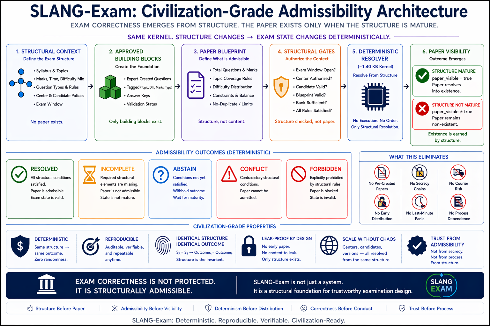

# ⭐ **SLANG-Exam**

## **Question Paper Visibility Without Pre-Created Papers — Structural Resolution Kernel**

**Proven in ~1.40 KB**

No pre-created final assembled paper.  
No early distribution surface.  
No sealed-envelope secrecy chain.  
No last-minute reconciliation pressure.  

Only structure — and the final assembled paper becomes structurally visible only when the exam structure is mature.

This is not paper protection by hiding.

This is structural non-visibility before maturity.  
This is admissibility from structure.

No forced visibility.  
No premature existence.  
No dependency.

`correctness = structure`  
`paper_visible iff structure_mature`  
`structure_mature = complete AND consistent`

> **Note:** Throughout this README, "structure" refers to the complete, declared, and consistent set of conditions governing whether the final assembled paper may become structurally visible — including blueprint validity, authorization rules, question-bank sufficiency, and exam-window conditions.

> Structure here does not mean formatting, layout, or visual arrangement.

The paper is not hidden.  
It is structurally non-existent before maturity.

The paper is not delayed.

It is not partially hidden.

It is not waiting in encrypted storage.

It does not yet exist as a final admissible object.

`paper existence is earned by structure`

This is the key structural shift.

Traditional systems attempt to protect a paper that already exists.

SLANG-Exam removes the early final-assembled paper itself as a dependency.

`No early assembled object -> no early assembled-paper leak surface`

---

# 🧭 **Civilization-Grade Admissibility Architecture**



The final assembled paper is not treated as a pre-created object.

Only:

- approved structure  
- admissibility rules  
- authorization conditions  
- structural maturity  

exist before the exam.

`paper_visible iff structure_mature`

The final assembled paper becomes structurally visible only when the structure becomes complete and consistent.

---

# ⚠️ **Important Clarification**

This is not a full examination platform.

It is a structural admissibility kernel.

SLANG-Exam does not replace:

- examination boards  
- universities  
- invigilators  
- academic authorities  
- evaluation systems  
- regulatory governance  
- teachers or subject experts  

Students still take exams.  
Experts still create questions.  
Boards still define syllabus, marks, rules, difficulty, and evaluation policy.

This kernel demonstrates only one invariant:

`paper_visible iff structure_mature`

Real-world deployment, governance, academic integrity, and examination operations remain the responsibility of official educational institutions.

---

# ⚡ **The Claim**

A valid exam paper can become structurally visible without:

- pre-created final assembled papers  
- sealed-envelope secrecy chains  
- early assembled-paper storage  
- forced paper existence  
- courier dependency  
- premature visibility  

when structure is sufficient.

---

# 🧠 **The Idea**

Traditional examination systems assume:

- the final assembled paper must exist early  
- the paper must be stored securely  
- secrecy chains are unavoidable  
- distribution workflows are required  
- emergency replacement papers are necessary  
- paper exposure risk is inevitable  

SLANG-Exam shows:

Paper visibility does not emerge from secrecy workflows.

It emerges from structure.

The final assembled paper is not exposed because it exists.

It becomes structurally visible only when the examination structure is mature.

---

# 🧠 **Structural Maturity Gate**

A final assembled paper becomes structurally visible only when:

- `window_valid`  
- `center_valid`  
- `candidate_valid`  
- `blueprint_valid`  
- `bank_ready`  

are satisfied.

Therefore:

`structure_mature = complete AND consistent`

and:

`paper_visible iff structure_mature`

The paper is not triggered by storage.  
It is admitted only after structural maturity.

---

# 🌍 **A World Built on Pre-Created Papers**

Modern examination systems rely on:

- pre-created final papers  
- secrecy chains  
- printing centers  
- sealed envelopes  
- storage rooms  
- distribution networks  
- human access controls  
- emergency backup papers  

Each treated as required.

But:

What if the final assembled paper itself is not the source of examination correctness?

What if correctness is preserved by structure?

---

# 🔄 **The Shift**

Across domains:

`correctness does not depend on workflow`  
`paper visibility does not depend on secrecy chains`  
`trust does not depend on premature paper existence`

It is preserved by:

**structure**

For examinations:

`question paper visibility -> remove early assembled-paper dependency -> structure remains -> examination correctness preserved`

---

# 🌍 **Traditional vs Structural Examination**

| Traditional Examination | SLANG-Exam |
|---|---|
| create paper → store → distribute → protect → exam | create structure → approve rules → resolve paper at exam time |
| final assembled paper exists early | final assembled paper becomes visible only after maturity |
| secrecy chain required | structure alone determines visibility |
| leak risk unavoidable | no early assembled paper exists to leak |
| emergency paper dependency | admissibility gating |
| process-dependent trust | structure-dependent trust |

Result:

The final assembled paper becomes structurally visible only when structure is complete AND consistent.

No forced existence.  
No premature visibility.  
No unsafe exposure.
---

# ⚠️ **Read This Carefully**

This is not a better examination workflow.  
This is not a faster exam system.

This is dependency elimination.

`paper_visibility` does not depend on early final-assembled-paper existence.  
Trust does not depend on secrecy chains.  
It never did.

---

# ⚡ **The Critical Line**

Question paper visibility  
→ remove early final-assembled-paper dependency  
→ structure remains  
→ admissible examination preserved

Nothing was improved.  
Nothing was replaced.  
Only the dependency was removed.

No pre-created final assembled paper.  
No forced visibility.  
No early assembled-paper leak surface.

---

# 🧩 **Structural Collapse Guarantee**

This kernel does not modify classical examination correctness.

It preserves it.

`phi((m, a, s)) = m`

Where:

- `m` = classical examination outcome  
- `a` = alignment  
- `s` = structural state  

When structure is complete and consistent,  
the visible paper aligns with structurally admissible examination truth.

No approximation.  
No reinterpretation.  
No forced existence.

Only structural revelation.

---

# ⚠️ **Question Bank Clarification**

SLANG-Exam addresses the early final-assembled-paper exposure surface.

The approved question bank remains a separate operational and security responsibility.

This includes:

- access controls  
- governance oversight  
- expert vetting  
- secure storage  

This kernel governs when the final assembled paper becomes structurally visible.

It does not replace question-bank security.

These are complementary — not competing — responsibilities.

---

# 🧱 **Dependency Elimination**

| Domain | Removed Dependency | What Preserves Correctness |
|---|---|---|
| Examination Visibility | Pre-created final assembled paper / secrecy workflow | Structure |

---

# ⚡ **The Full Structural Process**

## **1. Structural Context**

The examination authority defines:

- syllabus  
- topics  
- marks  
- difficulty mix  
- question types  
- time limits  
- exam policies  

Example:

- 30% algebra  
- 20% geometry  
- 20% reasoning  
- 30% application problems  

At this stage:

No final assembled paper exists.

Only structure exists.

---

## **2. Approved Building Blocks**

Experts prepare approved questions.

Each question contains structural tags:

- topic  
- marks  
- difficulty  
- format  
- expected time  
- answer key  
- approval status  

Example:

`Q101 -> Algebra, Medium, 2 marks, MCQ, approved`

Still:

No final assembled paper exists.

Only approved building blocks exist.

---

## **3. Paper Blueprint**

The system defines admissibility rules:

`total_questions = 10`  
`total_marks = 20`  
`easy = 3`  
`medium = 5`  
`hard = 2`

`must_include = ["algebra", "geometry"]`

This blueprint is structure.

Not content.

---

## **4. Structural Storage**

The question bank may exist securely.

But:

there is no single final assembled paper object.

Only:

- approved question bank  
- blueprint  
- admissibility rules  
- authorization structure  

exist before the exam.

The final assembled paper does not yet exist.

---

## **5. Structural Approval**

Before exam day, authorities approve:

- syllabus structure  
- blueprint validity  
- authorization rules  
- center eligibility  
- candidate/session conditions  
- visibility window  

They approve the structure.

Not one fixed final assembled paper.

---

## **6. Structural Maturity Check**

At official exam time, the resolver checks:

- Is the exam window open?  
- Is the center authorized?  
- Is the candidate valid?  
- Is the blueprint valid?  
- Are enough approved questions available?  
- Are all structural rules satisfied?  

Only then:

`paper_visible = true`

Otherwise:

No final assembled paper appears.

No forced output.  
No unsafe visibility.  
No guess.

Absence is a valid structural state.

---

## **7. Structural Resolution**

The final assembled paper becomes structurally visible only when:

`structure_mature = complete AND consistent`

The system may resolve:

- one common paper  
- center-specific equivalent papers  
- candidate-specific equivalent papers  

All remain structurally equivalent.

Equivalent papers must satisfy identical structural constraints:

- topic coverage  
- marks distribution  
- difficulty balance  
- time expectation  
- format rules  

If these differ:

the structure is different.

`same declared structure -> same resolved outcome`

Fairness is preserved through structure.

---

### ⚖️ **Structural Fairness Clarification**

Different papers remain admissible only when their identity is itself part of the declared structure.

Equivalent papers must satisfy identical structural constraints:

- topic coverage  
- marks distribution  
- difficulty balance  
- time expectations  
- format rules  

If these differ:

the structure is different.

`same declared structure -> same resolved outcome`

Fairness is preserved structurally — not merely through identical paper text.

---

## **8. Structural Visibility**

At exam start:

- online paper appears  
- printable paper unlocks  
- center receives the resolved version  

Before that:

No complete final assembled paper exists to leak.

---

## **9. Structural Identity**

Each resolved paper may contain:

- `exam_id`  
- `center_id`  
- `candidate_id`  
- `paper_version`  
- `question_set_hash`  

This enables:

- tamper detection  
- replay verification  
- auditability  
- deterministic identity  

`same structure -> same paper_identity`

---

## **10. Structural Evaluation**

Evaluation links directly to the resolved structure.

The system knows:

- which candidate received which questions  
- which answer key applies  
- whether the resolved paper was structurally valid  
- whether maturity conditions were satisfied  

This prevents mismatch ambiguity.

---

# ⚡ **30-Second Proof**

```
python slang_exam.py
```

---

# 🔍 **You will observe**

- final assembled paper visibility emerges from structure  
- no pre-created final assembled paper required  
- no secrecy chain required  
- no early visibility required  
- incomplete structure → no paper  
- invalid structure → no paper  
- unauthorized structure → no paper  
- identical structure → identical paper visibility

---

# 🔬 **Break the Structure — Safety in Action**

## **Test 1 — Exam Window Closed**

Change:

`"exam_time": "closed"`

Result:

- `window_valid` disappears  
- `paper_visible` disappears  
- `question_paper` disappears  

The paper does not appear before the structurally valid exam window.

---

## **Test 2 — Unauthorized Center**

Change:

`"center_authorized": "false"`

Result:

- `center_valid` disappears  
- `paper_visible` disappears  
- `question_paper` disappears  

Unauthorized centers cannot reveal the paper.

---

## **Test 3 — Insufficient Question Bank**

Change:

`"approved_questions": ["Q1", "Q2", "Q3"]`

Result:

- `bank_ready` disappears  
- `paper_visible` disappears  
- `question_paper` disappears  

The system refuses incomplete paper construction.

`missing structure -> no paper`

---

## **Test 4 — Invalid Blueprint**

Change:

`"total_questions": 4`

Result:

- `blueprint_valid` disappears  
- `paper_visible` disappears  
- `question_paper` disappears  

The final assembled paper does not become structurally visible when the blueprint itself is structurally invalid.

---

## **Test 5 — Rule Reordering**

Reorder the rules → run again

Result:

`same structure -> same paper_visibility`

Workflow never mattered.

Structure did.

---

# ⚡ **Structural Absence Principle**

If structure is not complete and consistent:

`-> paper visibility does not exist`

This is not delay.  
This is not failure.

This is structural absence.

`absence ≠ failure`  
`absence = truth`

The system refuses to expose final assembled papers unsupported by structure.

---

# 🔐 **The Examination Twist**

In traditional systems:

`absence of paper = operational failure`

Here:

absence of a final assembled paper is a structurally valid state.

No false paper.  
No forced visibility.  
No premature existence.

Only what reaches structural maturity becomes structurally visible.

---

# 💻 **The Code (~1.40 KB)**

See `slang_exam.py` in this folder — the complete structural examination admissibility kernel.

---

# 🔍 **What Just Happened**

A tiny resolver propagated examination relationships until structure stabilized.

No secrecy chain.  
No pre-created final assembled paper.  
No forced visibility.

Only:

`paper_visibility = resolve(structure)`

The system resolves until structural maturity is reached.

Structure resolves.

It does not generate.

The final assembled paper is not a pre-declared object.

It becomes structurally visible only after structural maturity.

No randomness.  
No hidden workflow.  
No forced selection logic.

Only structural admissibility.

---

# 🔐 **Structural Fairness Clarification**

Different papers are valid only when their identity is itself part of the declared structure.

Center-specific or candidate-specific papers remain admissible only if:

- structural constraints remain identical  
- admissibility rules remain identical  
- blueprint integrity remains identical  

Fairness is preserved structurally — not through identical paper text alone.

---

# 🧠 **Core Structural Properties**

`same declared structure -> same paper_visibility`  
`different paper_visibility -> structure must differ`

- order independent  
- deterministic  
- idempotent  

`structure_mature -> paper_visible`  
`¬structure_mature -> no paper_visibility`

---

# 🔐 **Deterministic Guarantee**

`same declared structure -> same paper_visibility -> same paper_identity`

No workflow, distribution sequence, or rule ordering  
can alter this invariant.

---

# 🔐 **Structural Property**

`same declared structure -> same paper_visibility`  
`same declared structure -> same resolved paper_state`

`incomplete structure -> no paper`  
`unauthorized structure -> no paper`  
`invalid structure -> no paper`

If visibility changes, the structure changed.

---

# 🛡 **Safety Model**

| Condition | Result |
|---|---|
| complete + consistent | paper visible |
| incomplete | no paper visibility |
| invalid / conflicting | no forced paper |

No guessing.  
No premature visibility.  
No unsafe exposure.

---

# 📌 **Structural Evidence**

The declared structure itself is sufficient proof.

No secrecy pressure  
No forced publication  
No artificial visibility  

Inspect structure → verify paper admissibility

`same declared structure -> same paper_visibility`

The structure itself becomes the audit surface.

Not:

- secrecy chains  
- transport logs  
- human custody chains  
- courier evidence  
- emergency workflows  

Inspect structure -> verify paper admissibility

`structure = evidence`

---

# 🔐 **The Structural Identity Twist**

In traditional systems:

paper identity is attached after creation.

Here:

paper identity emerges from structure itself.

`same declared structure -> same paper_identity`

Identity is not externally imposed.

It is structurally resolved.

---

# ⚡ **What This Tiny Kernel Shows**

Even in ~1.40 KB:

- paper visibility emerges deterministically from structure  
- no pre-created final assembled paper is required  
- unauthorized centers cannot expose papers  
- incomplete blueprints block visibility  
- insufficient question banks block visibility  
- order independence holds  
- deterministic replay identity is preserved  
- absence of paper is a valid structural state  
- the final assembled paper resolves from structure, not storage

---

# ⚠️ **Important Demo Clarification**

In this minimal demo:

`approved_questions`

are symbolic placeholders used only to expose structural relationships.

In real deployment:

- question banks remain protected  
- governance remains external  
- selection logic becomes part of declared structure  

The purpose of the kernel is not to implement a full examination platform.

The purpose is to demonstrate the invariant:

`paper_visible iff structure_mature`

---

# 🌍 **What This Implies**

If this model scales:

- reduced early assembled-paper exposure  
- lower secrecy-chain dependency  
- structurally auditable examination visibility  
- deterministic replay identity for paper states  
- safer admissibility gating before visibility  
- structural silence instead of unsafe forced papers

---

# 🌍 **Why This Matters**

- reduces dependency on early final-assembled-paper existence  
- reduces secrecy-chain exposure  
- enables structural auditability (`structure = evidence`)  
- prevents unsupported paper visibility  
- introduces admissibility before visibility  

This is not optimization.

This is dependency elimination.

---

# ⚠️ **What This Is / Is Not**

## **IS**

- minimal structural proof  
- deterministic admissibility kernel  
- dependency elimination demonstration  
- examination visibility maturity demonstration  

## **IS NOT**

- full examination platform  
- academic governance replacement  
- production examination engine  
- institutional bypass mechanism

---

# 🌍 **Where This Could Matter Most**

Many large-scale examination failures share the same structural pattern:

the final assembled paper exists before exam time.

That early existence creates an exposure surface across:

- printing  
- transport  
- storage  
- distribution  
- server exposure  

SLANG-Exam targets this early final-assembled-paper dependency for correctness.

If independently validated and institutionally adopted, this approach could reduce exposure created by premature final assembled-paper visibility — while preserving governance, fairness, and examination integrity.

Question-bank security, institutional governance, implementation security, and operational controls remain separate responsibilities.

---

# 🔍 **Execution Clarification**

This kernel runs as a program.

But:

execution is not the source of paper admissibility.

Paper visibility is determined by structure.  
Execution is only the substrate.

Execution reveals the visibility state, but does not determine it.

---

# 🔭 **Observatory Insight**

This demo does not produce full examination systems.

It answers:

**Is this final assembled paper structurally admissible to exist?**

The paper is not forced into visibility.

It is admitted.

---

# ⚡ **The Important Part**

This is not the full SLANG system.

This is the smallest visible edge of a much larger structural shift.

This tiny kernel shows that final assembled question-paper visibility can resolve as pure structure.

Paper visibility becomes structural admissibility.

---

# 🌍 **Governance Made Structurally Visible**

SLANG-Exam is not governance removal.

It is governance expressed as admissibility structure.

Authorities still define:

- syllabus  
- rules  
- validity  
- fairness constraints  
- authorization conditions  

But instead of approving one fixed final assembled paper early:

they approve the structure from which admissible papers may emerge.

This reduces unnecessary exposure while preserving institutional authority.

---

# ❓ **Universality Clarification**

The kernel is universal.

Only the rules change.

Examples:

- school board exams -> syllabus coverage rules  
- entrance exams -> ranking constraints  
- certification exams -> competency thresholds  
- university exams -> subject-specific admissibility  

The structural engine remains unchanged.

Only the declared structure evolves.

---

# 🌍 **A Deeper Principle**

SLANG-Exam demonstrates a broader structural principle within the Shunyaya framework:

`correctness emerges from structure`

not from:

- secrecy chains  
- process pressure  
- storage dependency  
- forced visibility  
- workflow escalation  

The final assembled paper becomes structurally visible only when the declared structure is complete and consistent.

---

# 🧭 **Final Insight**

Question paper visibility does not require pre-created final assembled papers.

It requires sufficient structure.

Systems do not enforce examination trust.  
They reveal it.

---

# ⭐ **Final Line**

The final assembled paper exists only when it is allowed to exist.

Forced early paper existence becomes optional.  
Structure becomes fundamental.

This tiny kernel shows the boundary.

What you are seeing is not the full examination system.

It is the edge of a new structural admissibility model.

This is not examination optimization.

This is dependency elimination.
