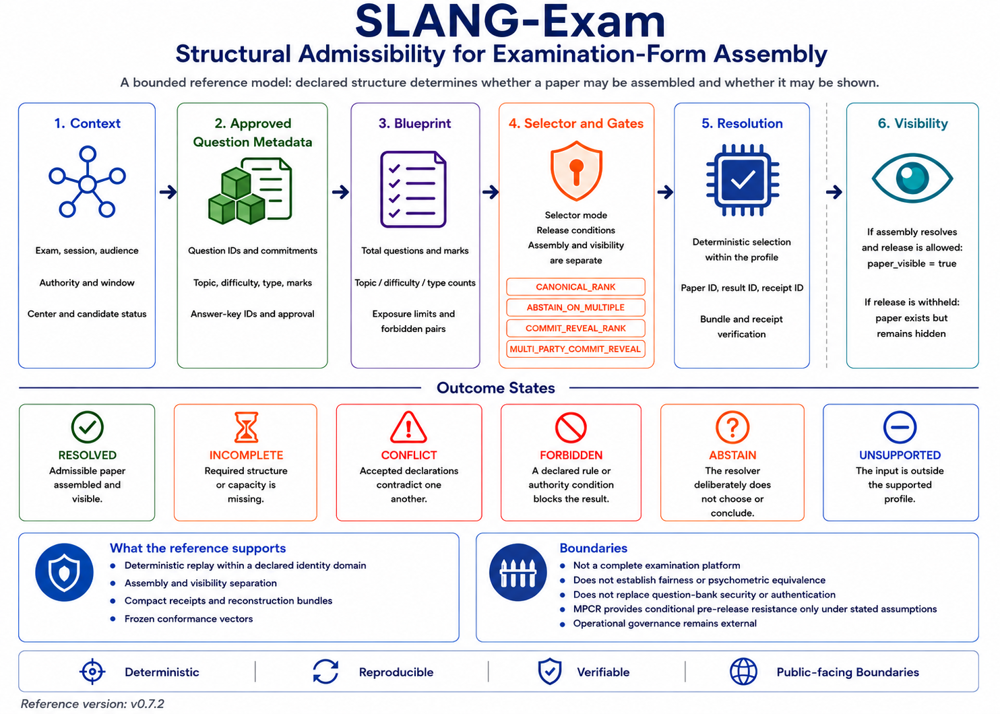

# SLANG-Exam

## Structural Admissibility for Deterministic Examination-Form Assembly

SLANG-Exam is a bounded reference demonstration within SLANG-Observatory.

It separates questions that are often combined:

1. Is the submitted examination structure supported and complete?
2. Is the declared examination context admitted?
3. Can approved question-bank metadata satisfy the declared blueprint?
4. Which admissible paper is selected under the declared selector?
5. Is the assembled paper admitted for visibility?
6. Can the result be reconstructed and verified from preserved evidence?

The governing relation is:

`exam_result = resolve(submitted_input, versioned_profile, versioned_ruleset)`

For a conclusive semantic resolution:

`same canonical input + same identity domain + same semantic resolution -> same result_id`

Exact reference replay is stricter:

`same canonical input + same reference rules and traversal contract -> same result and search evidence`

SLANG-Exam does not claim that examination quality, fairness, confidentiality,
authentication, institutional authority, or operational security can be reduced
to this resolver.

---

## License and Use Notice

The SLANG-Exam reference implementation and verification artifacts are free to use, copy, modify, test, study, and redistribute without a license fee, subject to the [SLANG-Observatory LICENSE](../../LICENSE).

Architecture materials, documentation, specifications, diagrams, and explanatory content are subject to CC BY-NC 4.0 as stated in the LICENSE.

Provided as is, without warranty. SLANG-Exam is not an operational examination system, security mechanism, certification process, or institutional authority.

---

## 🧭 **Visual Overview**



---

## Current Reference

- Version: `0.7.2`
- Python: `3.9+`
- Dependencies: Python standard library only
- Reference script: [`slang_exam_v0_7_2.py`](slang_exam_v0_7_2.py)
- Vector utility: [`slang_exam_vectors_v0_7_2.py`](slang_exam_vectors_v0_7_2.py)
- Frozen vectors: [`SLANG_Exam_Vectors_v0_7_2.json`](SLANG_Exam_Vectors_v0_7_2.json)
- MPCR profile: [`SLANG_Exam_MPCR_Profile_v0_7_2.txt`](SLANG_Exam_MPCR_Profile_v0_7_2.txt)
- Input schema: `SLANG-EXAM-INPUT-5`
- Result schema: `SLANG-EXAM-RESULT-5`
- Bundle schema: `SLANG-EXAM-BUNDLE-5`
- Receipt schema: `SLANG-EXAM-RECEIPT-4`
- Vector schema: `SLANG-EXAM-VECTORS-4`
- Canonicalization profile: `SLANG-CANONICAL-JSON-1-D02`
- Core version: `SLANG-CORE-1-D03`
- Profile: `SLANG-EXAM-PROFILE-1-D05`
- Ruleset: `SLANG-EXAM-RULESET-1-D05`
- Self-test: `127/127 PASS`
- Frozen semantic vectors: `56/56 reproduced`
- Reference evidence vectors: `56/56 reproduced`
- Metamorphic relations: `10/10 reproduced`
- Bounded-search probes: `3/3 reproduced`

---

## Quick Verification

Run the permanent audit:

```bat
python -B slang_exam_v0_7_2.py --self-test
```

Expected summary:

```text
TOTAL                127/127 PASS
```

Verify the frozen vectors:

```bat
python -B slang_exam_vectors_v0_7_2.py --verify SLANG_Exam_Vectors_v0_7_2.json
```

Expected summary:

```text
semantic vectors: 56/56 reproduced
reference evidence: 56/56 reproduced
relations: 10/10 reproduced
search probes: 3/3 reproduced
VERIFY: PASS
```

Run semantic-only conformance verification:

```bat
python -B slang_exam_vectors_v0_7_2.py --verify SLANG_Exam_Vectors_v0_7_2.json --semantic-only
```

Expected summary:

```text
semantic vectors: 56/56 reproduced
reference evidence: not required
relations: 10/10 reproduced
search probes: not required
VERIFY: PASS
```

Run the default reference case:

```bat
python -B slang_exam_v0_7_2.py
```

Run the MPCR example:

```bat
python -B slang_exam_v0_7_2.py --input SLANG_Exam_MPCR_Example_Input_v0_7_2.json
```

---

## Reference Files

### Core and conformance

- [`slang_exam_v0_7_2.py`](slang_exam_v0_7_2.py)
- [`slang_exam_vectors_v0_7_2.py`](slang_exam_vectors_v0_7_2.py)
- [`SLANG_Exam_Vectors_v0_7_2.json`](SLANG_Exam_Vectors_v0_7_2.json)

### Canonical reference evidence

- [`SLANG_Exam_Bundle_v0_7_2.json`](SLANG_Exam_Bundle_v0_7_2.json)
- [`SLANG_Exam_Receipt_v0_7_2.json`](SLANG_Exam_Receipt_v0_7_2.json)

### Multi-party commit-reveal evidence

- [`SLANG_Exam_MPCR_Example_Input_v0_7_2.json`](SLANG_Exam_MPCR_Example_Input_v0_7_2.json)
- [`SLANG_Exam_MPCR_Bundle_v0_7_2.json`](SLANG_Exam_MPCR_Bundle_v0_7_2.json)
- [`SLANG_Exam_MPCR_Receipt_v0_7_2.json`](SLANG_Exam_MPCR_Receipt_v0_7_2.json)
- [`SLANG_Exam_MPCR_Profile_v0_7_2.txt`](SLANG_Exam_MPCR_Profile_v0_7_2.txt)

### Visual reference

- [`SLANG-Exam-Reference-Diagram.png`](SLANG-Exam-Reference-Diagram.png)

The reference script can run without the frozen vector JSON.

The vector utility requires the reference script and requires the frozen vector
JSON when `--verify` is used.

---

## What the Reference Resolves

The reference accepts:

- an examination context
- a paper blueprint
- a selector declaration
- approved question-bank metadata
- optional declared bank and blueprint identities
- selector-specific commitment evidence

It resolves:

- portable input admission
- input validity
- audience-context consistency
- scope-sensitive assembly authority
- blueprint capacity
- cross-constraint satisfiability
- deterministic paper selection
- multiplicity evidence
- release admission
- paper visibility
- selector evidence
- deterministic identities
- reconstruction bundles
- compact receipts

The reference question bank contains metadata and content commitments. It does
not contain question text.

---

## Resolution States

The resolver may return:

- `RESOLVED`
- `INCOMPLETE`
- `CONFLICT`
- `FORBIDDEN`
- `UNSUPPORTED`
- `ABSTAIN`

### `RESOLVED`

The submitted structure is supported, admitted, satisfiable, selected, and
visible under the declared release conditions.

### `INCOMPLETE`

Required structure or capacity is absent, or a complete bounded search proves
that no admissible paper satisfies the declared blueprint.

### `CONFLICT`

Declared facts, identities, commitments, references, or normalized structures
contradict one another.

### `FORBIDDEN`

The declared structure may be valid, but an applicable authority or visibility
condition does not admit the requested outcome.

### `UNSUPPORTED`

The submitted value lies outside the bounded input, schema, selector,
question-bank, marks, or resource contract.

### `ABSTAIN`

The resolver does not force an outcome when bounded search cannot establish the
required conclusion within the declared search limit, or when a selector
requires refusal under multiplicity.

---

## Portable JSON Boundary

The supported portable JSON domain contains:

- objects with string keys
- arrays
- strings without lone surrogates
- booleans
- `null`
- integers in the portable safe range

The supported integer range is:

`-(2^53 - 1) <= integer <= 2^53 - 1`

The loader and portable-value validator reject:

- floating-point values
- `NaN`
- positive or negative infinity
- integers outside the portable safe range
- duplicate JSON object keys
- lone surrogate strings
- invalid JSON
- invalid UTF-8 input
- unsupported Python objects passed directly to the resolver

The resource limits are:

- `MAX_JSON_DEPTH = 64`
- `MAX_JSON_NODES = 100000`
- `MAX_JSON_INPUT_BYTES = 4194304`

Excessive nesting, excessive structural size, and oversized input files are
refused without entering examination search.

These restrictions reduce avoidable identity differences and protect the
reference paths that read untrusted input and untrusted reconstruction bundles.

---

## Examination Resource Boundary

The bounded examination profile declares:

- `MAX_QUESTION_BANK_SIZE = 40`
- `MAX_TOTAL_QUESTIONS = 12`
- `MAX_QUESTION_MARKS = 200`
- `MAX_TOTAL_MARKS = 1000`
- `MAX_SEARCH_NODES = 250000`

Question marks must satisfy:

`1 <= marks <= MAX_QUESTION_MARKS`

Blueprint total marks must satisfy:

`1 <= total_marks <= MAX_TOTAL_MARKS`

Values outside these limits produce `UNSUPPORTED` before exact-marks
feasibility or recursive search begins.

---

## Strict SHA-256 Syntax

SHA-256 commitments must contain exactly 64 hexadecimal characters:

`^[0-9a-fA-F]{64}$`

Accepted uppercase characters are normalized to lowercase.

The reference rejects:

- leading or trailing whitespace
- a leading plus or minus sign
- underscores
- a `0x` prefix
- non-hexadecimal characters
- incorrect length

This rule applies consistently to question content commitments, selector
commitments, reveal salts, and declared digest identities.

---

## Submission Preservation

A reconstruction bundle preserves:

`submitted_input`

This is the authoritative source used for complete reconstruction.

The bundle also contains:

`normalized_projection`

The normalized projection is a derived inspection surface. It does not replace
the submitted input during verification.

The core relation is:

`verify_bundle(resolve(input)) = PASS`

for every admitted portable JSON input represented by the resolver surface.

---

## Input Validation

The resolver validates:

- schema, profile, and ruleset identifiers
- required and optional fields
- supported field names
- printable ASCII identifiers and labels
- integer and resource ranges
- boolean fields
- exact SHA-256 syntax
- question-bank limits
- blueprint totals
- topic registry declarations
- selector-specific fields
- commitment and reveal manifests
- audience-scope and audience-identity consistency

Derived result fields are not accepted inside submitted input.

---

## Bank and Blueprint Identity

The normalized question bank and blueprint receive deterministic identities:

`bank_id = SHA256(canonical normalized question bank)`

`blueprint_id = SHA256(canonical normalized blueprint)`

Optional declared identities are checked against the derived values.

A mismatch produces `CONFLICT`.

---

## Selection Context

The resolver derives one `selection_context_id` before validating
commit-reveal evidence.

The selection context binds:

- core version
- profile identity
- ruleset identity
- canonicalization identity
- selector mode
- selection event identity
- examination identity
- session identity
- audience scope
- audience identity
- variant identity
- question-bank identity
- blueprint identity
- MPCR participant-set identity when applicable

Conceptually:

`selection_context_id = SHA256(canonical selection context)`

This prevents a valid commitment from being reused against another declared
bank, blueprint, audience, event, variant, participant set, profile, ruleset, or
canonicalization contract.

Authority and release booleans do not enter the selection context. They govern
admission and visibility rather than the fixed selection universe.

---

## Scope-Sensitive Authority

The reference applies authority requirements according to `audience_scope`.

For `COMMON`:

`assembly_authorized = true`

For `CENTER`:

`assembly_authorized = true AND center_authorized = true`

For `CANDIDATE`:

`assembly_authorized = true AND center_authorized = true AND candidate_valid = true`

Audience-identity requirements are:

`COMMON -> audience_id = ALL`

`CENTER -> audience_id != ALL`

`CANDIDATE -> audience_id != ALL`

These values are declared facts in the bounded model. They do not establish
authentication, institutional authority, or identity ownership.

---

## Blueprint Admissibility

The blueprint declares:

- total question count
- total marks
- topic counts
- difficulty counts
- question-type counts
- maximum questions per exposure group
- forbidden question pairs
- optional topic registry identity
- optional allowed-topic set

Capacity diagnostics may identify:

- `MISSING_TOPIC_CAPACITY:<TOPIC>`
- `MISSING_DIFFICULTY_CAPACITY:<DIFFICULTY>`
- `MISSING_TYPE_CAPACITY:<TYPE>`
- `MISSING_TOTAL_QUESTION_CAPACITY`

Individual category capacity is not sufficient. One selected set must satisfy
all supported constraints together.

---

## Deterministic Selection

Eligible questions are ordered by:

`(rank_digest, question_id)`

The selected paper is:

`the lexicographically first admissible rank vector`

The implementation uses bounded include-first search over canonical rank order.

The contract does not claim minimum rank sum or another global numeric
optimization objective.

---

## Exact-Marks Feasibility and Memory Bound

The exact-marks feasibility structure uses bounded integer bitsets.

Conceptually:

`bit k = 1 iff mark total k is reachable`

Sums above `target_marks` are discarded because search never queries them.

The conceptual memory bound is:

`O((N + 1) * (Q + 1) * (M + 1)) bits`

where:

- `N <= MAX_QUESTION_BANK_SIZE`
- `Q <= MAX_TOTAL_QUESTIONS`
- `M <= MAX_TOTAL_MARKS`

This boundary applies before recursive selection search and prevents
combinatorial reachable-sum set growth from adversarial marks.

---

## Search Boundary

Recursive search is bounded by:

`MAX_SEARCH_NODES = 250000`

The node-count invariant is:

`search_nodes <= search_node_limit`

Search evidence includes:

- nodes evaluated
- node limit
- budget-exhaustion status
- admissible-solution lower bound
- decision threshold
- partial-candidate diagnostics
- pruning counters

The reference applies sound necessary-condition pruning for:

- remaining item capacity
- exact reachable marks
- topic capacity
- difficulty capacity
- question-type capacity
- exposure-group capacity
- forbidden-pair-compatible capacity

`SEARCH_BUDGET_EXHAUSTED` is a traversal conclusion. It is not a proof that no
admissible paper exists.

---

## Multiplicity Evidence

The resolver may report:

- `UNIQUE_PROVED`
- `MULTIPLE_PROVED`
- `NOT_ESTABLISHED`

`UNIQUE_PROVED` means bounded search established exactly one admissible paper.

`MULTIPLE_PROVED` means at least two admissible papers were found.

`NOT_ESTABLISHED` means bounded search did not establish uniqueness or
multiplicity beyond the reported lower bound.

For canonically selecting modes, multiplicity is advisory and does not revoke
an already established first admissible paper.

Advisory multiplicity is excluded from the semantic `result_id` core for those
modes. Therefore, changing only the multiplicity probe or search traversal does
not change `result_id` when the semantic resolution remains the same.

For `ABSTAIN_ON_MULTIPLE`, the semantic state and stable reason code carry the
authoritative refusal conclusion.

---

## Release Admission

Assembly and visibility are separate.

`paper_visible = true` only when:

- assembly resolves
- `release_authorized = true`
- `exam_window_open = true`

A paper may be assembled while its selected question list remains withheld.

When visibility is withheld:

- `state = FORBIDDEN`
- `assembly_state = RESOLVED`
- `release_state = WITHHOLD`
- `paper_visible = false`
- `paper_id` remains available
- `selected_questions = null`

Changing only a release condition preserves:

- `selection_context_id`
- selector public bindings
- selected paper
- `paper_id`

---

## Selector Modes

### `CANONICAL_RANK`

This mode ranks eligible questions from public declared inputs.

Its posture is:

`selection_posture = PUBLIC_INPUTS`

The selected paper is the lexicographically first admissible paper under the
canonical rank order.

This mode is deterministic and reproducible. It does not provide selection
secrecy.

### `ABSTAIN_ON_MULTIPLE`

This mode requires uniqueness.

Its behavior is:

`0 solutions + complete search -> INCOMPLETE`

`1 solution + complete search -> RESOLVED`

`2 solutions found -> ABSTAIN`

`uniqueness not established before exhaustion -> ABSTAIN`

A multiple-paper outcome uses:

`MULTIPLE_ADMISSIBLE_PAPERS_WITHOUT_SELECTION`

A uniqueness-boundary failure may use:

`UNIQUENESS_NOT_ESTABLISHED`

### `COMMIT_REVEAL_RANK`

This mode accepts:

- `selection_event_id`
- `selection_commitment`
- `selection_salt`
- `variant_id`

The commitment binds:

- commitment domain
- `selection_context_id`
- revealed salt

Conceptually:

`selection_commitment = SHA256(domain, selection_context_id, salt)`

Its posture is:

`selection_posture = SINGLE_PARTY_COMMIT_REVEAL`

The resolver does not establish when the commitment was created, whether it was
anchored before reveal, whether the salt remained secret, or whether candidate
salts were searched before committing.

### `MULTI_PARTY_COMMIT_REVEAL`

This mode accepts:

- `selection_event_id`
- `variant_id`
- commitment manifest
- reveal manifest
- optional declared manifest identities

The bounded participant range is:

`2 <= party_count <= 8`

Each party commitment binds:

`party_commitment = SHA256(domain, selection_context_id, party_id, salt)`

The selector derives:

- `participant_set_id`
- `commitment_manifest_id`
- `reveal_manifest_id`
- `commitment_aggregate_id`
- `selector_transcript_id`
- combined selection salt

Its posture is:

`selection_posture = CONDITIONAL_PRE_REVEAL_RESISTANCE`

The commitment aggregate is a distinct pre-reveal identity:

`commitment_aggregate_id != commitment_manifest_id`

The completed transcript binds both manifests without exposing raw salts in the
compact receipt.

See:

[`SLANG_Exam_MPCR_Profile_v0_7_2.txt`](SLANG_Exam_MPCR_Profile_v0_7_2.txt)

---

## MPCR Structural Binding

### Participant set

The participant set is normalized by `party_id` and bound before commitment
validation.

Changing the participant roster changes:

- `participant_set_id`
- `selection_context_id`
- valid party commitments

### Commitment manifest

The commitment manifest is normalized and sorted by `party_id`.

Input-array order does not determine its identity.

### Reveal manifest

The reveal manifest is normalized and sorted by `party_id`.

Every declared party must reveal exactly once.

### Commitment aggregate

The pre-reveal aggregate binds:

- `selection_context_id`
- `participant_set_id`
- `commitment_manifest_id`

### Selector transcript

The completed transcript binds:

- `selection_context_id`
- `participant_set_id`
- `commitment_manifest_id`
- `reveal_manifest_id`

### Conditional posture

The resolver verifies submitted structure. It does not prove that:

- the roster was fixed before commitments
- the bank and blueprint were fixed before commitments
- commitments were externally anchored before reveal
- at least one independent salt remained secret
- a salt was not chosen through outcome-directed grinding
- the event was not restarted to obtain a preferred paper
- communication or storage systems were secure

---

## Semantic and Operational Identities

### `result_id`

`result_id` binds the semantic resolution through an explicit stable identity
core.

It excludes traversal-dependent evidence such as:

- node counts
- pruning counts
- partial-candidate metrics
- search budget diagnostics
- advisory multiplicity for canonically selecting modes

### `search_evidence_id`

`search_evidence_id` binds operational traversal evidence, including:

- search-node count
- node limit
- pruning counters
- partial-candidate statistics
- budget status
- reference multiplicity evidence

### `bundle_id`

The reconstruction bundle binds:

- submitted input
- normalized projection
- semantic result
- operational search evidence

### `receipt_id`

The compact receipt binds the public result and bundle references without
carrying the complete submitted input or raw reveal salts.

---

## Verification Semantics

### Bundle verification

Bundle verification performs exact reference reconstruction and compares the
complete bundle, including reference `search_evidence`.

It is an exact reference replay check. It is not traversal-agnostic.

### Receipt verification

Receipt verification checks the compact receipt's own canonical identity and
required structure.

### Receipt-to-bundle verification

Receipt-to-bundle verification confirms exact binding between the supplied
receipt and supplied reconstruction bundle.

### Semantic-only conformance

Semantic-only conformance is provided by the frozen vector utility:

```bat
python -B slang_exam_vectors_v0_7_2.py --verify SLANG_Exam_Vectors_v0_7_2.json --semantic-only
```

It does not require reproduction of reference traversal evidence or bounded
search probes.

---

## Reconstruction Bundles

Verify the canonical bundle:

```bat
python -B slang_exam_v0_7_2.py --verify-bundle SLANG_Exam_Bundle_v0_7_2.json
```

Verify the MPCR bundle:

```bat
python -B slang_exam_v0_7_2.py --verify-bundle SLANG_Exam_MPCR_Bundle_v0_7_2.json
```

Expected result:

```text
VERIFY: PASS
Reason: PASS
```

---

## Compact Receipts

Verify the canonical receipt:

```bat
python -B slang_exam_v0_7_2.py --verify-receipt SLANG_Exam_Receipt_v0_7_2.json
```

Verify its bundle binding:

```bat
python -B slang_exam_v0_7_2.py --verify-receipt-against-bundle SLANG_Exam_Receipt_v0_7_2.json SLANG_Exam_Bundle_v0_7_2.json
```

Verify the MPCR receipt:

```bat
python -B slang_exam_v0_7_2.py --verify-receipt SLANG_Exam_MPCR_Receipt_v0_7_2.json
```

Verify its bundle binding:

```bat
python -B slang_exam_v0_7_2.py --verify-receipt-against-bundle SLANG_Exam_MPCR_Receipt_v0_7_2.json SLANG_Exam_MPCR_Bundle_v0_7_2.json
```

Expected result:

```text
VERIFY: PASS
Reason: PASS
```

---

## Frozen Conformance Vectors

The frozen vector set contains:

- `56` scenarios
- `10` metamorphic relations
- `3` bounded-search probes
- semantic result expectations
- exact reference operational-evidence expectations

Vector-set identity:

`slang_exam_vectors_sha256:4fd82bf072c30ca5b55f91e7f8f63ff467f6c674b12478a69d350c16ddeb2c9a`

Full verification:

```bat
python -B slang_exam_vectors_v0_7_2.py --verify SLANG_Exam_Vectors_v0_7_2.json
```

Semantic-only verification:

```bat
python -B slang_exam_vectors_v0_7_2.py --verify SLANG_Exam_Vectors_v0_7_2.json --semantic-only
```

A replacement vector file is not silently written over an existing contract
file. Candidate generation requires an explicit output path, and replacement
of an existing candidate path requires explicit contract-change acceptance.

---

## Permanent Adversarial Coverage

The v0.7.2 permanent checks include:

- oversized per-question marks
- oversized blueprint total marks
- bounded wide-spread marks
- powers-of-two marks rejection before search
- strict hexadecimal acceptance and rejection cases
- excessive JSON depth
- excessive JSON node count
- excessive JSON input size
- question-bank order invariance
- manifest-order invariance
- semantic result identity independent of advisory multiplicity
- semantic result identity independent of node and pruning counters
- budget exhaustion before any paper is found
- budget exhaustion after one canonical paper is found
- multiplicity proof under sufficient budget
- near-duplicate category banks
- exact bundle reconstruction
- receipt and receipt-to-bundle tamper checks

---

## Reference Evidence

### Canonical reference

- Selection mode: `CANONICAL_RANK`
- State: `RESOLVED`
- Multiplicity: `MULTIPLE_PROVED`
- Bundle verification: `PASS`
- Receipt verification: `PASS`
- Receipt-to-bundle binding: `PASS`

Canonical paper identity:

`slang_exam_paper_sha256:8a1c9b64b48610f2632ad97a9d1edefef4434826238b950367e7a41b093f8079`

Canonical result identity:

`slang_exam_result_sha256:a624c9987e7a4509b457865b2d98a86ea365e667cfaa7250179b12caa82442a4`

Canonical search-evidence identity:

`slang_exam_search_evidence_sha256:f2735c0741766fbb078e07a8bd948a7c9c0f07b5b9aae4297e8dacba7f1e1505`

Canonical bundle identity:

`slang_exam_bundle_sha256:4aa5e394d6a2406c5a67176b1f52ebf9672c5c089d88ec3cc4daad7f27f4cdbc`

Canonical receipt identity:

`slang_exam_receipt_sha256:115f512640f07d3d04bd5ff8c2adf91d0660e204cadec3d33dd4933ebf464a35`

### MPCR reference

- Selection mode: `MULTI_PARTY_COMMIT_REVEAL`
- State: `RESOLVED`
- Multiplicity: `MULTIPLE_PROVED`
- Selected questions: `Q202, Q401, Q302, Q101, Q104`
- Bundle verification: `PASS`
- Receipt verification: `PASS`
- Receipt-to-bundle binding: `PASS`

MPCR selection-context identity:

`slang_exam_selection_context_sha256:32d766fb26fb7dd21f108442f960cd4b5415db18b37a08b177eaba9f7d0cf41e`

MPCR paper identity:

`slang_exam_paper_sha256:4c234a22ad9de2ef72375dd506f8ff3972e719ec47f094ce06e4b98b25a6759c`

MPCR result identity:

`slang_exam_result_sha256:2fcc7636cab756236e02b80bb333784a34f6386d7af5c8ad2e976749a745f661`

MPCR search-evidence identity:

`slang_exam_search_evidence_sha256:d59a95fd99a8f7088d025a2bccce6312f73fa495605d3fa5e41c6d16882af27a`

MPCR bundle identity:

`slang_exam_bundle_sha256:b810d36a5522c77507ad976e296e65fbb49e64fdd1ca1542b34eded33422f12d`

MPCR receipt identity:

`slang_exam_receipt_sha256:919cb3e872bdcd8239e016c22ccfb35f049f3fc531168dbe7c0261eac1f4dc05`

---

## Command Reference

Show command help:

```bat
python -B slang_exam_v0_7_2.py --help
```

Run the permanent audit:

```bat
python -B slang_exam_v0_7_2.py --audit
```

Resolve an input file:

```bat
python -B slang_exam_v0_7_2.py --input INPUT.json
```

Print the default reconstruction bundle:

```bat
python -B slang_exam_v0_7_2.py --bundle
```

Print the default compact receipt:

```bat
python -B slang_exam_v0_7_2.py --receipt
```

Write the default reconstruction bundle:

```bat
python -B slang_exam_v0_7_2.py --write-bundle SLANG_Exam_Bundle_v0_7_2.json
```

Write the default compact receipt:

```bat
python -B slang_exam_v0_7_2.py --write-receipt SLANG_Exam_Receipt_v0_7_2.json
```

Verify a bundle:

```bat
python -B slang_exam_v0_7_2.py --verify-bundle BUNDLE.json
```

Verify a receipt:

```bat
python -B slang_exam_v0_7_2.py --verify-receipt RECEIPT.json
```

Verify receipt-to-bundle binding:

```bat
python -B slang_exam_v0_7_2.py --verify-receipt-against-bundle RECEIPT.json BUNDLE.json
```

---

## Security and Governance Boundary

SLANG-Exam does not provide:

- authentication
- institutional authorization infrastructure
- identity ownership proof
- digital signatures
- trusted timestamps
- secure communication
- question-bank encryption
- answer-key protection
- endpoint security
- printing security
- network security
- physical examination security
- invigilation
- grading validity
- pedagogical quality assessment
- legal or institutional compliance

Question content commitments identify declared content references. They do not
encrypt question text or prove confidentiality.

Commit-reveal selectors verify the submitted final structure. They do not prove
the external history of commitment creation, anchoring, secrecy, independence,
or event governance.

---

## Bounded Claim

Within the declared profile:

`complete + consistent + admitted structure -> deterministic bounded resolution`

`incomplete structure -> no forced paper`

`conflicting structure -> no forced paper`

`unsupported structure -> explicit refusal`

`visibility not admitted -> assembled paper may remain withheld`

`same canonical input + same identity domain + same conclusive semantic resolution -> same result_id`

Operational execution remains necessary to evaluate the resolver.

The bounded claim is that the result follows from admitted declared structure
and the versioned contract rather than question-bank input order or
manifest-array order.

---

## Verification Status

Reference self-test:

`127/127 PASS`

Frozen conformance vectors:

`56/56 semantic vectors reproduced`

`56/56 reference evidence reproduced`

`10/10 metamorphic relations reproduced`

`3/3 bounded-search probes reproduced`

Canonical bundle:

`VERIFY: PASS`

Canonical receipt:

`VERIFY: PASS`

Canonical receipt-to-bundle binding:

`VERIFY: PASS`

MPCR bundle:

`VERIFY: PASS`

MPCR receipt:

`VERIFY: PASS`

MPCR receipt-to-bundle binding:

`VERIFY: PASS`
