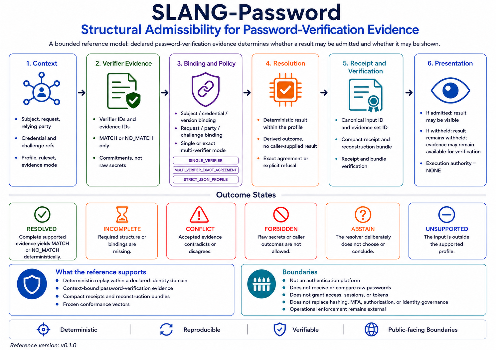

# SLANG-Password

## Deterministic Admission of Declared Password-Verification Evidence

**SLANG-Password does not verify passwords, authenticate users, grant access,
create sessions, issue tokens, or reset credentials. It resolves only the
structural admissibility of declared password-verification evidence.**

SLANG-Password v0.1.0 is a bounded, profile-oriented reference implementation
for resolving whether declared password-verification evidence is structurally
admissible under an identified context, verifier set, evidence mode, profile,
and ruleset.

The central contract is:

`same admitted canonical evidence + same bound authentication context + same versioned profile and ruleset -> same bounded result state`

The reference separates password verification from structural admission.
An existing security component may perform a password comparison. SLANG-Password
does not repeat that comparison. It evaluates the resulting declared evidence
for completeness, consistency, context binding, exact verifier agreement,
identity consistency, and presentation admissibility.

The reference preserves explicit non-result states:

`required structure or verifier evidence missing -> INCOMPLETE`

`binding mismatch, duplicate identity, unexpected verifier, or evidence disagreement -> CONFLICT`

`raw secret material or caller-supplied authority outcome present -> FORBIDDEN`

`unknown schema, profile, field, evidence mode, identifier form, or resource shape -> UNSUPPORTED`

`evaluation not authorized under the declared context -> ABSTAIN`

A supported and complete `NO_MATCH` declaration is a resolved negative outcome.
It is not treated as a structural conflict.

SLANG-Password does not accept raw-password fields or compare passwords,
authenticate a person, grant access, create sessions, issue tokens, mutate
credentials, or replace established authentication and security controls.

## License and Use Notice

The SLANG-Password reference implementation and verification artifacts are free to use, copy, modify, test, study, and redistribute without a license fee, subject to the [SLANG-Observatory LICENSE](../../LICENSE).

Architecture materials, documentation, specifications, diagrams, and explanatory content are subject to CC BY-NC 4.0 as stated in the LICENSE.

Provided as is, without warranty. SLANG-Password is not an authentication system, password verifier, access-control mechanism, session authority, identity provider, or password-reset system.

---

## 🧭 **Visual Overview**



The diagram summarizes the separation between the existing security plane and
the SLANG structural plane, including strict input admission, context binding,
verifier agreement, bounded resolution, visibility, reconstruction evidence,
and the responsibilities that remain outside the reference resolver.

---

## Current Reference

Version:

`0.1.0`

Core:

`SLANG-CORE-1-D05`

Profile:

`SLANG-PASSWORD-PROFILE-1-D01`

Ruleset:

`SLANG-PASSWORD-RULESET-1-D01`

Canonicalization:

`SLANG-CANONICAL-JSON-1-D02`

Verifier evidence profile:

`PASSWORD-VERIFIER-EVIDENCE-1`

Input schema:

`SLANG-PASSWORD-INPUT-1`

Result schema:

`SLANG-PASSWORD-RESULT-1`

Bundle schema:

`SLANG-PASSWORD-BUNDLE-1`

Receipt schema:

`SLANG-PASSWORD-RECEIPT-1`

Public summary schema:

`SLANG-PASSWORD-PUBLIC-SUMMARY-1`

Target runtime:

`Python 3.9+`

Dependencies:

`Python standard library only`

Observed verification environment:

`Python 3.12`

The profile file is the normative statement of supported semantics, limits,
state precedence, reason codes, identity domains, authority boundaries, and
verification behavior. This README provides a guided summary and command
reference.

---

## Quick Verification

Run the permanent reference audit:

```bat
python -B slang_password_v0_1_0.py --self-test
```

Expected summary:

```text
TOTAL                    299/299 PASS
```

Resolve the canonical example input:

```bat
python -B slang_password_v0_1_0.py --input SLANG_Password_Example_Input_v0_1_0.json
```

Expected principal fields:

```text
"summary_schema": "SLANG-PASSWORD-PUBLIC-SUMMARY-1"
"resolution_state": "RESOLVED"
"visibility_state": "VISIBLE"
"outcome_visible": true
"outcome_fields_redacted": false
"verification_outcome": "MATCH"
"admission_state": "ADMIT"
"authentication_authority": "NONE"
"access_authority": "NONE"
"session_authority": "NONE"
"execution_authority": "NONE"
```

Verify the canonical reconstruction bundle:

```bat
python -B slang_password_v0_1_0.py --verify-bundle SLANG_Password_Bundle_v0_1_0.json
```

Expected:

```text
VERIFY: PASS
PASS
```

Verify the compact receipt:

```bat
python -B slang_password_v0_1_0.py --verify-receipt SLANG_Password_Receipt_v0_1_0.json
```

Expected:

```text
VERIFY: PASS
PASS
```

Verify the receipt against its exact bundle:

```bat
python -B slang_password_v0_1_0.py --verify-receipt-against-bundle SLANG_Password_Receipt_v0_1_0.json SLANG_Password_Bundle_v0_1_0.json
```

Expected:

```text
VERIFY: PASS
PASS
```

Verify the frozen conformance vectors:

```bat
python -B slang_password_vectors_v0_1_0.py --verify SLANG_Password_Vectors_v0_1_0.json
```

Expected result:

```text
semantic vectors: 86/86 reproduced
presentation vectors: 5/5 reproduced
parser vectors: 13/13 reproduced
artifact vectors: 10/10 reproduced
reference evidence: 3/3 reproduced
serialization bytes: 3/3 reproduced
relations: 12/12 reproduced
VERIFY: PASS
```

No third-party Python packages are required.

### How to read the evidence artifacts

`bundle -> parsed submitted input with recognized forbidden-field values redacted + normalized projection + full result + deterministic reconstruction`

`receipt + exact bundle -> compact binding verification`

`receipt alone -> receipt integrity verification without input reconstruction`

`public summary -> visibility-aware presentation projection`

### Artifact handling summary

**Reconstruction bundle**

- retains supported, unknown, and otherwise unsupported parsed input values
- redacts values under recognized forbidden field names
- supports exact deterministic reconstruction
- must be treated as a potentially sensitive, access-controlled artifact

**Compact receipt**

- does not reproduce `submitted_input` or values under unknown or unsupported fields
- contains normalized structural references and deterministic identities
- binds the corresponding submission and reconstruction bundle
- may remain sensitive or correlatable even though it is compact

**Public summary**

- contains a visibility-aware result projection
- does not contain the complete submitted input
- does not provide full reconstruction
- is not an authentication credential, access token, or session authority

A passing verification establishes agreement with this declared reference
contract. It does not establish that a person was authenticated or that access
should be granted.

---

## Threat Model and Verification Meaning

### Input-control assumption

The reference assumes that an untrusted caller may control the entire submitted
JSON document, including identifiers, verifier declarations, evidence
commitments, declared identities, context flags, field order, evidence order,
unknown fields, and caller-supplied conclusions.

The reference responds through strict JSON admission, exact supported-field
sets, rejection of caller-derived outcomes, forbidden-field-name detection,
identifier and commitment grammars, declared-identity recomputation,
context-binding checks, exact verifier-set checks, exact result agreement,
deterministic precedence, bounded resources, and bundle and receipt
reconstruction.

These mechanisms do not establish source authenticity, verifier
trustworthiness, secrecy of permitted field values, identity ownership,
successful password comparison, MFA completion, authorization, session
authority, or operational access authority.

### Bounded verification meaning

The reference is designed to detect or expose structural conditions within its
bounded input model, including:

- raw secret fields presented to the resolver
- caller-supplied derived outcomes
- missing verifier evidence
- unexpected verifier evidence
- duplicate evidence or verifier identifiers
- subject-reference mismatch
- credential-reference mismatch
- credential-version mismatch
- request-reference mismatch
- relying-party mismatch
- challenge mismatch
- exact verifier disagreement
- malformed declared identities
- declared identity mismatch
- unknown profiles or rulesets
- unsupported evidence modes or result symbols
- malformed JSON and duplicate JSON keys
- portable JSON and resource-limit violations
- bundle or receipt tampering detectable through exact reconstruction

Key distinctions are:

`declared MATCH evidence != independently repeated password comparison`

`evidence commitment syntax != source authenticity`

`context binding != identity ownership`

`deterministic reconstruction != real-world truth`

`ADMIT != authenticated`

`DENY != account lockout`

`receipt verification != access authority`

`public-summary redaction != confidentiality system`

The reference does not establish whether the verifier is trustworthy, whether
the declared comparison occurred, whether the subject owns the account, whether
MFA or risk controls passed, or whether an operational system should create a
session or allow an action.

---

## Reference Files

### Core and conformance

- [`slang_password_v0_1_0.py`](slang_password_v0_1_0.py)
- [`slang_password_vectors_v0_1_0.py`](slang_password_vectors_v0_1_0.py)
- [`SLANG_Password_Vectors_v0_1_0.json`](SLANG_Password_Vectors_v0_1_0.json)

### Canonical reference evidence

- [`SLANG_Password_Example_Input_v0_1_0.json`](SLANG_Password_Example_Input_v0_1_0.json)
- [`SLANG_Password_Bundle_v0_1_0.json`](SLANG_Password_Bundle_v0_1_0.json)
- [`SLANG_Password_Receipt_v0_1_0.json`](SLANG_Password_Receipt_v0_1_0.json)

### Profile

- [`SLANG_Password_Profile_v0_1_0.txt`](SLANG_Password_Profile_v0_1_0.txt)

### Visual reference

- [`SLANG-Password-Reference-Diagram.png`](SLANG-Password-Reference-Diagram.png)

---

## What the Reference Resolves

The resolver accepts declared password-verification evidence produced outside
the resolver and answers this bounded question:

> Is the declared verification evidence complete, consistent, correctly bound,
> compatible with the declared verifier set and evidence mode, and admissible
> under the identified profile and ruleset?

The reference input contains:

- a schema identifier
- a profile identifier
- a ruleset identifier
- one declared evaluation context
- one or more verifier evidence records
- a declared context identity
- a declared evidence-set identity

The context binds the evidence to:

- `evaluation_id`
- `subject_ref`
- `credential_ref`
- `credential_version`
- `request_ref`
- `relying_party_ref`
- `challenge_ref`
- `evidence_mode`
- `expected_verifier_ids`
- `evaluation_authorized`
- `reference_visibility_authorized`

Each verifier evidence record declares:

- `evidence_id`
- `verifier_id`
- `verifier_profile_id`
- `subject_ref`
- `credential_ref`
- `credential_version`
- `request_ref`
- `relying_party_ref`
- `challenge_ref`
- `verification_result`
- `evidence_commitment`

The supported verifier result symbols are:

- `MATCH`
- `NO_MATCH`

The reference does not infer a password result from a username, secret, hash,
password length, retry sequence, or login workflow.

---

## Two-Plane Use Model

A conforming integration may place SLANG-Password beside an existing security
system.

### Existing security plane

The surrounding system remains responsible for:

- secret collection
- password hashing and comparison
- credential storage
- salts, peppers, and key management
- MFA
- retry and lockout policy
- challenge expiry and consumption
- abuse detection
- session creation and validation
- authorization
- access enforcement
- operational monitoring

### SLANG structural plane

The reference resolver is limited to:

- strict input admission
- identifier normalization
- canonical projection
- context binding
- verifier-set checking
- exact evidence agreement
- deterministic state resolution
- identity construction
- visibility-aware presentation
- reconstruction bundle construction
- compact receipt construction

A deployment may use a relation such as:

`protected_action_allowed = security_checks_pass AND structural_evidence_admitted AND authorization_allows`

SLANG-Password resolves only `structural_evidence_admitted`.

---

## Resolution States

### `RESOLVED`

The supported structure is complete, consistent, authorized for evaluation,
and produces one admitted verification outcome.

A resolved result may contain either:

`verification_outcome = MATCH`

or:

`verification_outcome = NO_MATCH`

### `INCOMPLETE`

Required structure or expected verifier evidence is absent.

Examples:

- a required context field is missing
- a declared identity is missing
- an expected verifier record is absent
- a multi-verifier evidence set is incomplete
- no supported verification outcome can be derived

### `CONFLICT`

Supported declarations cannot coexist under the profile.

Examples:

- evidence is bound to a different subject
- evidence is bound to a different credential version
- an unexpected verifier is present
- duplicate evidence identifiers create ambiguity
- verifier results disagree
- a declared context or evidence-set identity differs from its recomputed value

### `FORBIDDEN`

The input contains material or conclusions that this resolver is not permitted
to process or trust.

Examples:

- a raw password field is present
- a password hash or salt field is present
- a session or access token field is present
- the caller supplies `authenticated`, `access`, `resolution_state`, or another
  derived authority field

### `UNSUPPORTED`

The input falls outside the exact versioned profile.

Examples:

- unknown schema, profile, or ruleset
- unknown evidence mode
- unknown verifier evidence profile
- unsupported result symbol
- invalid identifier syntax
- invalid commitment syntax
- unknown field
- excessive evidence count or unsupported resource shape

### `ABSTAIN`

The structure is otherwise supported, but evaluation is not authorized under
the declared context.

`ABSTAIN` does not produce `MATCH` or `NO_MATCH`.

---

## Primary State Selection and Diagnostics

When multiple issues are present, the primary state is selected by this
versioned precedence:

`FORBIDDEN > CONFLICT > UNSUPPORTED > INCOMPLETE > ABSTAIN > RESOLVED`

Within the same state, the primary issue is selected by ascending reason code
and then ascending detail string.

All distinct reason codes are retained in sorted order, subject to the declared
resource boundary.

This means that validation-check ordering does not become primary-state
authority.

Examples:

- raw secret material plus a missing field resolves to `FORBIDDEN`
- a context mismatch plus an unknown field resolves to `CONFLICT`
- an unknown profile plus missing evidence resolves to `UNSUPPORTED`
- supported but incomplete evidence resolves to `INCOMPLETE`

---

## Verification Outcome and Admission

The verification outcome values are:

- `MATCH`
- `NO_MATCH`
- `NONE`

The admission values are:

- `ADMIT`
- `DENY`
- `WITHHOLD`

The mapping is:

`RESOLVED + MATCH -> verification_outcome = MATCH; admission_state = ADMIT`

`RESOLVED + NO_MATCH -> verification_outcome = NO_MATCH; admission_state = DENY`

`FORBIDDEN, CONFLICT, UNSUPPORTED, INCOMPLETE, or ABSTAIN -> verification_outcome = NONE; admission_state = WITHHOLD`

`ADMIT` means only that the bounded declared `MATCH` evidence is structurally
admitted under the current profile.

`DENY` means only that the bounded declared `NO_MATCH` evidence is structurally
admitted under the current profile.

Neither value grants or denies operational access by itself.

---

## Evidence Modes

The profile supports exactly two evidence modes.

### `SINGLE_VERIFIER`

Requirements:

- exactly one expected verifier identifier
- exactly one verifier evidence record
- exact verifier identity match
- complete context binding
- supported verifier profile and result symbol

### `MULTI_VERIFIER_EXACT_AGREEMENT`

Requirements:

- between two and eight unique expected verifier identifiers
- one evidence record for every expected verifier
- no unexpected verifier
- unique verifier and evidence identifiers
- exact agreement across all admitted verification results

The mode does not use majority voting, weighting, quorum substitution, or
first-arrival selection.

`all admitted verifier outcomes agree -> continue`

`any admitted verifier disagreement -> CONFLICT`

A `MATCH` declaration cannot outvote a `NO_MATCH` declaration.

---

## Context Binding

Every verifier record must match the normalized context for:

- subject reference
- credential reference
- credential version
- request reference
- relying-party reference
- challenge reference

A mismatch produces a specific conflict reason:

- `SUBJECT_BINDING_MISMATCH`
- `CREDENTIAL_BINDING_MISMATCH`
- `CREDENTIAL_VERSION_MISMATCH`
- `REQUEST_BINDING_MISMATCH`
- `RELYING_PARTY_BINDING_MISMATCH`
- `CHALLENGE_BINDING_MISMATCH`

Context binding prevents evidence declared for one bounded context from being
admitted as though it applied to another.

A credential-version change changes the context identity and result identity.
It does not itself rotate a password, revoke a session, or alter a credential.

---

## Forbidden Secret and Authority Fields

The resolver must not accept raw secret material or caller-declared authority
outcomes as supported input.

Representative forbidden fields include:

- `password`
- `raw_password`
- `current_password`
- `old_password`
- `new_password`
- `secret`
- `raw_secret`
- `password_hash`
- `stored_hash`
- `credential_hash`
- `salt`
- `pepper`
- `private_key`
- `session_token`
- `access_token`
- `refresh_token`
- `authenticated`
- `access`
- `grant`
- `granted`
- `login_success`
- `resolution_state`
- `verification_outcome`
- `admission_state`
- `result_id`
- `bundle_id`
- `receipt_id`

The scan is recursive and applies at every nesting depth. Field-name matching uses only the declared ASCII trimming and ASCII lowercase rules. Non-ASCII field names are not Unicode-folded into forbidden ASCII names; unsupported names remain subject to the exact field-set rules.
The presence of a forbidden field produces:

`resolution_state = FORBIDDEN`

Before a reconstruction bundle, receipt, or identity is constructed, the value
associated with each detected forbidden field is replaced with:

`<FORBIDDEN_VALUE_REDACTED>`

This protection is based on field names. It does not inspect or classify field
values.

A value placed in an otherwise permitted reference field, such as
`subject_ref`, `credential_ref`, `request_ref`, or `challenge_ref`, is treated
as a declared reference. When valid under the identifier grammar, that value
may appear in the result, reconstruction bundle, and receipt.

Therefore:

`reference field -> opaque non-secret reference only`

Callers must not place passwords, tokens, private keys, hashes, personal data,
or other secret material inside reference fields. Identifier normalization and
syntax validation are not secret-detection mechanisms.

The result field:

`secret_material_processed = false`

means that the supported resolver path does not use secret material to perform
a password comparison. Inputs containing recognized forbidden fields are
rejected and redacted, but preventing secret material from being placed inside
permitted fields remains the caller's responsibility.

`forbidden-field rejection != content-based secret detection`

`identifier validation != sensitivity classification`

`redaction != confidentiality system`

### Unknown and unsupported field values

Redaction is limited to the declared forbidden-field-name set.

A field whose name is not in that set, including an unknown field or a
non-ASCII lookalike name that resolves to `UNSUPPORTED`, is not redacted. Its
parsed JSON value is retained in `submitted_input` inside the reconstruction
bundle and is committed to by `submission_id`, even when the input is rejected
and no outcome is admitted.

The bundle preserves parsed JSON values. It does not preserve the original JSON
source formatting, whitespace, object-key order, or escape spelling.

Unknown and unsupported fields do not appear in `normalized_projection`, which
contains supported normalized fields only. Their values are not reproduced
inside the compact receipt, although the receipt binds the corresponding
submission and bundle through `submission_id` and `bundle_id`.

`unsupported field != redacted field`

`input rejected != submitted value discarded`

Callers must therefore treat a reconstruction bundle as potentially sensitive.
Passwords, tokens, private keys, hashes, personal data, and other sensitive
values must not be placed under any field name, whether supported, forbidden,
unknown, or unsupported.

---

## Portable JSON Boundary

The reference parser accepts strict UTF-8 JSON and rejects:

- duplicate object keys
- malformed JSON
- non-UTF-8 input
- floating-point numbers
- `NaN`
- positive or negative Infinity
- integers outside the portable safe range
- lone Unicode surrogate code points
- unsupported JSON value classes
- inputs exceeding declared limits

Supported JSON value classes are:

- object
- array
- string
- integer from `-(2^53 - 1)` through `+(2^53 - 1)`
- boolean
- null

Floating-point values are not supported by this profile.

---

## Resource Boundary

The reference declares these principal limits:

`MAX_JSON_INPUT_BYTES = 1048576`

`MAX_JSON_DEPTH = 48`

`MAX_JSON_NODES = 50000`

`MAX_LIST_LENGTH = 256`

`MAX_STRING_LENGTH = 1024`

`MAX_IDENTIFIER_LENGTH = 128`

`MAX_EVIDENCE_RECORDS = 8`

`MAX_REASON_CODES = 64`

`MAX_JSON_INPUT_BYTES` applies to UTF-8 JSON accepted through `loads_strict`,
`load_json`, and command-line file input. A direct call to
`resolve_password(value)` receives an already constructed Python object and has
no original serialized byte length. Direct calls remain subject to depth,
node-count, collection-size, string-length, identifier-length, evidence-count,
and portable-value restrictions.

`reason_codes`, `missing_dependencies`, `conflicts`, `prohibitions`, and
`unsupported_features` are each capped at `MAX_REASON_CODES` after stable
sorting and deduplication.

These are reference-profile limits. They do not establish suitable production
limits for every deployment.

---

## Identifier Lexical Profile and Normalization

Structural identifiers use an ASCII-only lexical profile.

Before normalization, every character must be one of:

- horizontal tab: `U+0009`
- line feed: `U+000A`
- carriage return: `U+000D`
- printable ASCII: `U+0020` through `U+007E`

No non-ASCII code point is admitted in a structural identifier.

Normalization then:

1. removes only `U+0009`, `U+000A`, `U+000D`, and `U+0020` from the beginning and end;
2. maps only ASCII letters `a-z` to `A-Z`; and
3. validates the result against:

`^[A-Z0-9][A-Z0-9._:@/-]{0,127}$`

Examples:

`subject-alpha -> SUBJECT-ALPHA`

` verifier-a  -> VERIFIER-A`

`\t subject-alpha \r\n -> SUBJECT-ALPHA`

The following are unsupported:

- an identifier ending in `U+0085` or `U+00A0`
- an identifier beginning with `U+2003`
- `ßprint`
- `file`
- fullwidth Latin letters

The profile applies no Unicode normalization, compatibility mapping, locale-sensitive casing, or Unicode case folding.

`Unicode normalization form = NONE`

`Unicode case folding = NONE`

`non-ASCII structural identifier input = UNSUPPORTED`

The resolver treats identifiers as opaque structural references. It does not
infer account ownership, personhood, legal identity, or semantic equivalence
from their text. ASCII validation is not secret detection.

---

## Evidence Commitments

Each verifier evidence record contains an `evidence_commitment` with grammar:

`sha256:[0-9a-f]{64}`

Commitment strings use the same permitted ASCII input character set as structural identifiers. Normalization removes only `U+0009`, `U+000A`, `U+000D`, and `U+0020` from the beginning and end, then maps only ASCII letters `A-Z` to `a-z`. The normalized prefix and digest must be lowercase.

Non-ASCII whitespace, Unicode compatibility characters, and non-ASCII hexadecimal lookalikes are unsupported.

The resolver checks syntax and binds the commitment string into the evidence
identity. It does not establish which source bytes were committed, who created
the commitment, whether the source was independent, or whether the committed
evidence is trustworthy.

`commitment identity != source authenticity`

---

## Declared Structural Identities

Every input contains:

- `declared_context_id`
- `declared_evidence_set_id`

The resolver recomputes both identities from normalized material and compares
them with the declared values.

A missing identity produces `MISSING_DECLARED_IDENTITY`.

A malformed identity produces `INVALID_DECLARED_IDENTITY`.

A syntactically valid but unequal identity produces
`DECLARED_IDENTITY_MISMATCH` and a `CONFLICT` state.

The prefixes are:

`slang_password_context_sha256:`

`slang_password_evidence_set_sha256:`

Each prefix is followed by exactly 64 lowercase hexadecimal characters.

---

## Canonicalization and Order Independence

Canonical JSON is constructed by:

- validating the portable JSON boundary
- preserving supported JSON data types
- escaping non-ASCII characters in JSON form
- sorting object keys lexicographically
- removing insignificant whitespace
- using comma as the item separator
- using colon as the key-value separator
- writing UTF-8 with exactly one terminal line-feed byte for artifact files

The logical serialization is equivalent to:

`json.dumps(value, ensure_ascii=true, allow_nan=false, sort_keys=true, separators=(",", ":"))`

Verifier evidence records are normalized and sorted by:

1. `verifier_id`
2. `evidence_id`
3. canonical record serialization

Therefore object-key order and admitted verifier-evidence presentation order do
not become resolution authority.

`same semantic admitted structure -> same canonical projection`

Order independence is bounded to presentation permutations of the same admitted
structure. It does not mean that operational security workflows, credential
histories, network events, or policy changes are interchangeable.

---

## Semantic and Operational Identities

The reference constructs domain-separated SHA-256 identities for:

- identity domain
- submitted input
- canonical input
- context
- verifier manifest
- evidence set
- evidence agreement
- rule profile
- outcome
- evaluation evidence
- result
- bundle
- receipt

Representative fields are:

- `submission_id`
- `canonical_input_id`
- `context_id`
- `verifier_manifest_id`
- `evidence_set_id`
- `evidence_agreement_id`
- `rule_profile_id`
- `outcome_id`
- `evaluation_evidence_id`
- `result_id`
- `bundle_id`
- `receipt_id`

Each identity has a separate text prefix. Equality across different prefixes has
no meaning under this profile.

`evidence_agreement_id` identifies the declared material evaluated for
agreement. Its presence does not mean that agreement was established. Agreement
succeeds only when the result state and reason codes establish that the
applicable evidence-mode requirements were satisfied.

`evidence_agreement_id present != evidence agreement established`

An identity demonstrates deterministic commitment to declared canonical
material within its domain. It does not establish source authenticity, legal
authority, identity ownership, or real-world correctness.

---

## Resolution and Visibility Separation

Structural resolution and reference presentation are separate decisions.

For a `RESOLVED` result:

`reference_visibility_authorized = true -> visibility_state = VISIBLE`

`reference_visibility_authorized = false -> visibility_state = WITHHELD`

The complete reconstruction bundle retains the deterministic result.

When the public outcome is withheld, the public summary sets:

```text
"verification_outcome": null
"admission_state": null
"outcome_fields_redacted": true
```

Visibility authorization does not create authentication, access, session, or
execution authority.

---

## Public Summary Projection

The command-line resolver prints a visibility-aware public summary with schema:

`SLANG-PASSWORD-PUBLIC-SUMMARY-1`

The summary contains:

- version and state fields
- visibility fields
- outcome fields when visible
- stable reason codes
- fixed authority fields
- result and bundle identities

The public summary is a presentation artifact. It is not a reconstruction
bundle, authentication credential, access token, session token, or security
log.

---

## Reconstruction Bundles

The bundle schema is:

`SLANG-PASSWORD-BUNDLE-1`

A conforming bundle contains exactly:

- `schema`
- `version`
- `core_version`
- `canonicalization_id`
- `identity_domain_id`
- `submitted_input`
- `normalized_projection`
- `result`
- `bundle_id`

Bundle verification:

1. validates the portable JSON boundary
2. requires the exact bundle field set
3. checks versioned domain declarations
4. reconstructs the normalized projection and result from `submitted_input`
5. reconstructs `bundle_id`
6. requires exact canonical equality

The bundle's `submitted_input` reproduces the caller's parsed JSON document with
only values under recognized forbidden field names redacted. Values under
unknown or unsupported field names are retained. A reconstruction bundle must
therefore be handled as a potentially sensitive artifact and should not be
published or shared without reviewing its contents.

A passing bundle verification demonstrates deterministic reconstruction under
this implementation and profile. It does not establish source authenticity,
successful authentication, or operational authority.

---

## Compact Receipts

The receipt schema is:

`SLANG-PASSWORD-RECEIPT-1`

A receipt contains selected bounded result fields and binds them to an exact
`bundle_id`.

The compact receipt does not reproduce `submitted_input` or the values of
unknown and unsupported fields. It may nevertheless contain normalized context
references and deterministic identities, and it binds the full reconstruction
bundle through `submission_id` and `bundle_id`. Compactness does not establish
that a receipt is non-sensitive.

Receipt verification reconstructs `receipt_id` and requires:

`execution_authority = NONE`

`authentication_authority = NONE`

`access_authority = NONE`

`session_authority = NONE`

Receipt-against-bundle verification reconstructs the expected receipt from the
verified bundle and requires exact canonical equality.

`receipt verification != source authentication`

`receipt verification != login authorization`

`receipt verification != session authority`

---

## Frozen Conformance Vectors

The companion vector document and vector utility provide portable evidence for:

`vector_set_id = slang_password_vector_set_sha256:506b885c11a902d4f16872cd3c30d9a4056741213d10ae1a3c2a745e49db7cae`

The frozen corpus covers:

- semantic result reproduction
- positive `MATCH` admission
- resolved `NO_MATCH` behavior
- all six resolution states
- context-binding mismatches
- single-verifier and multi-verifier exact agreement
- raw-secret and caller-outcome rejection
- declared-identity checking
- order independence
- deterministic identity construction
- parser rejection behavior, including generated byte, depth, and node-limit cases
- field-name-based rejection and permitted-reference value preservation
- ASCII-only identifier and commitment normalization
- rejection of Unicode whitespace, compatibility mappings, ligatures, and fullwidth identifier forms
- ASCII case-insensitive forbidden-field matching without Unicode folding
- adjacent state-precedence cases
- public-summary presentation
- reference bundle and receipt reproduction
- tamper detection
- exact JSON file serialization
- metamorphic relations

The vector utility is a companion frozen-corpus generator and verifier. It
exercises the supplied Python reference implementation against independently
stored expected results, artifact identities, serialization records, parser
cases, and metamorphic relations.

A passing result demonstrates agreement between the supplied reference
implementation and the frozen corpus. The utility is not an independent
resolver implementation or third-party verification, and it does not establish
production suitability.

---

## Permanent Reference Audit

The core script contains permanent checks grouped under:

- `ABSTAIN`
- `AGREEMENT`
- `CONTEXT_BINDING`
- `DETERMINISM`
- `EVIDENCE`
- `FORBIDDEN`
- `IDENTITY`
- `IDENTITY_CHANGE`
- `INCOMPLETE`
- `MULTI_VERIFIER`
- `NEGATIVE`
- `NORMALIZATION`
- `ORDER_INDEPENDENCE`
- `PARSER`
- `PRECEDENCE`
- `PRESENTATION`
- `PRIVACY`
- `REFERENCE`
- `RESOURCE`
- `SERIALIZATION`
- `UNSUPPORTED`

The current reference audit reports:

```text
ABSTAIN                  4/4 PASS
AGREEMENT                12/12 PASS
CONTEXT_BINDING          18/18 PASS
DETERMINISM              6/6 PASS
EVIDENCE                 9/9 PASS
FORBIDDEN                39/39 PASS
IDENTITY                 30/30 PASS
IDENTITY_CHANGE          7/7 PASS
INCOMPLETE               17/17 PASS
MULTI_VERIFIER           4/4 PASS
NEGATIVE                 6/6 PASS
NORMALIZATION            14/14 PASS
ORDER_INDEPENDENCE       5/5 PASS
PARSER                   9/9 PASS
PRECEDENCE               10/10 PASS
PRESENTATION             11/11 PASS
PRIVACY                  34/34 PASS
REFERENCE                12/12 PASS
RESOURCE                 13/13 PASS
SERIALIZATION            6/6 PASS
UNSUPPORTED              33/33 PASS
TOTAL                    299/299 PASS
```

A passing internal audit confirms behavior against the included permanent test
set. It does not establish production security, universal correctness, or
independent certification.

---

## Reference Evidence

The canonical example uses:

- evidence mode: `SINGLE_VERIFIER`
- one expected verifier: `VERIFIER-A`
- verification result: `MATCH`
- credential version: `VERSION-003`
- visible reference presentation
- evaluation authorized

The reference result resolves to:

```text
resolution_state = RESOLVED
verification_outcome = MATCH
admission_state = ADMIT
visibility_state = VISIBLE
outcome_visible = true
authentication_authority = NONE
access_authority = NONE
session_authority = NONE
execution_authority = NONE
```

The canonical bundle and receipt verify through their dedicated commands and
are bound through exact `bundle_id` equality.

---

## Easy Adoption Pattern

A conventional integration can retain its existing password-verification path
and add a small adapter that emits the supported evidence structure.

```text
existing password verifier
    -> declared verifier evidence
    -> SLANG-Password resolver
    -> bounded result + bundle + receipt
    -> existing MFA, authorization, session, and enforcement layers
```

The resolver can be used as:

- a local Python library function
- a command-line utility
- an offline verification component
- a sidecar admission layer
- a conformance target for another implementation

Adoption does not require sending a raw password to SLANG-Password.

A practical integration should use opaque references for subjects, credentials,
requests, relying parties, and challenges, and should apply its own data
minimization, retention, authorization, and security controls.

---

## Command Reference

Run the permanent audit:

```bat
python -B slang_password_v0_1_0.py --self-test
```

Resolve a JSON input file:

```bat
python -B slang_password_v0_1_0.py --input INPUT.json
```

Resolve the built-in canonical reference input:

```bat
python -B slang_password_v0_1_0.py
```

Write the canonical reference input:

```bat
python -B slang_password_v0_1_0.py --write-reference-input SLANG_Password_Example_Input_v0_1_0.json
```

Write a reconstruction bundle:

```bat
python -B slang_password_v0_1_0.py --input SLANG_Password_Example_Input_v0_1_0.json --write-bundle SLANG_Password_Bundle_v0_1_0.json
```

Write a compact receipt:

```bat
python -B slang_password_v0_1_0.py --input SLANG_Password_Example_Input_v0_1_0.json --write-receipt SLANG_Password_Receipt_v0_1_0.json
```

Require a visible resolved outcome:

```bat
python -B slang_password_v0_1_0.py --input INPUT.json --require-visible-result
```

Verify a bundle:

```bat
python -B slang_password_v0_1_0.py --verify-bundle BUNDLE.json
```

Verify a receipt:

```bat
python -B slang_password_v0_1_0.py --verify-receipt RECEIPT.json
```

Verify a receipt against its exact bundle:

```bat
python -B slang_password_v0_1_0.py --verify-receipt-against-bundle RECEIPT.json BUNDLE.json
```

Print the versioned identity-domain declarations:

```bat
python -B slang_password_v0_1_0.py --print-identity-domain
```

---

## Command-Line Exit and Error Contract

Exit codes are:

`0 = command completed successfully`

`1 = self-test or verification failure`

`2 = input, JSON boundary, I/O, or command-resolution error`

`3 = --require-visible-result was used and no visible resolved outcome was produced`

For ordinary input resolution, exit code `0` means that the command executed.
It does not mean that:

- the result state was `RESOLVED`
- the declared outcome was `MATCH`
- a user was authenticated
- access was granted
- a session should be created

Callers must inspect the structured result fields rather than interpret process
completion as authentication success.

---

## Security, Privacy, and Governance Boundary

SLANG-Password does not replace:

- established password hashing algorithms
- credential databases
- salts, peppers, or key management
- authentication protocols
- MFA
- risk engines
- rate limiting
- lockout and abuse controls
- session management
- authorization policy
- identity governance
- endpoint or network security
- incident response
- logging and monitoring
- legal or organizational authority

The resolver does not require usernames, email addresses, raw passwords,
password hashes, salts, peppers, session tokens, or access tokens.

The readable references in the example artifacts are for inspectability. They
are not a recommendation to place personal data in operational artifacts.

Reconstruction bundles may retain parsed values supplied under unknown or
unsupported field names. Rejection of an input does not discard those values
from the bundle. Before storing, transmitting, or publishing a bundle, callers
must review the complete `submitted_input` content and apply appropriate access,
retention, and disclosure controls.

Organizations remain responsible for data minimization, retention, access
control, authenticity mechanisms, secure transport, secure storage, policy,
compliance, and operational enforcement.

---

## Relationship to SLANG-ResetPassword

SLANG-Password and SLANG-ResetPassword address different bounded questions.

SLANG-Password resolves:

`Is declared evidence concerning an existing password-verification result structurally admissible?`

SLANG-ResetPassword resolves:

`Is declared evidence authorizing credential replacement structurally admissible?`

A successful SLANG-Password result does not authorize a password reset.

A successful SLANG-ResetPassword result does not prove that an existing
password matched.

The projects may share structural vocabulary, canonicalization discipline, and
evidence practices while preserving separate profiles and authority boundaries.

---

## Bounded Claim

Within the exact v0.1.0 profile:

`same admitted canonical evidence + same bound authentication context + same versioned profile and ruleset -> same bounded result state`

The reference demonstrates that workflow order and verifier-evidence arrival
order need not serve as the sole authority over this bounded structural
admission result once the complete admitted structure is available.

It does not claim that password verification, authentication, authorization,
cryptography, MFA, session management, or operational security are unnecessary.

It does not establish universal sequence independence, universal authentication
correctness, source truth, personhood, identity ownership, legal authority,
production readiness, or suitability for safety-critical use.

---

## Verification Status

The supplied v0.1.0 reference package has completed:

- permanent self-test: `299/299 PASS`
- semantic vectors: `86/86 reproduced`
- presentation vectors: `5/5 reproduced`
- parser vectors: `13/13 reproduced`
- artifact vectors: `10/10 reproduced`
- reference evidence: `3/3 reproduced`
- serialization bytes: `3/3 reproduced`
- metamorphic relations: `12/12 reproduced`
- frozen-vector verification: `PASS`
- canonical example resolution: `PASS`
- canonical bundle verification: `PASS`
- canonical receipt verification: `PASS`
- receipt-against-bundle verification: `PASS`

These results apply to the supplied implementation, artifacts, frozen corpus,
versioned profile, and declared test boundary.

---

## Final Contract

`same admitted canonical evidence + same bound authentication context + same versioned profile and ruleset -> same bounded result state`

SLANG-Password admits declared password-verification evidence. It does not
perform password verification, authenticate a user, grant access, create a
session, mutate a credential, or reset a password.
