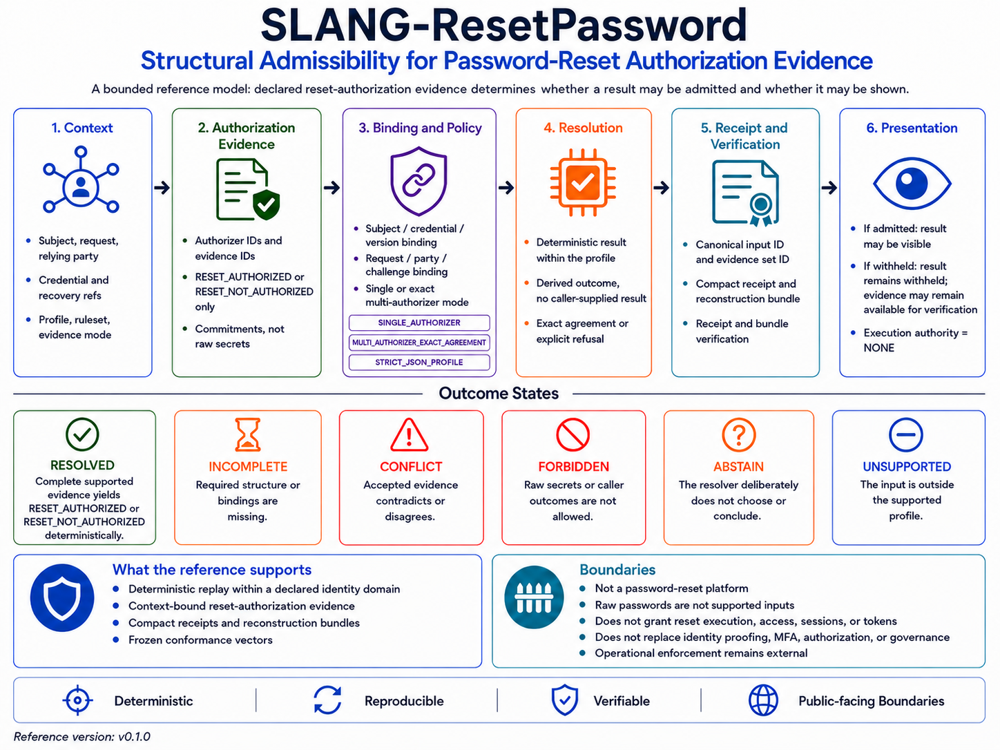

# SLANG-ResetPassword

## Deterministic Admission of Declared Credential-Replacement Authorization Evidence

**SLANG-ResetPassword does not validate reset tokens, one-time passwords,
recovery codes, or new passwords; authenticate users; replace credentials;
grant access; create sessions; or execute password resets. It resolves only the
structural admissibility of declared credential-replacement authorization
evidence.**

SLANG-ResetPassword v0.1.0 is a bounded, profile-oriented reference
implementation for resolving whether externally produced reset-authorization
evidence is structurally admissible under an identified reset context,
authorizer set, evidence mode, profile, and ruleset.

The central contract is:

`same admitted canonical evidence + same bound reset context + same versioned profile and ruleset -> same bounded result state`

An existing recovery and security system may perform identity proofing, token or
one-time-password validation, recovery-code validation, policy checks, password
checks, and credential replacement. SLANG-ResetPassword does not repeat those
operations. It evaluates the resulting declared authorization evidence for
completeness, consistency, context binding, exact authorizer agreement, identity
consistency, and presentation admissibility.

The reference preserves explicit non-result states:

`required structure or authorization evidence missing -> INCOMPLETE`

`binding mismatch, duplicate identity, unexpected authorizer, or evidence disagreement -> CONFLICT`

`raw recovery secret, password material, or caller-supplied authority outcome present -> FORBIDDEN`

`unknown schema, profile, field, evidence mode, identifier form, or resource shape -> UNSUPPORTED`

`evaluation not authorized under the declared context -> ABSTAIN`

A supported and complete `RESET_NOT_AUTHORIZED` declaration is a resolved
negative outcome. It is not treated as a structural conflict.

## License and Use Notice

The SLANG-ResetPassword reference implementation and verification artifacts are
free to use, copy, modify, test, study, and redistribute without a license fee,
subject to the [SLANG-Observatory LICENSE](../../LICENSE).

Architecture materials, documentation, specifications, diagrams, and
explanatory content are subject to CC BY-NC 4.0 as stated in the LICENSE.

Provided as is, without warranty. SLANG-ResetPassword is not a password-reset
engine, authentication system, identity-proofing system, token validator,
credential store, credential-mutation authority, access-control mechanism,
session authority, or identity provider.

---

## 🧭 **Visual Overview**



The diagram summarizes the separation between the existing recovery and
security plane and the SLANG structural plane, including strict input
admission, reset-context binding, authorizer agreement, bounded resolution,
visibility, reconstruction evidence, and the responsibilities that remain
outside the reference resolver.

---

## Current Reference

Version:

`0.1.0`

Core:

`SLANG-CORE-1-D05`

Profile:

`SLANG-RESET-PASSWORD-PROFILE-1-D01`

Ruleset:

`SLANG-RESET-PASSWORD-RULESET-1-D01`

Canonicalization:

`SLANG-CANONICAL-JSON-1-D02`

Authorization evidence profile:

`RESET-AUTHORIZER-EVIDENCE-1`

Input schema:

`SLANG-RESET-PASSWORD-INPUT-1`

Result schema:

`SLANG-RESET-PASSWORD-RESULT-1`

Bundle schema:

`SLANG-RESET-PASSWORD-BUNDLE-1`

Receipt schema:

`SLANG-RESET-PASSWORD-RECEIPT-1`

Public summary schema:

`SLANG-RESET-PASSWORD-PUBLIC-SUMMARY-1`

Target runtime:

`Python 3.9+`

Dependencies:

`Python standard library only`

Observed verification environments for the current supplied package:

`Python 3.12 and Python 3.13`

The profile file is the normative statement of supported semantics, limits,
state precedence, reason codes, identity domains, authority boundaries, and
verification behavior. This README provides a guided summary and command
reference.

---

## Quick Verification

Run the permanent reference audit:

```bat
python -B slang_reset_password_v0_1_0.py --self-test
```

Expected summary:

```text
TOTAL                    368/368 PASS
```

Resolve the canonical example input:

```bat
python -B slang_reset_password_v0_1_0.py --input SLANG_ResetPassword_Example_Input_v0_1_0.json
```

Expected principal fields:

```text
"summary_schema": "SLANG-RESET-PASSWORD-PUBLIC-SUMMARY-1"
"resolution_state": "RESOLVED"
"visibility_state": "VISIBLE"
"outcome_visible": true
"outcome_fields_redacted": false
"authorization_outcome": "RESET_AUTHORIZED"
"admission_state": "ADMIT"
"reset_authority": "NONE"
"credential_mutation_authority": "NONE"
"authentication_authority": "NONE"
"access_authority": "NONE"
"session_authority": "NONE"
"execution_authority": "NONE"
"public_summary_id": "slang_reset_password_public_summary_sha256:..."
```

Verify the canonical reconstruction bundle:

```bat
python -B slang_reset_password_v0_1_0.py --verify-bundle SLANG_ResetPassword_Bundle_v0_1_0.json
```

Expected:

```text
VERIFY: PASS
PASS
```

Verify the compact receipt:

```bat
python -B slang_reset_password_v0_1_0.py --verify-receipt SLANG_ResetPassword_Receipt_v0_1_0.json
```

Expected:

```text
VERIFY: PASS
PASS
```

Verify the receipt against its exact bundle:

```bat
python -B slang_reset_password_v0_1_0.py --verify-receipt-against-bundle SLANG_ResetPassword_Receipt_v0_1_0.json SLANG_ResetPassword_Bundle_v0_1_0.json
```

Expected:

```text
VERIFY: PASS
PASS
```

Verify the frozen conformance vectors:

```bat
python -B slang_reset_password_vectors_v0_1_0.py --verify SLANG_ResetPassword_Vectors_v0_1_0.json
```

Expected result:

```text
semantic vectors: 94/94 reproduced
presentation vectors: 6/6 reproduced
parser vectors: 13/13 reproduced
artifact vectors: 22/22 reproduced
reference evidence: 3/3 reproduced
serialization bytes: 4/4 reproduced
relations: 12/12 reproduced
VERIFY: PASS
```

No third-party Python packages are required.

### How to read the evidence artifacts

`bundle -> parsed submitted input with recognized forbidden-field values redacted + normalized projection + full result + deterministic reconstruction`

`receipt + exact bundle -> compact binding verification`

`receipt alone -> receipt integrity verification without input reconstruction`

`public summary -> visibility-aware presentation projection`

### Artifact handling summary

**Reconstruction bundle**

- retains supported, unknown, and otherwise unsupported parsed input values
- redacts values only under recognized forbidden field names
- retains the full deterministic outcome even when `visibility_state = WITHHELD`
- supports exact deterministic reconstruction
- is a sensitive, access-controlled verification artifact rather than a public presentation surface

**Compact receipt**

- does not reproduce `submitted_input` or values under unknown or unsupported fields
- contains normalized reset-context references and deterministic identities
- binds the corresponding submission and reconstruction bundle
- retains `authorization_outcome`, `admission_state`, reason codes, `result_id`, and `bundle_id` even when the outcome is withheld
- is a sensitive verification artifact rather than a visibility-filtered presentation surface

**Public summary**

- is the sole visibility-aware presentation projection
- neutralizes directional reason codes when a resolved outcome is withheld
- removes outcome-dependent `result_id` and `bundle_id` when withheld
- gives otherwise identical withheld positive and negative cases the same projection and `public_summary_id`
- does not contain the complete submitted input or provide full reconstruction
- is not a reset token, credential-mutation instruction, authentication credential, access token, or session authority

Redaction is keyed only on recognized forbidden field names. Value-level secret
detection is outside the reference profile; a sensitive value placed inside a
permitted, unknown, or unsupported field may be retained in private artifacts.

A passing verification establishes agreement with this declared reference
contract. It does not establish that recovery checks succeeded, that a person
was authenticated, or that a credential should be replaced.

---

## Threat Model and Verification Meaning

### Input-control assumption

The reference assumes that an untrusted caller may control the entire submitted
JSON document, including identifiers, authorizer declarations, evidence
commitments, declared identities, context flags, field order, evidence order,
unknown fields, and caller-supplied conclusions.

The reference responds through strict JSON admission, exact supported-field
sets, rejection of caller-derived outcomes, forbidden-field-name detection,
identifier and commitment grammars, declared-identity recomputation,
reset-context binding, exact authorizer-set checks, exact result agreement,
deterministic precedence, bounded resources, and bundle and receipt
reconstruction.

These mechanisms do not establish source authenticity, authorizer
trustworthiness, secrecy of permitted field values, identity ownership, token
validity, one-time-password validity, recovery-code validity, MFA completion,
password-policy compliance, authorization, credential-mutation authority,
session authority, or operational reset authority.

### Bounded verification meaning

The reference is designed to detect or expose structural conditions within its
bounded input model, including:

- raw password or recovery-secret fields presented to the resolver
- caller-supplied derived outcomes or authority claims
- missing authorization evidence
- unexpected authorizer evidence
- duplicate evidence or authorizer identifiers
- subject-reference mismatch
- credential-reference mismatch
- pre-replacement credential-version mismatch
- replacement-request mismatch
- relying-party mismatch
- recovery-case mismatch
- exact authorizer disagreement
- malformed declared identities
- declared identity mismatch
- unknown profiles or rulesets
- unsupported evidence modes or result symbols
- malformed JSON and duplicate JSON keys
- portable JSON and resource-limit violations
- bundle or receipt tampering detectable through exact reconstruction

Key distinctions are:

`declared RESET_AUTHORIZED evidence != independently repeated recovery checks`

`evidence commitment syntax != source authenticity`

`reset-context binding != identity ownership`

`deterministic reconstruction != real-world truth`

`ADMIT != credential replacement authorized operationally`

`DENY != account lockout`

`receipt verification != reset authority`

`public-summary integrity != exact private-bundle binding`

`public-summary redaction != cryptographic confidentiality`

The reference does not establish whether an authorizer is trustworthy, whether
the declared checks occurred, whether the subject owns the account, whether a
recovery case is current or unreplayed, or whether an operational system should
mutate a credential.

---

## Reference Files

### Core and conformance

- [`slang_reset_password_v0_1_0.py`](slang_reset_password_v0_1_0.py)
- [`slang_reset_password_vectors_v0_1_0.py`](slang_reset_password_vectors_v0_1_0.py)
- [`SLANG_ResetPassword_Vectors_v0_1_0.json`](SLANG_ResetPassword_Vectors_v0_1_0.json)

### Canonical reference evidence

- [`SLANG_ResetPassword_Example_Input_v0_1_0.json`](SLANG_ResetPassword_Example_Input_v0_1_0.json)
- [`SLANG_ResetPassword_Bundle_v0_1_0.json`](SLANG_ResetPassword_Bundle_v0_1_0.json)
- [`SLANG_ResetPassword_Receipt_v0_1_0.json`](SLANG_ResetPassword_Receipt_v0_1_0.json)

### Profile

- [`SLANG_ResetPassword_Profile_v0_1_0.txt`](SLANG_ResetPassword_Profile_v0_1_0.txt)

### Visual reference

- [`SLANG-ResetPassword-Reference-Diagram.png`](SLANG-ResetPassword-Reference-Diagram.png)

---

## What the Reference Resolves

The resolver accepts declared credential-replacement authorization evidence
produced outside the resolver and answers this bounded question:

> Is the declared reset-authorization evidence complete, consistent, correctly
> bound, compatible with the declared authorizer set and evidence mode, and
> admissible under the identified profile and ruleset?

The reference input contains:

- a schema identifier
- a profile identifier
- a ruleset identifier
- one declared reset-evaluation context
- one or more authorization evidence records
- a declared context identity
- a declared evidence-set identity

The context binds the evidence to:

- `evaluation_id`
- `subject_ref`
- `credential_ref`
- `credential_version_before`
- `replacement_request_ref`
- `relying_party_ref`
- `recovery_case_ref`
- `evidence_mode`
- `expected_authorizer_ids`
- `evaluation_authorized`
- `reference_visibility_authorized`

Each authorization evidence record declares:

- `evidence_id`
- `authorizer_id`
- `authorizer_profile_id`
- `subject_ref`
- `credential_ref`
- `credential_version_before`
- `replacement_request_ref`
- `relying_party_ref`
- `recovery_case_ref`
- `authorization_result`
- `evidence_commitment`

The supported authorization result symbols are:

- `RESET_AUTHORIZED`
- `RESET_NOT_AUTHORIZED`

The reference does not infer a reset result from an email address, username,
password, reset token, one-time password, recovery code, password strength,
retry sequence, or recovery workflow.

---

## Two-Plane Use Model

A conforming integration may place SLANG-ResetPassword beside an existing
credential-recovery and security system.

### Existing recovery and security plane

The surrounding system remains responsible for:

- account discovery and recovery-channel selection
- identity proofing
- reset-token, one-time-password, or recovery-code generation and validation
- expiry, replay prevention, challenge consumption, and retry controls
- password-policy and breach checks
- credential hashing, storage, replacement, rotation, and revocation
- MFA and step-up authentication
- session invalidation and account-protection policy
- abuse detection, rate limiting, lockout, notification, and monitoring
- authorization and enforcement

### SLANG structural plane

The reference resolver is limited to:

- strict input admission
- ASCII-only identifier and commitment normalization
- canonical projection
- reset-context binding
- authorizer-set checking
- exact authorization-evidence agreement
- deterministic state resolution
- identity construction
- visibility-aware presentation
- reconstruction bundle construction
- compact receipt construction

A surrounding system may use a relation such as:

`credential_replacement_may_proceed = recovery_checks_pass AND structural_reset_authorization_admitted AND operational_policy_allows`

SLANG-ResetPassword resolves only `structural_reset_authorization_admitted`.

---

## Resolution States

### `RESOLVED`

The supported structure is complete, consistent, authorized for evaluation,
and produces one admitted reset-authorization outcome.

A resolved result may contain either:

`authorization_outcome = RESET_AUTHORIZED`

or:

`authorization_outcome = RESET_NOT_AUTHORIZED`

### `INCOMPLETE`

Required structure or expected authorizer evidence is absent.

Examples:

- a required context field is missing
- a declared identity is missing
- an expected authorizer record is absent
- a multi-authorizer evidence set is incomplete
- no supported authorization outcome can be derived

### `CONFLICT`

Supported declarations cannot coexist under the profile.

Examples:

- evidence is bound to a different subject
- evidence is bound to a different pre-replacement credential version
- evidence is bound to a different replacement request or recovery case
- an unexpected authorizer is present
- duplicate evidence identifiers create ambiguity
- authorizer results disagree
- a declared context or evidence-set identity differs from its recomputed value

### `FORBIDDEN`

The input contains material or conclusions that this resolver is not permitted
to process or trust.

Examples:

- a current or new password field is present
- a reset token, one-time password, recovery code, or backup code is present
- a password hash, salt, pepper, private key, or access token field is present
- the caller supplies `reset_authorized`, `credential_replaced`,
  `reset_authority`, `authorization_outcome`, or another derived authority field

### `UNSUPPORTED`

The input falls outside the exact versioned profile.

Examples:

- unknown schema, profile, or ruleset
- unknown evidence mode
- unknown authorizer evidence profile
- unsupported authorization result symbol
- invalid identifier or commitment syntax
- unknown field
- excessive evidence count or unsupported resource shape

### `ABSTAIN`

The structure is otherwise supported, but evaluation is not authorized under
the declared context.

`ABSTAIN` does not produce `RESET_AUTHORIZED` or `RESET_NOT_AUTHORIZED`.

---

## Primary State Selection and Diagnostics

When multiple issues are present, the primary state is selected by this
versioned precedence:

`FORBIDDEN > CONFLICT > UNSUPPORTED > INCOMPLETE > ABSTAIN > RESOLVED`

Within the same state, the primary issue is selected by ascending reason code
and then ascending detail string.

All distinct reason codes are retained in sorted order, subject to the declared
resource boundary.

This means validation-check ordering does not become primary-state authority.

Examples:

- raw reset-token material plus a missing field resolves to `FORBIDDEN`
- a context mismatch plus an unknown field resolves to `CONFLICT`
- an unknown profile plus missing evidence resolves to `UNSUPPORTED`
- supported but incomplete evidence resolves to `INCOMPLETE`

---

## Authorization Outcome and Admission

The authorization outcome values are:

- `RESET_AUTHORIZED`
- `RESET_NOT_AUTHORIZED`
- `NONE`

The admission values are:

- `ADMIT`
- `DENY`
- `WITHHOLD`

The mapping is:

`RESOLVED + RESET_AUTHORIZED -> authorization_outcome = RESET_AUTHORIZED; admission_state = ADMIT`

`RESOLVED + RESET_NOT_AUTHORIZED -> authorization_outcome = RESET_NOT_AUTHORIZED; admission_state = DENY`

`FORBIDDEN, CONFLICT, UNSUPPORTED, INCOMPLETE, or ABSTAIN -> authorization_outcome = NONE; admission_state = WITHHOLD`

`ADMIT` means only that the bounded declared `RESET_AUTHORIZED` evidence is
structurally admitted under the current profile.

`DENY` means only that the bounded declared `RESET_NOT_AUTHORIZED` evidence is
structurally admitted under the current profile.

Neither value replaces a credential or grants operational reset authority.

---

## Evidence Modes

The profile supports exactly two evidence modes.

### `SINGLE_AUTHORIZER`

Requirements:

- exactly one expected authorizer identifier
- exactly one authorization evidence record
- exact authorizer identity match
- complete reset-context binding
- supported authorizer profile and authorization result symbol

### `MULTI_AUTHORIZER_EXACT_AGREEMENT`

Requirements:

- between two and eight unique expected authorizer identifiers
- one evidence record for every expected authorizer
- no unexpected authorizer
- unique authorizer and evidence identifiers
- exact agreement across all admitted authorization results

The mode does not use majority voting, weighting, quorum substitution, or
first-arrival selection.

`all admitted authorizer outcomes agree -> continue`

`any admitted authorizer disagreement -> CONFLICT`

A `RESET_AUTHORIZED` declaration cannot outvote a `RESET_NOT_AUTHORIZED`
declaration.

---

## Reset-Context Binding

Every authorization evidence record must match the normalized context for:

- subject reference
- credential reference
- credential version before replacement
- replacement-request reference
- relying-party reference
- recovery-case reference

A mismatch produces a specific conflict reason:

- `SUBJECT_BINDING_MISMATCH`
- `CREDENTIAL_BINDING_MISMATCH`
- `CREDENTIAL_VERSION_BEFORE_MISMATCH`
- `REPLACEMENT_REQUEST_BINDING_MISMATCH`
- `RELYING_PARTY_BINDING_MISMATCH`
- `RECOVERY_CASE_BINDING_MISMATCH`

Context binding prevents evidence declared for one bounded reset case from being
admitted as though it applied to another.

A change to `credential_version_before`, `replacement_request_ref`, or
`recovery_case_ref` changes the context and result identities. It does not
itself rotate a password, revoke sessions, consume a recovery challenge, or
alter a credential.

---

## Forbidden Secret and Authority Fields

The resolver must not accept raw recovery secrets, password material, or
caller-declared authority outcomes as supported input.

Representative forbidden fields include:

- `password`
- `raw_password`
- `current_password`
- `old_password`
- `new_password`
- `reset_token`
- `reset_code`
- `token`
- `otp`
- `one_time_password`
- `recovery_code`
- `backup_code`
- `recovery_secret`
- `authorization_code`
- `password_hash`
- `stored_hash`
- `credential_hash`
- `salt`
- `pepper`
- `private_key`
- `session_token`
- `access_token`
- `refresh_token`
- `authenticated`
- `reset_authorized`
- `reset_approved`
- `credential_replaced`
- `credential_mutated`
- `reset_executed`
- `reset_authority`
- `credential_mutation_authority`
- `resolution_state`
- `authorization_outcome`
- `admission_state`
- `result_id`
- `bundle_id`
- `receipt_id`
- `public_summary_id`

The scan is recursive and applies at every nesting depth. Field-name matching
uses only the declared ASCII trimming and ASCII lowercase rules. Non-ASCII field
names are not Unicode-folded into forbidden ASCII names; unsupported names
remain subject to the exact field-set rules.

The presence of a forbidden field produces:

`resolution_state = FORBIDDEN`

Before a reconstruction bundle or identity is constructed, the value associated
with each detected forbidden field is replaced with:

`<FORBIDDEN_VALUE_REDACTED>`

This protection is based on field names. It does not inspect or classify field
values.

A value placed in an otherwise permitted reference field, such as
`subject_ref`, `credential_ref`, `replacement_request_ref`, or
`recovery_case_ref`, is treated as a declared reference. When valid under the
identifier grammar, that value may appear in the result, reconstruction bundle,
and receipt.

Therefore:

`reference field -> opaque non-secret reference only`

Callers must not place passwords, tokens, private keys, hashes, personal data,
or other sensitive material inside reference fields. Identifier normalization
and syntax validation are not secret-detection mechanisms.

The result field:

`secret_material_processed = false`

means that the supported resolver path does not validate recovery secrets,
compare passwords, or derive the reset-authorization outcome from secret
material. Inputs containing recognized forbidden fields are rejected and
redacted, but preventing sensitive material from being placed inside permitted,
unknown, or unsupported fields remains the caller's responsibility.

`forbidden-field rejection != content-based secret detection`

`identifier validation != sensitivity classification`

`redaction != confidentiality system`

### Unknown and unsupported field values

Redaction is limited to the declared forbidden-field-name set.

A field whose name is not in that set, including an unknown field or a
non-ASCII lookalike name that resolves to `UNSUPPORTED`, is not redacted. Its
parsed JSON value is retained in `submitted_input` inside the reconstruction
bundle and is committed to by `submission_id`, even when the input is rejected
and no outcome is admitted.

The bundle preserves parsed JSON values. It does not preserve original JSON
source formatting, whitespace, object-key order, or escape spelling.

Unknown and unsupported fields do not appear in `normalized_projection`, which
contains supported normalized fields only. Their values are not reproduced
inside the compact receipt, although the receipt binds the corresponding
submission and bundle through `submission_id` and `bundle_id`.

`unsupported field != redacted field`

`input rejected != submitted value discarded`

Callers must therefore treat a reconstruction bundle as potentially sensitive.
Passwords, reset tokens, one-time passwords, recovery codes, private keys,
personal data, and other sensitive values must not be placed under any field
name, whether supported, forbidden, unknown, or unsupported.

---

## Portable JSON and Resource Boundary

The reference parser accepts strict UTF-8 JSON and rejects:

- duplicate object keys
- malformed JSON
- non-UTF-8 input
- floating-point numbers
- `NaN`
- positive or negative Infinity
- integers outside the portable safe range
- lone Unicode surrogate code points
- unsupported JSON value classes
- inputs exceeding declared limits

Supported JSON value classes are object, array, string, portable-safe integer,
boolean, and null. Floating-point values are not supported.

The principal limits are:

`MAX_JSON_INPUT_BYTES = 1048576`

`MAX_JSON_DEPTH = 48`

`MAX_JSON_NODES = 50000`

`MAX_LIST_LENGTH = 256`

`MAX_STRING_LENGTH = 1024`

`MAX_IDENTIFIER_LENGTH = 128`

`MAX_EVIDENCE_RECORDS = 8`

`MAX_REASON_CODES = 64`

`MAX_JSON_INPUT_BYTES` applies to the original UTF-8 source bytes accepted
through `loads_strict`, `load_json`, and command-line file input.

Every submitted input is also checked against the same ceiling using the UTF-8
byte length of its canonical JSON serialization. This deterministic canonical
size applies to already constructed Python objects passed directly to
`resolve_reset_password(value)`, `normalized_projection(value)`, or
`build_bundle(value)`, and also applies after parsing serialized input.

The source-byte and canonical-size measures are not defined as equivalent at
the exact limit. Canonical serialization removes insignificant whitespace and
escapes non-ASCII characters.

The submitted-input ceiling does not apply to the complete bundle, compact
receipt, public summary, or their verification paths. A valid artifact may
serialize larger than its submitted input.

`reason_codes`, `missing_dependencies`, `conflicts`, `prohibitions`, and
`unsupported_features` are each capped at `MAX_REASON_CODES` after stable
sorting and deduplication.

---

## Portable ASCII Lexical Contract

Structural identifiers use an ASCII-only lexical profile.

Before normalization, every character must be one of:

- horizontal tab: `U+0009`
- line feed: `U+000A`
- carriage return: `U+000D`
- printable ASCII: `U+0020` through `U+007E`

No non-ASCII code point is admitted in a structural identifier.

Normalization then:

1. removes only `U+0009`, `U+000A`, `U+000D`, and `U+0020` from both ends;
2. maps only ASCII letters `a-z` to `A-Z`; and
3. validates the result against:

`^[A-Z0-9][A-Z0-9._:@/-]{0,127}$`

The profile applies no Unicode normalization, compatibility mapping,
locale-sensitive casing, or Unicode case folding.

`Unicode normalization form = NONE`

`Unicode case folding = NONE`

`non-ASCII structural identifier input = UNSUPPORTED`

Evidence commitments use the corresponding ASCII-only trim and lowercase rules
and must match:

`sha256:[0-9a-f]{64}`

---

## Declared Identities and Canonicalization

Every input contains:

- `declared_context_id`
- `declared_evidence_set_id`

The resolver recomputes both identities from normalized material and compares
them with the declared values.

A missing identity produces `MISSING_DECLARED_IDENTITY`.

A malformed identity produces `INVALID_DECLARED_IDENTITY`.

A syntactically valid but unequal identity produces
`DECLARED_IDENTITY_MISMATCH` and a `CONFLICT` state.

Canonical JSON:

- validates the portable JSON boundary
- preserves supported JSON data types
- escapes non-ASCII characters in JSON form
- sorts object keys lexicographically
- removes insignificant whitespace
- uses comma and colon separators without added spaces
- writes UTF-8 artifact files with exactly one terminal line-feed byte

Authorization evidence records are normalized and sorted by:

1. `authorizer_id`
2. `evidence_id`
3. canonical record serialization

Therefore object-key order and admitted authorization-evidence presentation
order do not become resolution authority.

`same semantic admitted structure -> same canonical projection`

---

## Semantic and Operational Identities

The reference constructs domain-separated SHA-256 identities for:

- identity domain
- submitted input
- canonical input
- reset context
- authorizer manifest
- evidence set
- evidence-agreement material
- rule profile
- outcome
- evaluation evidence
- result
- bundle
- receipt
- public summary

Representative fields are:

- `submission_id`
- `canonical_input_id`
- `context_id`
- `authorizer_manifest_id`
- `evidence_set_id`
- `evidence_agreement_id`
- `rule_profile_id`
- `outcome_id`
- `evaluation_evidence_id`
- `result_id`
- `bundle_id`
- `receipt_id`
- `public_summary_id`

`evidence_agreement_id` identifies the declared material evaluated for
agreement. Its presence does not mean agreement was established.

`evidence_agreement_id present != evidence agreement established`

An identity demonstrates deterministic commitment to declared canonical
material within its domain. It does not establish source authenticity, legal
authority, identity ownership, recovery success, or real-world correctness.

---

## Resolution and Visibility Separation

Structural resolution and reference presentation are separate decisions.

For a `RESOLVED` result:

`reference_visibility_authorized = true -> visibility_state = VISIBLE`

`reference_visibility_authorized = false -> visibility_state = WITHHELD`

The complete reconstruction bundle and compact receipt retain the deterministic
outcome regardless of `visibility_state`. They are verification artifacts, not
visibility-filtered presentation surfaces.

Visibility filtering is applied only by the public summary.

When a resolved outcome is withheld, the public summary sets:

```text
"authorization_outcome": null
"admission_state": null
"reason_codes": ["RESET_OUTCOME_WITHHELD"]
"result_id": null
"bundle_id": null
"outcome_fields_redacted": true
```

It does not expose a directional reason code or an outcome-dependent private
result or bundle identity.

For otherwise identical withheld cases:

`withheld RESET_AUTHORIZED public summary = withheld RESET_NOT_AUTHORIZED public summary`

This property is `WITHHELD_OUTCOME_NONINTERFERENCE`.

Visibility authorization does not create reset, credential-mutation,
authentication, access, session, or execution authority.

---

## Public Summary Projection

The public summary schema is:

`SLANG-RESET-PASSWORD-PUBLIC-SUMMARY-1`

The summary includes state and visibility fields, visibility-filtered outcome
fields, presentation-safe reason codes, fixed authority fields, optional
private identities when visible, and `public_summary_id`.

`public_summary_id` uses the prefix:

`slang_reset_password_public_summary_sha256:`

It commits to the complete visibility-filtered public summary excluding
`public_summary_id` itself.

A visible summary retains the declared outcome, admission state, directional
reason code, `result_id`, and `bundle_id`.

A withheld summary removes those outcome-dependent private fields and uses the
neutral reason code `RESET_OUTCOME_WITHHELD`. Otherwise identical withheld
positive and negative cases therefore produce the same `public_summary_id`.

Public-summary verification enforces the exact field set, schema, version,
visibility invariants, reason-code invariants, authority boundaries, and
`public_summary_id` reconstruction.

Public-summary-against-bundle verification compares the supplied summary with
the expected public projection of a verified bundle. Because opposite withheld
outcomes intentionally produce the same public projection, this establishes
projection consistency rather than unique public binding to one private bundle.

`public-summary integrity != exact private-bundle binding`

`public-summary redaction != cryptographic confidentiality`

The public summary is not a reconstruction bundle, compact receipt, reset token,
credential-mutation instruction, authentication credential, access token, or
session authority.

---

## Reconstruction Bundles

The bundle schema is:

`SLANG-RESET-PASSWORD-BUNDLE-1`

A conforming bundle contains exactly:

- `schema`
- `version`
- `core_version`
- `canonicalization_id`
- `identity_domain_id`
- `submitted_input`
- `normalized_projection`
- `result`
- `bundle_id`

Bundle verification reconstructs the normalized projection, result, and
`bundle_id` from `submitted_input` and requires exact canonical equality.

The bundle's `submitted_input` reproduces the caller's parsed JSON document with
only values under recognized forbidden field names redacted. Values under
unknown or unsupported field names are retained.

The result inside the bundle retains the full deterministic outcome even when
`visibility_state = WITHHELD`. A reconstruction bundle is not
visibility-filtered and must therefore be handled as a sensitive,
access-controlled artifact. It must not be used as the public presentation
surface for a withheld outcome.

A passing bundle verification demonstrates deterministic reconstruction under
this implementation and profile. It does not establish source authenticity,
successful recovery checks, operational reset authority, or
credential-mutation authority.

---

## Compact Receipts

The receipt schema is:

`SLANG-RESET-PASSWORD-RECEIPT-1`

A receipt contains selected bounded result fields and binds them to an exact
`bundle_id`.

The compact receipt does not reproduce `submitted_input` or the values of
unknown and unsupported fields. It nevertheless contains normalized reset
context references and deterministic identities and binds the full
reconstruction bundle through `submission_id` and `bundle_id`.

The receipt retains `authorization_outcome`, `admission_state`, directional
reason codes, `result_id`, and `bundle_id` even when `visibility_state =
WITHHELD`. It is not visibility-filtered and must not be used as the public
presentation surface for a withheld outcome. Compactness does not establish
that a receipt is non-sensitive.

Receipt verification reconstructs `receipt_id` and requires:

`execution_authority = NONE`

`reset_authority = NONE`

`credential_mutation_authority = NONE`

`authentication_authority = NONE`

`access_authority = NONE`

`session_authority = NONE`

Receipt-against-bundle verification reconstructs the expected receipt from the
verified bundle and requires exact canonical equality.

`receipt verification != source authentication`

`receipt verification != reset authorization`

`receipt verification != credential-mutation authority`

`receipt verification != session authority`

---

## Frozen Conformance Vectors

The companion vector document and utility provide portable evidence for:

`vector_set_id = slang_reset_password_vector_set_sha256:8b71cb377a1464fed4b6fd1b982dabe7c39821bc52ef33110ae1370b08d5e0c2`

The frozen corpus covers:

- semantic result reproduction
- positive `RESET_AUTHORIZED` admission
- resolved `RESET_NOT_AUTHORIZED` behavior
- all six resolution states
- reset-context binding mismatches
- single-authorizer and multi-authorizer exact agreement
- password, reset-token, one-time-password, and recovery-code rejection
- caller-supplied reset and credential-mutation authority rejection
- declared-identity checking
- order independence
- deterministic identity construction
- parser rejection behavior, including generated byte, depth, and node-limit cases
- field-name-based rejection and permitted-reference value preservation
- unknown-field value preservation in the reconstruction bundle
- portable ASCII identifier and commitment normalization
- rejection of Unicode whitespace, compatibility mappings, ligatures, and fullwidth identifier forms
- ASCII case-insensitive forbidden-field matching without Unicode folding
- adjacent state-precedence cases
- visibility-safe public-summary presentation
- neutralization of outcome-revealing reason codes
- suppression of outcome-dependent private identities when withheld
- withheld-outcome noninterference across positive and negative outcomes
- public-summary integrity and bundle-projection verification
- direct-object canonical-size input enforcement
- reference bundle and receipt reproduction
- authority-field and general tamper detection
- exact JSON file serialization
- metamorphic relations

The vector utility is a companion frozen-corpus generator and verifier. It
exercises the supplied Python reference implementation against independently
stored expected results, artifact identities, serialization records, parser
cases, and metamorphic relations.

A passing result demonstrates agreement between the supplied reference
implementation and frozen corpus. The utility is not an independent resolver
implementation or third-party verification, and it does not establish
operational suitability.

---

## Permanent Reference Audit

The core script contains permanent checks grouped under:

- `ABSTAIN`
- `AGREEMENT`
- `CONTEXT_BINDING`
- `DETERMINISM`
- `EVIDENCE`
- `FORBIDDEN`
- `IDENTITY`
- `IDENTITY_CHANGE`
- `INCOMPLETE`
- `MULTI_AUTHORIZER`
- `NEGATIVE`
- `NORMALIZATION`
- `ORDER_INDEPENDENCE`
- `PARSER`
- `PRECEDENCE`
- `PRESENTATION`
- `PRIVACY`
- `REFERENCE`
- `RESOURCE`
- `SERIALIZATION`
- `UNSUPPORTED`

The current reference audit reports:

```text
ABSTAIN                  4/4 PASS
AGREEMENT                12/12 PASS
CONTEXT_BINDING          18/18 PASS
DETERMINISM              8/8 PASS
EVIDENCE                 12/12 PASS
FORBIDDEN                63/63 PASS
IDENTITY                 32/32 PASS
IDENTITY_CHANGE          7/7 PASS
INCOMPLETE               17/17 PASS
MULTI_AUTHORIZER         4/4 PASS
NEGATIVE                 6/6 PASS
NORMALIZATION            14/14 PASS
ORDER_INDEPENDENCE       5/5 PASS
PARSER                   9/9 PASS
PRECEDENCE               10/10 PASS
PRESENTATION             27/27 PASS
PRIVACY                  52/52 PASS
REFERENCE                14/14 PASS
RESOURCE                 15/15 PASS
SERIALIZATION            6/6 PASS
UNSUPPORTED              33/33 PASS
TOTAL                    368/368 PASS
```

A passing internal audit confirms behavior against the included permanent test
set. It does not establish production security, universal correctness, or
independent certification.

---

## Reference Evidence

The canonical example uses:

- evidence mode: `SINGLE_AUTHORIZER`
- one expected authorizer: `AUTHORIZER-A`
- authorization result: `RESET_AUTHORIZED`
- pre-replacement credential version: `CREDENTIAL-VERSION-003`
- replacement request: `REPLACEMENT-REQUEST-001`
- recovery case: `RECOVERY-CASE-001`
- visible reference presentation
- evaluation authorized

The reference result resolves to:

```text
resolution_state = RESOLVED
authorization_outcome = RESET_AUTHORIZED
admission_state = ADMIT
visibility_state = VISIBLE
outcome_visible = true
reset_authority = NONE
credential_mutation_authority = NONE
authentication_authority = NONE
access_authority = NONE
session_authority = NONE
execution_authority = NONE
```

The canonical bundle and receipt verify through their dedicated commands and
are bound through exact `bundle_id` equality.

---

## Easy Adoption Pattern

A conventional integration can retain its existing credential-recovery path and
add a small adapter that emits the supported authorization-evidence structure.

```text
existing recovery and security controls
    -> declared reset-authorization evidence
    -> SLANG-ResetPassword resolver
    -> bounded result + bundle + receipt
    -> existing credential mutation, notification, session invalidation, and enforcement layers
```

The resolver can be used as:

- a local Python library function
- a command-line utility
- an offline verification component
- a sidecar structural-admission layer
- a conformance target for another implementation

Adoption does not require sending a password, reset token, one-time password,
or recovery code to SLANG-ResetPassword.

A practical integration should use opaque references for subjects, credentials,
replacement requests, relying parties, and recovery cases, and should apply its
own data-minimization, retention, authorization, and security controls.

---

## Command Reference

Run the permanent audit:

```bat
python -B slang_reset_password_v0_1_0.py --self-test
```

Resolve a JSON input file:

```bat
python -B slang_reset_password_v0_1_0.py --input INPUT.json
```

Resolve the built-in canonical reference input:

```bat
python -B slang_reset_password_v0_1_0.py
```

Write the canonical reference input:

```bat
python -B slang_reset_password_v0_1_0.py --write-reference-input SLANG_ResetPassword_Example_Input_v0_1_0.json
```

Write a reconstruction bundle:

```bat
python -B slang_reset_password_v0_1_0.py --input SLANG_ResetPassword_Example_Input_v0_1_0.json --write-bundle SLANG_ResetPassword_Bundle_v0_1_0.json
```

Write a compact receipt:

```bat
python -B slang_reset_password_v0_1_0.py --input SLANG_ResetPassword_Example_Input_v0_1_0.json --write-receipt SLANG_ResetPassword_Receipt_v0_1_0.json
```

Write a visibility-aware public summary:

```bat
python -B slang_reset_password_v0_1_0.py --input INPUT.json --write-public-summary PUBLIC_SUMMARY.json
```

Require a visible resolved outcome:

```bat
python -B slang_reset_password_v0_1_0.py --input INPUT.json --require-visible-result
```

Verify a bundle:

```bat
python -B slang_reset_password_v0_1_0.py --verify-bundle BUNDLE.json
```

Verify a receipt:

```bat
python -B slang_reset_password_v0_1_0.py --verify-receipt RECEIPT.json
```

Verify a public summary:

```bat
python -B slang_reset_password_v0_1_0.py --verify-public-summary PUBLIC_SUMMARY.json
```

Verify a receipt against its exact bundle:

```bat
python -B slang_reset_password_v0_1_0.py --verify-receipt-against-bundle RECEIPT.json BUNDLE.json
```

Verify a public summary against a bundle's public projection:

```bat
python -B slang_reset_password_v0_1_0.py --verify-public-summary-against-bundle PUBLIC_SUMMARY.json BUNDLE.json
```

Print the versioned identity-domain declarations:

```bat
python -B slang_reset_password_v0_1_0.py --print-identity-domain
```

---

## Command-Line Exit and Error Contract

Exit codes are:

`0 = command completed successfully`

`1 = self-test or artifact-verification failure`

`2 = runtime, input, JSON boundary, I/O, or command-resolution error`

`3 = --require-visible-result was used and no visible resolved outcome was produced`

For ordinary input resolution, exit code `0` means the command executed. It
does not mean that:

- the result state was `RESOLVED`
- the declared outcome was `RESET_AUTHORIZED`
- recovery checks succeeded
- a credential should be replaced
- a user was authenticated
- access was granted
- a session should be created

Callers must inspect the structured result fields rather than interpret process
completion as reset success.

---

## Security, Privacy, and Governance Boundary

SLANG-ResetPassword does not replace:

- identity proofing
- reset-token, one-time-password, or recovery-code systems
- expiry, replay prevention, challenge consumption, and retry controls
- password-policy and breach checks
- established password hashing algorithms
- credential databases and key management
- MFA and step-up authentication
- rate limiting, lockout, abuse detection, and notification
- credential mutation, rotation, or revocation mechanisms
- session invalidation and session management
- authorization policy and identity governance
- endpoint, network, transport, and storage security
- incident response, logging, and monitoring
- legal or organizational authority

The resolver does not require usernames, email addresses, current or new
passwords, password hashes, reset tokens, one-time passwords, recovery codes,
salts, peppers, session tokens, or access tokens.

The readable references in the example artifacts are for inspectability. They
are not a recommendation to place personal data in operational artifacts.

Reconstruction bundles may retain parsed values supplied under unknown or
unsupported field names. Rejection of an input does not discard those values
from the bundle. Before storing, transmitting, or disclosing a bundle, callers
must review the complete `submitted_input` content and apply appropriate access,
retention, and disclosure controls.

Bundles and compact receipts retain full outcomes even when visibility is
withheld. Only the public summary applies presentation filtering. Private
artifacts must remain within an independently authorized verification or audit
boundary.

Organizations remain responsible for data minimization, retention, access
control, authenticity mechanisms, secure transport, secure storage, policy,
compliance, and operational enforcement.

---

## Relationship to SLANG-Password

SLANG-Password and SLANG-ResetPassword address different bounded questions.

SLANG-Password resolves:

`Is declared evidence concerning an existing password-verification result structurally admissible?`

SLANG-ResetPassword resolves:

`Is declared evidence concerning credential-replacement authorization structurally admissible?`

A successful SLANG-Password result does not authorize credential replacement.

A successful SLANG-ResetPassword result does not prove that an existing
password matched and does not itself replace a credential.

The projects share structural vocabulary, canonicalization discipline, and
evidence practices while preserving separate profiles and authority boundaries.

---

## Bounded Claim

Within the exact v0.1.0 profile:

`same admitted canonical evidence + same bound reset context + same versioned profile and ruleset -> same bounded result state`

The reference demonstrates that recovery-workflow sequence and
authorization-evidence arrival order need not serve as the sole authority over
this bounded structural admission result once the complete admitted structure
is available.

It does not claim that password reset, recovery communication, token systems,
identity proofing, authentication, authorization, credential mutation,
cryptography, MFA, session management, or operational security are unnecessary.

It does not establish universal sequence independence, universal recovery
correctness, source truth, personhood, identity ownership, legal authority,
operational readiness, or suitability for safety-critical use.

---

## Verification Status

The supplied v0.1.0 reference package has completed:

- permanent self-test: `368/368 PASS`
- semantic vectors: `94/94 reproduced`
- presentation vectors: `6/6 reproduced`
- parser vectors: `13/13 reproduced`
- artifact vectors: `22/22 reproduced`
- reference evidence: `3/3 reproduced`
- serialization bytes: `4/4 reproduced`
- metamorphic relations: `12/12 reproduced`
- frozen-vector verification: `PASS`
- canonical example resolution: `PASS`
- canonical bundle verification: `PASS`
- canonical receipt verification: `PASS`
- receipt-against-bundle verification: `PASS`
- public-summary verification: `PASS`
- public-summary-against-bundle projection verification: `PASS`
- withheld-outcome noninterference: `PASS`

These results apply to the supplied implementation, artifacts, frozen corpus,
versioned profile, and declared test boundary.

---

## Final Contract

`same admitted canonical evidence + same bound reset context + same versioned profile and ruleset -> same bounded result state`

SLANG-ResetPassword admits declared credential-replacement authorization
evidence. It does not validate recovery secrets, authorize operational reset
execution, mutate a credential, authenticate a user, grant access, or create a
session.
