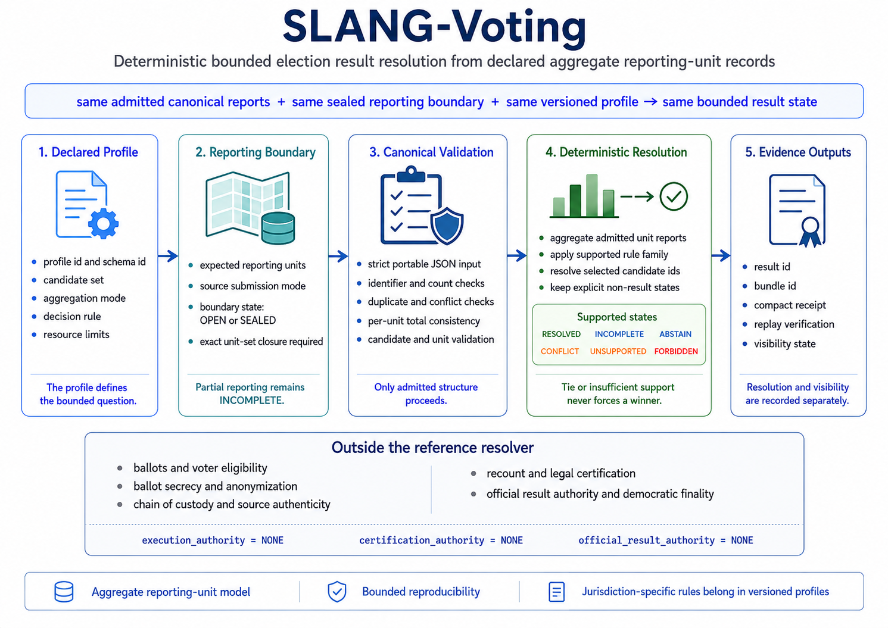

# SLANG-Voting

## Bounded Deterministic Election-Result Resolution from Declared Aggregate Records

SLANG-Voting v0.1.2 is a profile-oriented reference implementation for
resolving bounded election-result states from declared aggregate records,
versioned rules, an exact reporting boundary, and an explicit evidence mode.

The central contract is:

`same admitted canonical reports + same sealed reporting boundary + same versioned profile -> same bounded result state`

The reference preserves explicit non-result states:

`open or missing reporting boundary -> INCOMPLETE`

`contradictory records or source disagreement -> CONFLICT`

`valid tie or unresolved decision condition -> ABSTAIN`

`unsupported electoral method or input form -> UNSUPPORTED`

`evaluation or reference visibility prohibited -> FORBIDDEN`

The reference does not determine whether submitted records are authentic,
lawful, complete in the real world, or legally certifiable. It deterministically
resolves only the admitted declared structure. It is not a voting system,
election standard, or certification authority.

## License and Use Notice

The SLANG-Voting reference implementation and verification artifacts are free to use, copy, modify, test, study, and redistribute without a license fee, subject to the [SLANG-Observatory LICENSE](../../LICENSE).

Architecture materials, documentation, specifications, diagrams, and explanatory content are subject to CC BY-NC 4.0 as stated in the LICENSE.

Provided as is, without warranty. SLANG-Voting is not a voting system, certification process, or official result authority.

---

## 🧭 **Visual Overview**



The diagram summarizes the declared profile, exact reporting boundary,
canonical validation, bounded resolution, evidence outputs, and the
responsibilities that remain outside the reference resolver.

---

## Current Reference

Version:

`0.1.2`

Core:

`SLANG-CORE-1-D05`

Profile:

`SLANG-VOTING-PROFILE-1-D03`

Ruleset:

`SLANG-VOTING-RULESET-1-D03`

Canonicalization:

`SLANG-CANONICAL-JSON-1-D02`

Input schema:

`SLANG-VOTING-INPUT-1`

Result schema:

`SLANG-VOTING-RESULT-1`

Bundle schema:

`SLANG-VOTING-BUNDLE-1`

Receipt schema:

`SLANG-VOTING-RECEIPT-1`

Public summary schema:

`SLANG-VOTING-PUBLIC-SUMMARY-1`

Vector schema:

`SLANG-VOTING-VECTORS-2`

Target runtime:

`Python 3.9+`

Recorded package verification runtime:

`Python 3.13.5`

Dependencies:

`Python standard library only`

The profile file is the normative statement of supported semantics, limits,
state selection, reason codes, and identity preimages. This README provides a
guided summary and command reference.

Version 0.1.2 adds a visibility-aware public summary, frozen presentation
vectors, permanent presentation checks, an optional visible-result exit contract,
structured command-line error categories, and operating-system-independent JSON
file serialization. Full bundles and receipts retain
reconstruction evidence; the public summary sets candidate-bearing fields to
`null` when `outcome_visible = false`.

---

## Quick Verification

Run the permanent reference audit:

```bat
python -B slang_voting_v0_1_2.py --self-test
```

Expected summary:

```text
TOTAL                    209/209 PASS
```

Verify the frozen conformance vectors:

```bat
python -B slang_voting_vectors_v0_1_2.py --verify SLANG_Voting_Vectors_v0_1_2.json
```

Expected summary:

```text
semantic vectors: 49/49 reproduced
presentation vectors: 4/4 reproduced
parser vectors: 8/8 reproduced
reference evidence: 3/3 reproduced
serialization bytes: 1/1 reproduced
relations: 8/8 reproduced
VERIFY: PASS
```

Resolve the canonical example input:

```bat
python -B slang_voting_v0_1_2.py --input SLANG_Voting_Example_Input_v0_1_2.json
```

Expected principal fields:

```text
"summary_schema": "SLANG-VOTING-PUBLIC-SUMMARY-1"
"resolution_state": "RESOLVED"
"visibility_state": "VISIBLE"
"outcome_visible": true
"outcome_fields_redacted": false
"selected_candidate_ids": ["CANDIDATE-A"]
```

Verify the canonical reconstruction bundle:

```bat
python -B slang_voting_v0_1_2.py --verify-bundle SLANG_Voting_Bundle_v0_1_2.json
```

Expected:

```text
VERIFY: PASS
PASS
```

Verify the compact receipt:

```bat
python -B slang_voting_v0_1_2.py --verify-receipt SLANG_Voting_Receipt_v0_1_2.json
```

Expected:

```text
VERIFY: PASS
PASS
```

Verify the receipt against its exact bundle:

```bat
python -B slang_voting_v0_1_2.py --verify-receipt-against-bundle SLANG_Voting_Receipt_v0_1_2.json SLANG_Voting_Bundle_v0_1_2.json
```

Expected:

```text
VERIFY: PASS
PASS
```

No third-party Python packages are required.

### Verify byte-reproducible vector generation

Write a temporary vector document:

```bat
python -B slang_voting_vectors_v0_1_2.py --write GENERATED_SLANG_Voting_Vectors_v0_1_2.json
```

Verify its semantic and byte-serialization contract:

```bat
python -B slang_voting_vectors_v0_1_2.py --verify GENERATED_SLANG_Voting_Vectors_v0_1_2.json
```

Compare it byte-for-byte with the frozen vector document:

```bat
fc /b SLANG_Voting_Vectors_v0_1_2.json GENERATED_SLANG_Voting_Vectors_v0_1_2.json
```

Expected:

```text
FC: no differences encountered
```

The generated file uses UTF-8 bytes, no byte-order mark, LF line endings, and
exactly one terminal LF on every supported operating system.

### How to read the evidence artifacts

`bundle -> submitted input + normalized projection + full result + reconstruction`

`receipt + exact bundle -> compact binding verification`

`receipt alone -> integrity verification without report-set reconstruction`

The public summary is a visibility-aware presentation projection. It is not a
replacement for the bundle or receipt.

---

## Threat Model and Verification Meaning

A passing check establishes agreement with this declared reference contract.
It does not establish real-world election truth or authority.

Key distinctions are:

`sealed declared boundary != proven real-world completeness`

`multi-source exact agreement != source independence`

`source commitment syntax != provenance`

`bundle reconstruction != source truth`

`receipt verification != official correctness`

`public-summary redaction != confidentiality`

The reference does not verify ballots, voters, chain of custody, source
authenticity, fairness, legal compliance, certification, official finality, or
democratic legitimacy.

---

## Reference Files

### Core and conformance

- `slang_voting_v0_1_2.py`
- `slang_voting_vectors_v0_1_2.py`
- `SLANG_Voting_Vectors_v0_1_2.json`

### Canonical reference evidence

- `SLANG_Voting_Example_Input_v0_1_2.json`
- `SLANG_Voting_Bundle_v0_1_2.json`
- `SLANG_Voting_Receipt_v0_1_2.json`

### Profile

- `SLANG_Voting_Profile_v0_1_2.txt`

### Visual reference

- `SLANG-Voting-Reference-Diagram.png`

---

## What the Reference Resolves

The reference accepts a bounded election-result structure containing:

- a contest identifier
- a declared candidate set
- an exact expected reporting-unit set
- an aggregation mode
- a decision rule
- one or more declared data sources
- aggregate candidate counts for every expected reporting unit
- non-candidate record counts
- total record counts
- source commitments
- declared report-set identities
- an evaluation and reference-visibility context

The current reference can resolve three bounded decision families over two
aggregation families.

Aggregation families:

- `SUM_COUNTS`
- `UNIT_WINNER_WEIGHT`

Decision families:

- `UNIQUE_MAX`
- `ABSOLUTE_MAJORITY`
- `TOP_K`

This creates six supported combinations under one fixed profile. Each
combination has exact semantics described below.

The current profile does not encode every electoral system. Ranked-choice
redistribution, proportional allocation, transferable-vote methods, quota
methods, runoff sequencing, reserved-seat rules, legal tie procedures,
invalid-record adjudication, and jurisdiction-specific certification require
separate versioned profiles before they can be claimed as supported.

---

## Resolution States

### `RESOLVED`

The admitted structure is complete and consistent under the current profile,
and the declared decision rule produces an unambiguous bounded result.

For a visible result:

`resolution_state = RESOLVED`

`visibility_state = VISIBLE`

`outcome_visible = true`

### `INCOMPLETE`

Required declared structure is absent or the reporting boundary remains open.

Examples:

- a required source is missing
- an expected reporting unit is missing
- a candidate count is missing
- the reporting boundary is not sealed

The resolver does not treat currently available partial reports as the complete
contest.

### `CONFLICT`

Declared structural claims cannot coexist under the profile.

Examples:

- duplicate source identifiers
- duplicate reporting-unit reports
- a report for an undeclared unit
- a count for an undeclared candidate
- a report total that does not reconcile
- a declared identity that does not match the normalized structure
- exact multi-source report sets that disagree

### `ABSTAIN`

The input is admitted and complete, but the supported decision rule does not
justify a unique result.

Examples:

- a top tie under `UNIQUE_MAX`
- no absolute majority under `ABSOLUTE_MAJORITY`
- a tie crossing the `TOP_K` selection boundary
- a tied local unit under `UNIT_WINNER_WEIGHT`
- zero total resolution quantity

`ABSTAIN` is a resolver state. It is not a voter-choice label. Non-candidate
records use the separate field `non_candidate_count`.

### `UNSUPPORTED`

The input requests or contains a feature outside the current profile.

Examples:

- an unsupported aggregation method
- an unsupported decision rule
- malformed identifiers
- non-canonical decimal counts
- unsupported fields
- resource limits exceeded

### `FORBIDDEN`

The submitted structure attempts a prohibited action or the declared reference
context does not authorize evaluation or visibility.

Examples:

- derived-field injection
- `evaluation_authorized = false`
- a resolved outcome with `reference_visibility_authorized = false`

A visibility prohibition can preserve:

`resolution_state = RESOLVED`

while returning:

`state = FORBIDDEN`

`visibility_state = WITHHOLD`

`outcome_visible = false`

---

## Primary State Selection and Diagnostics

A submission may contain several independent validation issues. The normative
validation precedence is:

`FORBIDDEN > CONFLICT > UNSUPPORTED > INCOMPLETE`

Validation runs before aggregation and decision. When validation issues exist:

`state = highest-precedence validation state`

`resolution_state = state`

`outcome_visible = false`

`reason_codes` preserves every detected issue code as a deduplicated, lexically
sorted list. The category fields preserve the corresponding deduplicated issue
details:

- `missing_dependencies`
- `conflicts`
- `prohibitions`
- `unsupported_features`

A result may therefore carry `state = FORBIDDEN` while retaining lower-priority
structural findings. For example, evaluation refusal combined with a missing
reporting unit returns `FORBIDDEN` and records both
`EVALUATION_NOT_AUTHORIZED` and `MISSING_REPORTING_UNIT`.

`FORBIDDEN` does not suppress diagnostics and does not provide diagnostic
confidentiality. The profile file contains the complete normative reason-code
registry.

---

## Exact Reporting-Boundary Closure

The reference requires an explicit expected reporting-unit set:

`expected_unit_ids = {U1, U2, ..., Un}`

Every admitted source must provide exactly that set:

`reported_unit_set = expected_unit_set`

A missing unit produces `INCOMPLETE`.

An undeclared unit produces `CONFLICT`.

The context must also declare:

`reporting_boundary_sealed = true`

This prevents an interim leader over a partial declared dataset from being
resolved as though the bounded record set were complete.

A sealed reference boundary is only a declaration inside the submitted model.
It does not prove that every real-world reporting unit has been identified or
reported.

---

## Aggregate-Record Model

Each reporting-unit record contains:

- `unit_id`
- `candidate_counts`
- `non_candidate_count`
- `total_records`

`UNIT_WINNER_WEIGHT` also requires:

- `unit_weight`

Every report must satisfy:

`sum(candidate_counts) + non_candidate_count = total_records`

Every declared candidate must appear exactly once in every candidate-count map.

Counts are canonical non-negative decimal strings:

`0`

`125`

`1000000`

The following forms are rejected:

`-1`

`01`

`1.5`

`true`

JSON numbers are not accepted for record counts. Decimal strings provide exact
cross-language representation without floating-point interpretation.

---

## Candidate and Identifier Boundary

Identifiers are normalized to uppercase and must match:

`[A-Z0-9][A-Z0-9._:-]{0,63}`

Candidate identifiers, reporting-unit identifiers, source identifiers,
contest identifiers, evaluation identifiers, and jurisdiction identifiers use
this boundary.

Before validation, identifier text is normalized by removing leading and
trailing whitespace and converting letters to uppercase. Therefore:

`" source-a " -> SOURCE-A`

`"candidate-a" -> CANDIDATE-A`

The submitted form remains bound by `submission_id`, while the normalized
projection is bound by `canonical_input_id`. Two submitted identifiers that
normalize to the same value are not treated as distinct. They produce a
normalization-collision `CONFLICT`. For example, `candidate-a` and
`CANDIDATE-A` cannot coexist as separate candidates.

Candidate presentation order does not break ties and does not decide a result.
Canonical sorting is used only for deterministic representation.

Declared candidate-set, reporting-boundary, and report-set identities require
64 lowercase hexadecimal characters after their exact prefixes. Uppercase
hexadecimal is rejected as `UNSUPPORTED` rather than reported as a semantic
mismatch.

`source_dataset_commitment` accepts hexadecimal in either case and normalizes
the digest to lowercase.

---

## Aggregation Modes

### `SUM_COUNTS`

For each candidate `c`:

`resolution_total(c) = sum(unit_count(u, c) for every expected unit u)`

The resolution totals equal the aggregate candidate-record totals.

This mode can represent a bounded direct-count contest when the supplied
aggregate records and local rule mapping are appropriate.

### `UNIT_WINNER_WEIGHT`

Each reporting unit declares aggregate candidate counts and a positive unit
weight.

The local unit leader is determined by a unique maximum:

`local_winner(u) = unique argmax_c unit_count(u, c)`

The full unit weight is assigned to that local winner:

`resolution_total(c) = sum(unit_weight(u) for units won by c)`

A tied local unit causes the entire bounded evaluation to return `ABSTAIN /
UNIT_LOCAL_TIE`. The profile does not partially allocate untied units, discard
the tied unit, or invent a local tie-break procedure.

This is a bounded winner-takes-unit-weight profile. It is not a claim that all
unit-based electoral systems use this method.

---

## Decision Rules

### `UNIQUE_MAX`

A result resolves only when one candidate has the unique highest resolution
total:

`selected = unique argmax_c resolution_total(c)`

A top tie produces `ABSTAIN` with `TOP_TIE`.

### `ABSOLUTE_MAJORITY`

A result resolves only when one candidate has more than half of the total
resolution quantity:

`2 * top_total > total_resolution_quantity`

Failure to cross that boundary produces `ABSTAIN` with
`NO_ABSOLUTE_MAJORITY`.

The reference does not automatically schedule, model, or resolve a later round.

### `TOP_K`

The profile selects the highest `k` candidates only when the selection boundary
is unambiguous.

If a tie crosses the final selected position:

`selection_boundary_tie -> ABSTAIN`

Lexical candidate order never breaks a material tie.

`seats_to_fill` must satisfy:

`1 <= seats_to_fill < candidate_count`

---

## Evidence Modes

### `SINGLE_SOURCE`

The context declares exactly one expected source.

The source provides one complete report set and its declared report-set
identity.

### `MULTI_SOURCE_EXACT_AGREEMENT`

The context declares at least two expected sources.

Every source independently supplies a complete report set. The resolver
requires both exact report-set identity agreement and direct canonical report
equality:

`report_set_id(source_1) = ... = report_set_id(source_n)`

`canonical_reports(source_1) = ... = canonical_reports(source_n)`

Disagreement in either lane produces `CONFLICT`. After equality is established,
aggregation may use the canonical report set of any source because all admitted
sets are exactly equal.

This mode is best understood as a replication and integrity check. It asks
whether every declared source reproduces the same normalized report set. It is
not a majority, quorum, reconciliation, error-correction, or independent-source
corroboration mechanism. One disagreeing source causes `CONFLICT`; the current
profile does not select the largest agreeing subset.

This establishes exact agreement among the submitted declared structures. It
does not prove that sources are independent, authentic, competent, or free
from coordination. Digital signatures, organizational authority, and external
provenance remain outside the reference implementation.

### Future quorum-profile direction

A separate versioned profile may define an explicit quorum mode such as
`M_OF_N_EXACT_AGREEMENT`. Such a profile would need precise rules for quorum
thresholds, competing agreement groups, minority evidence preservation,
ties, conflicts, visibility, identities, vectors, and authority boundaries.
No quorum mode is supported by v0.1.2.

---

## Source Commitments

Each source supplies a 64-character hexadecimal
`source_dataset_commitment`.

The commitment is identity-bound into the source manifest and reconstruction
bundle. The reference validates its syntax but does not prove:

- who created it
- when it was created
- which external file or system it represents
- whether the represented source is authentic
- whether the source is complete

A commitment is a declared binding value, not source-truth certification.

### Report-set identity availability

A source receives `computed_report_set_id` only when the contest fields needed
by the identity are normalized, at least one normalized report exists, and no
report-affecting source issue remains.

These syntax issues do not block computation because they do not alter report
content:

- `INVALID_SOURCE_DATASET_COMMITMENT`
- `INVALID_DECLARED_REPORT_SET_ID`

Every other issue detected while normalizing that source or its reports blocks
its computed report-set identity.

---

## Declared Structural Identities

The input may bind the candidate set and reporting boundary through:

- `declared_candidate_set_id`
- `declared_reporting_boundary_id`

Every source must bind its report set through:

- `declared_report_set_id`

A mismatch produces `CONFLICT`.

These checks detect mismatches and bind the submitted reference structure to
its declared identities. They do not establish external ownership or legal
authority.

---

## Portable JSON Boundary

Strict JSON loading rejects:

- duplicate object keys
- floating-point JSON numbers
- `NaN`
- positive or negative infinity
- integers outside `[-9007199254740991, 9007199254740991]`
- lone Unicode surrogates
- excessive byte size
- excessive nesting depth
- excessive node count

Record quantities are more restrictive and must be canonical decimal strings.

Canonical JSON uses:

- UTF-8 input
- escaped ASCII output for identity material
- lexicographically sorted object keys
- no insignificant whitespace
- no non-finite numbers

---

## Deterministic JSON File Serialization

Generated vector documents, reconstruction bundles, and compact receipts use
one file-byte contract:

`UTF-8 + no BOM + LF line endings + exactly one terminal LF`

The writer emits UTF-8 bytes directly and does not rely on host text-mode
newline conversion. Therefore:

`same supported JSON object + same writer -> same file bytes across supported operating systems`

This file-byte contract is separate from semantic structural identity:

`same semantic object -> same structural identity`

Structural identity preimages use compact ASCII-canonical JSON with escaped
non-ASCII characters, sorted keys, and no insignificant whitespace. Generated
artifact files use readable UTF-8 JSON with native Unicode characters,
two-space indentation, sorted keys, LF line endings, and one terminal LF.
Therefore, structural identities are computed from the canonical preimage, not
from the generated file bytes. Hashing a bundle, receipt, or vector file as raw
bytes will not reproduce its embedded structural identity unless that identity
is explicitly defined as a file checksum.

A differently formatted but semantically equivalent admitted JSON file may still
reproduce the same structural identity. Byte equality applies to artifacts
written by the published deterministic writer.

The permanent audit checks generated example, bundle, receipt, and vector bytes.
The vector verifier also reports `serialization bytes: 1/1 reproduced` only when
the verified vector file is already in the canonical byte form.

---

## Resource Boundary

The current implementation declares:

- maximum input size: 16 MiB
- maximum JSON depth: 64
- maximum JSON nodes: 500000
- maximum candidates: 128
- maximum reporting units per source: 10000
- maximum sources: 16
- maximum identifier length: 64 characters
- maximum count length: 30 decimal digits
- maximum aggregate length: 40 decimal digits

Inputs beyond these limits produce an explicit non-result state or a strict
loading error.

The limits define this reference implementation. They are not election-policy
recommendations.

The quantity and unit limits imply that every admitted aggregate has at most 34
decimal digits. An exact upper bound is:

`MAX_REPORTING_UNITS * (10^MAX_COUNT_DIGITS - 1) < 10^34`

The defensive aggregate guard permits 40 digits. The permanent audit verifies:

`maximum reachable admitted aggregate digits < MAX_AGGREGATE_DIGITS`

Therefore no input that passes the per-field and reporting-unit limits can
reach the aggregate guard under this profile. A future limit change must
preserve this invariant or revise the profile and its frozen evidence.

---

## Submission Preservation and Canonical Projection

The bundle preserves two distinct input views.

### Submitted input

`submitted_input` preserves the admitted JSON structure supplied to the
resolver.

Its identity is:

`submission_id`

Presentation changes to list order can change this identity.

### Normalized projection

`normalized_projection` sorts structures that the profile declares to be
order-independent, including:

- candidate identifiers
- expected reporting-unit identifiers
- expected source identifiers
- source presentation
- report presentation
- candidate-count map presentation

Its identity is:

`canonical_input_id`

Therefore:

`same admitted semantic structure in different declared presentation orders -> same canonical_input_id`

This does not mean every possible input permutation has equivalent meaning.
Only the structures explicitly normalized by this profile receive that
invariance.

---

## Semantic and Operational Identities

### `candidate_set_id`

Binds the contest identifier and normalized candidate set.

### `reporting_boundary_id`

Binds the contest identifier, expected reporting-unit set, and declared sealed
boundary state.

### `report_set_id`

Binds the normalized aggregate reports, candidate set, expected reporting-unit
set, contest, and aggregation mode.

### `rule_profile_id`

Binds the aggregation mode and decision rule.

### `source_manifest_id`

Binds expected source identities, source commitments, declared report-set
identities, and computed report-set identities.

### `source_agreement_id`

Binds the evidence mode and each submitted source-to-report-set relationship.

### `outcome_id`

Binds the semantic bounded resolution:

- candidate set
- reporting boundary
- report set
- rule profile
- resolution state
- selected candidates
- leading candidates
- resolution totals

A reference-visibility policy change does not change `outcome_id` when the
underlying resolution remains the same.

### `evaluation_evidence_id`

Binds source evidence, outcome identity, visibility state, and evaluation
evidence.

### `result_id`

Binds `outcome_id` to the final reference state and visibility posture.

### `bundle_id`

Binds the complete reconstruction package, including submitted input,
normalized projection, and result.

### `receipt_id`

Binds the compact receipt.

### Exact identity preimages

Every identity uses:

`identity = prefix + sha256(canonical_json(preimage))`

The profile file publishes the exact prefix and complete canonical preimage for
`identity_domain_id`, `submission_id`, `canonical_input_id`,
`candidate_set_id`, `reporting_boundary_id`, `report_set_id`,
`rule_profile_id`, `source_manifest_id`, `source_agreement_id`, `outcome_id`,
`evaluation_evidence_id`, `result_id`, `bundle_id`, and `receipt_id`.

---

## Resolution and Visibility Separation

SLANG-Voting separates bounded result resolution from reference visibility.

A structure may resolve while visibility remains withheld:

`resolution_state = RESOLVED`

`state = FORBIDDEN`

`visibility_state = WITHHOLD`

This is only a reference-display policy boundary. It is not a legal publication
rule, embargo system, or official declaration authority. The full result,
reconstruction bundle, and compact receipt may retain selected candidates,
totals, and identities for reconstruction. The visibility-aware public summary
sets candidate-bearing fields to `null` whenever `outcome_visible = false`.
Neither lane provides confidentiality or access control.

Every result declares:

`execution_authority = NONE`

`certification_authority = NONE`

`official_result_authority = NONE`

---

## Public Summary Projection

The command-line resolver prints a visibility-aware projection with schema:

`SLANG-VOTING-PUBLIC-SUMMARY-1`

The projection always includes:

- state and resolution state
- visibility state
- `outcome_visible`
- `outcome_fields_redacted`
- reason codes
- result identity
- bundle identity

Candidate-bearing values are exposed only when:

`outcome_visible = true`

Otherwise the same fields remain present with `null` values:

`selected_candidate_ids = null`

`leading_candidate_ids = null`

`candidate_resolution_totals = null`

`outcome_fields_redacted = true`

This rule applies to withheld resolved outcomes and to `ABSTAIN`, `INCOMPLETE`,
`CONFLICT`, `UNSUPPORTED`, and validation-stage `FORBIDDEN` outcomes. The full
result, bundle, and receipt remain unchanged. Public-summary redaction is a
presentation rule, not a confidentiality guarantee.

---

## Reconstruction Bundles

A bundle contains:

- version and identity-domain metadata
- the submitted input
- the normalized projection
- the complete result
- `bundle_id`

Bundle verification:

1. checks the portable JSON boundary
2. checks the exact bundle field set
3. checks version and identity-domain metadata
4. recomputes `bundle_id`
5. reconstructs the bundle from `submitted_input`
6. requires canonical equality with the supplied bundle

A passing reconstruction demonstrates agreement with this reference
implementation and profile. It does not establish source authenticity or
official correctness.

---

## Compact Receipts

A receipt records the principal identities and outcome fields without repeating
all aggregate reports.

It includes:

- resolution and visibility states
- selected and leading candidate identifiers
- profile modes
- source and report identities
- outcome and evidence identities
- authority boundaries
- bundle binding
- `receipt_id`

Receipt verification checks receipt integrity.

Receipt-to-bundle verification checks exact reconstruction binding.

A receipt alone does not contain enough information to reconstruct the full
input report set.

---

## Frozen Conformance Vectors

The frozen vector file contains:

- 49 semantic vectors
- 4 presentation vectors
- 8 strict-parser vectors
- 3 reference-evidence checks
- 1 canonical file-serialization check
- 8 metamorphic relations

The vectors cover:

- all supported aggregation and decision families
- exact source agreement
- source disagreement
- ties and abstention
- reporting-boundary closure
- visibility withholding
- visible, withheld, abstaining, and incomplete public summaries
- candidate-field redaction when no outcome is visible
- count syntax
- report reconciliation
- duplicate and undeclared structure
- declared-identity mismatch
- derived-field injection
- parser hostility
- order invariance
- semantic-versus-operational identity separation
- mixed-issue state precedence and full diagnostic retention
- lowercase declared structural identity syntax
- source commitment hexadecimal case normalization
- direct canonical report-set equality
- canonical UTF-8/LF file serialization
- byte-identical vector regeneration

The vector set identity is:

`slang_voting_vector_set_sha256:466f6277ed1b09f49539d5eb0147e8b2914f08a804331c69e6697465b9750ecb`

---

## Permanent Adversarial Coverage

The reference audit includes permanent checks for:

- source-order, reporting-unit-order, and candidate-order invariance where declared
- stale or mismatched declared identities
- source-set disagreement
- missing and extra sources
- duplicate sources
- missing and extra reporting units
- duplicate unit reports
- missing and extra candidate counts
- malformed decimal counts
- boolean-as-count refusal
- report-total mismatch
- local-unit tie abstention
- top-level derived-field injection
- bundle and receipt tampering
- unrelated receipt-to-bundle binding
- duplicate JSON keys
- non-finite JSON numbers
- oversized portable integers
- lone Unicode surrogates
- validation-state precedence
- sorted multi-issue reason codes and category retention
- uppercase declared structural identity refusal
- report-set identity computation conditions
- aggregate-capacity invariant
- full-evidence retention under reference-visibility withholding
- UTF-8 JSON file output without carriage returns or a byte-order mark
- exactly one terminal LF
- strict serialization round-trip
- frozen example, bundle, receipt, and vector byte canonicality
- public-summary schema and visibility-aware candidate-field redaction
- full evidence retention beside a redacted summary
- visible-result strict exit behavior
- structured portable-JSON command-line error categories

---

## Reference Evidence

The canonical reference uses:

- three declared sources
- exact multi-source report-set agreement
- four reporting units
- three candidates
- `SUM_COUNTS`
- `UNIQUE_MAX`

The admitted aggregate candidate totals are:

`CANDIDATE-A = 370`

`CANDIDATE-B = 325`

`CANDIDATE-C = 115`

The bounded reference result is:

`state = RESOLVED`

`selected_candidate_ids = [CANDIDATE-A]`

This statement is limited to the supplied reference structure. The candidate
identifiers are generic and do not represent a real election.

Canonical result identity:

`slang_voting_result_sha256:00420863e38264fdcfa6c47c0d7f5fd27363a9f5693bbda13a42bdddeb9d5dc9`

Canonical bundle identity:

`slang_voting_bundle_sha256:fc896a8019e0275312c595c152806a3ecaf81e604b5bc840d28ebff20dc8a78b`

Canonical receipt identity:

`slang_voting_receipt_sha256:90253123696e4b381d384a27cc9af333a9ea843ff1e58baef7544e794c1ef2ce`

---

## Command Reference

Run the built-in reference example:

```bat
python -B slang_voting_v0_1_2.py
```

Resolve an input file:

```bat
python -B slang_voting_v0_1_2.py --input INPUT.json
```

Require a visible resolved outcome for a pipeline:

```bat
python -B slang_voting_v0_1_2.py --input INPUT.json --require-visible-result
```

This optional mode returns exit code `3` when the bounded outcome is not
publicly visible. The normal resolver mode still returns exit code `0` after it
successfully emits any bounded state, including explicit non-result states.

Resolve and write a bundle:

```bat
python -B slang_voting_v0_1_2.py --input INPUT.json --write-bundle BUNDLE.json
```

Resolve and write both bundle and receipt:

```bat
python -B slang_voting_v0_1_2.py --input INPUT.json --write-bundle BUNDLE.json --write-receipt RECEIPT.json
```

Verify a bundle:

```bat
python -B slang_voting_v0_1_2.py --verify-bundle BUNDLE.json
```

Verify a receipt:

```bat
python -B slang_voting_v0_1_2.py --verify-receipt RECEIPT.json
```

Verify a receipt against a bundle:

```bat
python -B slang_voting_v0_1_2.py --verify-receipt-against-bundle RECEIPT.json BUNDLE.json
```

Write a fresh vector document from the reference implementation:

```bat
python -B slang_voting_vectors_v0_1_2.py --write GENERATED_VECTORS.json
```

The writer emits deterministic UTF-8/LF bytes. A generated document can be
compared with the frozen vector document using `fc /b` on Windows or `cmp` on
POSIX systems.

Verify the frozen vectors:

```bat
python -B slang_voting_vectors_v0_1_2.py --verify SLANG_Voting_Vectors_v0_1_2.json
```

---

## Command-Line Exit and Error Contract

Default resolution mode uses:

`0 = input processed and bounded state emitted`

`1 = requested bundle, receipt, binding, or vector verification failed`

`2 = loading, parsing, command, or execution error`

With `--require-visible-result`:

`3 = bounded state emitted but no visible resolved outcome is available`

Strict input failures are written to stderr as stable categories:

`ERROR_CODE: PORTABLE_JSON_BOUNDARY_FAILURE`

`ERROR_DETAIL: <specific parser or portable-boundary reason>`

Filesystem failures use `IO_ERROR`. Other invalid command combinations or
unexpected resolution exceptions use `COMMAND_OR_RESOLUTION_ERROR`.

---

## Jurisdiction-Specific Profile Direction

The core is jurisdiction-neutral in naming and separates stable structural
mechanisms from versioned electoral rules.

A jurisdiction-specific adoption path would require:

1. a precise mapping from local law to a versioned profile
2. an exact definition of candidates, options, units, quantities, and closure
3. an explicit treatment of ties, thresholds, invalid records, later rounds,
   seat allocation, and exceptional cases
4. source-authenticity and chain-of-custody controls outside this resolver
5. independent implementation and conformance testing
6. legal, institutional, accessibility, privacy, and security review
7. official certification procedures outside this resolver

The architecture permits additional profiles to be defined without changing
the meaning of existing frozen profiles.

`new electoral rule family -> new versioned profile`

A profile must not be treated as supported until its semantics, limits,
vectors, adversarial tests, and claim boundary are published.

---

## Security, Privacy, and Governance Boundary

SLANG-Voting does not provide:

- voter registration
- voter eligibility determination
- voter identity verification
- ballot capture
- ballot secrecy
- anonymization
- coercion resistance
- accessibility assurance
- secure voting hardware
- secure transmission
- source authentication
- digital signatures
- chain of custody
- recount execution
- audit sampling
- fraud detection
- dispute resolution
- legal compliance
- constitutional authority
- official certification
- official publication
- democratic legitimacy

The reference consumes aggregate declared records. It should not receive public
voter identity-to-choice mappings.

Multi-source exact agreement establishes only that submitted normalized report
sets are identical. It does not establish that the sources are trustworthy or
independent.

A passing audit, vector verification, bundle reconstruction, or receipt check
establishes conformance to this bounded reference contract. It does not certify
a real election.

---

## Bounded Claim

Within `SLANG-VOTING-PROFILE-1-D03`:

`same admitted canonical reports + same sealed reporting boundary + same versioned profile -> same bounded result state`

`missing declared structure -> INCOMPLETE`

`contradictory declared structure -> CONFLICT`

`complete structure without an unambiguous supported decision -> ABSTAIN`

`unsupported method or representation -> UNSUPPORTED`

`prohibited evaluation or reference visibility -> FORBIDDEN`

The reference demonstrates deterministic bounded transformation, explicit
refusal, exact evidence identity, reconstruction, and conformance testing.

It does not establish source truth, fairness, security, legal validity,
official finality, or universal electoral coverage.

---

## Verification Status

Reference audit:

`209/209 PASS`

Frozen semantic vectors:

`49/49 reproduced`

Frozen presentation vectors:

`4/4 reproduced`

Strict-parser vectors:

`8/8 reproduced`

Reference evidence:

`3/3 reproduced`

Canonical serialization bytes:

`1/1 reproduced`

Metamorphic relations:

`8/8 reproduced`

Canonical bundle:

`VERIFY: PASS`

Canonical receipt:

`VERIFY: PASS`

Receipt-to-bundle binding:

`VERIFY: PASS`
